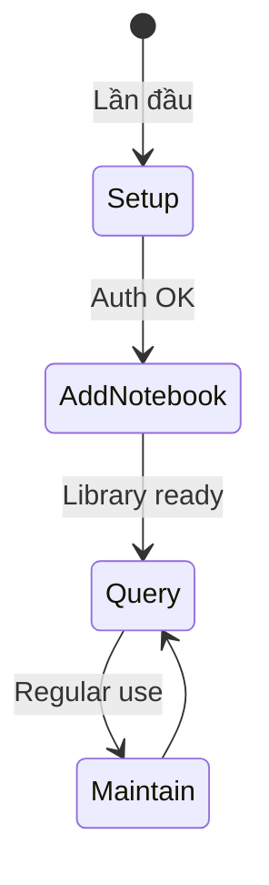

# NotebookLM Reference Documentation

## 📋 Overview

Tất cả reference docs sử dụng **Mermaid state machine diagrams** thay vì text để giảm cognitive load và tăng độ rõ ràng.

---

## 🗺️ State Machine Map

### [api-reference.md](api-reference.md) — API Workflows

| State Machine | Mục đích | Khi nào dùng |
|---------------|----------|--------------|
| **Overview Flow** | Pipeline tổng thể: Auth → Notebook → Query → Cleanup | Hiểu big picture |
| **Auth Lifecycle** | `setup` → `status` → `reauth` → `clear` | Setup lần đầu, debug auth errors |
| **Notebook Manager** | Add → List → Search → Activate → Remove | Quản lý notebook library |
| **Query Interface** | Select notebook → Send query → Handle follow-up | Hỏi câu hỏi, debug query issues |
| **Cleanup Flow** | Preview → Choose (full/safe) → Execute | Dọn dẹp cache/temp files |
| **Module Classes** | NotebookLibrary, AuthManager internal flow | Hiểu Python API |

**Sử dụng:** Tra cứu commands, hiểu lifecycle của từng component.

---

### [debugging.md](debugging.md) — Debug Workflows

| State Machine | Mục đích | Khi nào dùng |
|---------------|----------|--------------|
| **5-Layer Debug Flow** | Environment → Auth → Library → Browser → Links | Chạy `debug_skill.py`, xác định layer nào broken |
| **Layer 1: Environment** | Check venv → patchright → Chrome | `ModuleNotFoundError`, import errors |
| **Layer 2: Auth** | Check state.json → age → account | Redirect to login, auth expired |
| **Layer 3: Library** | Check notebooks → active → URL | "Notebook not found", library empty |
| **Layer 4: Browser** | Launch Chrome → Load page → Handle errors | Browser crash, timeout |
| **Layer 5: Links** | Validate URLs → Update/Remove inactive | `[INACTIVE]` notebooks |
| **Full Reset** | Nuclear option: wipe → reinstall → restore | Multiple layers broken |

**Sử dụng:** Khi skill bị lỗi, follow state machine từ trên xuống để tìm root cause.

---

### [research-guide.md](research-guide.md) — Research Workflows

| State Machine | Mục đích | Khi nào dùng |
|---------------|----------|--------------|
| **Method Picker** | Single query vs Multi-notebook research | Chọn giữa `ask_question.py` vs `research_method.py` |
| **Depth Selection** | Summary (1Q) → Comprehensive (3Q) → Detailed (5Q) | Quyết định độ sâu research |
| **Strategy Picker** | Survey / DepthFirst / Comparison / Progressive | Chọn strategy phù hợp với mục tiêu |
| **Topic Decomposition** | Fork complex topic → parallel queries → join | Break down câu hỏi phức tạp |

**Sử dụng:** Lên plan research, chọn depth và strategy phù hợp.

---

### [troubleshooting.md](troubleshooting.md) — Error Decision Trees

| State Machine | Mục đích | Khi nào dùng |
|---------------|----------|--------------|
| **Error Decision Tree** | Route error → fix flow | Bất kỳ lỗi nào xảy ra |
| **Auth Errors** | Not auth / Expires often / Blocked → fix | Auth-related errors |
| **Browser Errors** | Crash/hang / Not found → fix | Chrome issues |
| **Rate Limiting** | Wait / Switch account | Hit 50 queries/day limit |
| **Notebook Access** | Not found / Access denied / Wrong NB → fix | Notebook-related issues |
| **Recovery Flow** | Backup → Clean → Reinstall → Restore | Last resort recovery |

**Sử dụng:** Quick lookup khi gặp lỗi cụ thể.

---

### [usage_patterns.md](usage_patterns.md) — Common Workflows

| State Machine | Mục đích | Khi nào dùng |
|---------------|----------|--------------|
| **Initial Setup** | Auth → Add first notebook → Ready | Lần đầu dùng skill |
| **Adding Notebooks** | Smart discovery vs Ask user | User shares NotebookLM URL |
| **Daily Research** | Check lib → Query → Follow-up loop | Hằng ngày query notebooks |
| **Follow-Up Questions** | Analyze gaps → Ask follow-up → Synthesize | "Is that ALL you need?" prompt |
| **Multi-Notebook** | Activate NB1 → Query → Switch → Query NB2 → Compare | So sánh nhiều nguồn |
| **Error Recovery** | Identify error type → Route to fix | Khi gặp lỗi |
| **Batch Processing** | Load questions → Loop query + delay | Chạy nhiều queries |
| **Library Management** | Register once → Switch active → Query default/override | Quản lý nhiều notebooks |
| **Copilot: User URL** | Detect → Check library → Add/Query | GitHub Copilot workflow |
| **Copilot: Research** | Formulate Qs → Query → Follow-up loop → Implement | GitHub Copilot workflow |

**Sử dụng:** Follow patterns cho tasks phổ biến (setup, add NB, research, etc.).

---

### [best-practices.md](best-practices.md) — Best Practice Workflows

| State Machine | Mục đích | Khi nào dùng |
|---------------|----------|--------------|
| **Research Session** | Broad → Specific Q1/Q2/Q3 → Synthesize | Deep research 1 topic |
| **Multi-Notebook** | Query NB1 → NB2 → NB3 → Combine | Research across sources |
| **Discovery Before Add** | Query content → Extract metadata → Register | Thêm notebook mới |
| **Question Strategies** | Broad-to-narrow / Examples / Comparisons / Troubleshoot | Craft effective questions |
| **Library Organization** | By Project / By Topic / By Type | Organize notebook library |
| **Session Management** | Daily workflow → Weekly maintenance | Maintain skill health |
| **Rate Limit Mgmt** | Batch / Use active / Cache answers | Conserve 50 queries/day |
| **Security** | Data protection → Local only → Session isolation | Bảo mật |
| **Integration** | Query NB → (optional) Web search → Synthesize | Kết hợp nhiều nguồn |

**Sử dụng:** Learn best practices, avoid common mistakes.

---

## 🚀 Quickstart (Input lại dự án)

### Bước 1: Hiểu Pipeline Tổng Thể


**Đọc:** [api-reference.md § Overview](api-reference.md#overview)

---

### Bước 2: Initial Setup (lần đầu hoặc reimport)

```bash
# Check status
.\run.bat auth_manager.py status

# Setup nếu chưa auth
.\run.bat auth_manager.py setup  # Browser MỞ, user login Google

# Add notebook đầu tiên
.\run.bat notebook_manager.py add \
  --url "https://notebooklm.google.com/notebook/..." \
  --name "My Docs" \
  --description "What this contains" \
  --topics "topic1,topic2"
```

**Follow:** [usage_patterns.md § Pattern 1: Initial Setup](usage_patterns.md#pattern-1-initial-setup)  
**Nếu lỗi:** [debugging.md § 5-Layer Debug Flow](debugging.md#debug-flow-5-layers)

---

### Bước 3: Daily Usage

```bash
# List notebooks
.\run.bat notebook_manager.py list

# Query
.\run.bat ask_question.py --question "Your question" --notebook-id nb_xxx

# Follow-up nếu thấy "Is that ALL you need?"
.\run.bat ask_question.py --question "Follow-up with context"
```

**Follow:** [usage_patterns.md § Pattern 3: Daily Research](usage_patterns.md#pattern-3-daily-research)  
**Best practices:** [best-practices.md § Research Session](best-practices.md#pattern-1-research-session)

---

### Bước 4: Troubleshooting

**Nếu gặp lỗi:**
1. Xác định error type: [troubleshooting.md § Error Decision Tree](troubleshooting.md#error-decision-tree)
2. Run smoke test: `.\run.bat debug_skill.py`
3. Follow fix flow từ [debugging.md](debugging.md)

**Common fixes:**
- `ModuleNotFoundError` → Use `.\run.bat` wrapper
- Auth error → `.\run.bat auth_manager.py reauth`
- Browser crash → `.\run.bat cleanup_manager.py --preserve-library`

---

### Bước 5: Advanced Workflows

**Multi-notebook research:**  
→ [research-guide.md § Research Depths](research-guide.md#research-depths)

**Batch processing:**  
→ [usage_patterns.md § Pattern 7: Batch Processing](usage_patterns.md#pattern-7-batch-processing)

**Library organization:**  
→ [best-practices.md § Library Organization](best-practices.md#library-organization)

---

## 📊 State Machine Conventions

### Symbols
| Symbol | Meaning |
|--------|---------|
| `[*]` | Start/end state |
| `<<choice>>` | Decision point (if/else) |
| `<<fork>>` `<<join>>` | Parallel execution |
| `state Name { ... }` | Composite state (sub-flow) |
| `note right/left of State` | Critical warning |

### Reading Tips
- **Top to bottom** = happy path (success flow)
- **Branches** = error handling / choices
- **Loops back** = retry logic
- **Notes** = critical constraints (e.g., "Browser MUST be visible")

---

## 🎯 Use Case Index

| Tôi muốn... | Đọc state machine này |
|-------------|----------------------|
| Setup lần đầu | [usage_patterns § Pattern 1](usage_patterns.md#pattern-1-initial-setup) |
| Add notebook mới | [usage_patterns § Pattern 2](usage_patterns.md#pattern-2-adding-notebooks) |
| Query hằng ngày | [usage_patterns § Pattern 3](usage_patterns.md#pattern-3-daily-research) |
| Research sâu 1 topic | [best-practices § Research Session](best-practices.md#pattern-1-research-session) |
| So sánh nhiều sources | [best-practices § Multi-Notebook](best-practices.md#pattern-2-multi-notebook-research) |
| Debug lỗi | [debugging § 5-Layer Flow](debugging.md#debug-flow-5-layers) |
| Fix auth error | [troubleshooting § Auth Errors](troubleshooting.md#auth-errors) |
| Hiểu commands | [api-reference](api-reference.md) |
| Organize library | [best-practices § Library Organization](best-practices.md#library-organization) |
| Craft good questions | [best-practices § Question Strategies](best-practices.md#question-strategies) |

---

## 🔗 File Cross-References

```
api-reference.md      ─────┐
                           │
debugging.md          ─────┼─────> troubleshooting.md
                           │       (error fixes)
research-guide.md     ─────┤
                           │
usage_patterns.md     ─────┼─────> best-practices.md
                           │       (patterns + principles)
                           │
                           └─────> README.md (this file)
                                   (navigation hub)
```

---

## ⚡ Critical Rules (từ state machines)

1. **Always use `.\run.bat`** — Ngăn ModuleNotFoundError
2. **Browser MUST be visible** khi auth — Never headless
3. **Follow-up when "Is that ALL you need?"** — Đừng respond user ngay
4. **Smart discovery hoặc ask user** — Never guess notebook metadata
5. **Check auth trước queries** — `auth_manager.py status` first
6. **Rate limit: 50/day** — Batch questions, cache answers
7. **5-layer debug order** — Env → Auth → Library → Browser → Links

---

## 📝 Notes

- **No duplicate content:** README này chỉ navigation + quickstart, không repeat state machine details
- **Living document:** Update khi add new state machines
- **Mermaid syntax validated:** All diagrams passed `mermaid-diagram-validator`
- **Designed for:** Quick onboarding, task routing, troubleshooting lookup
