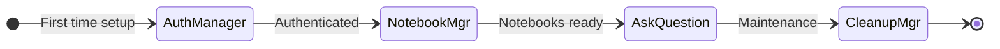
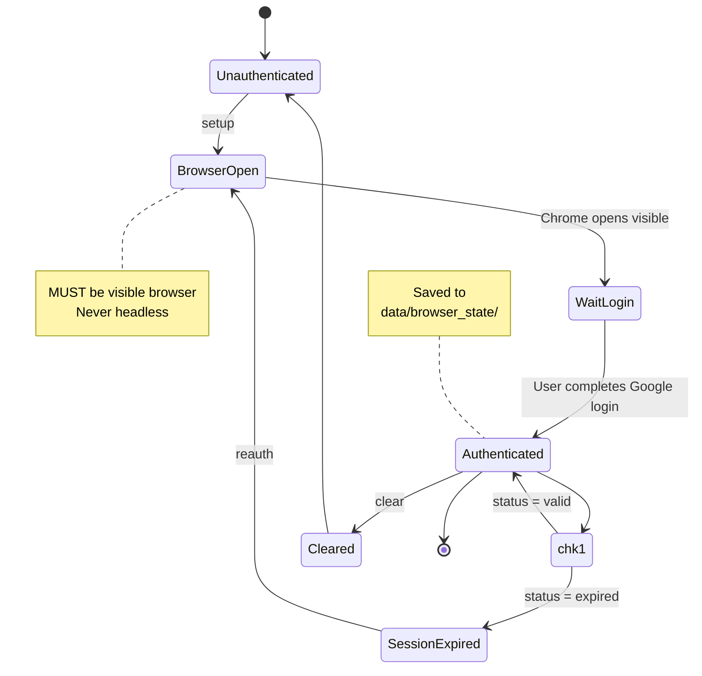
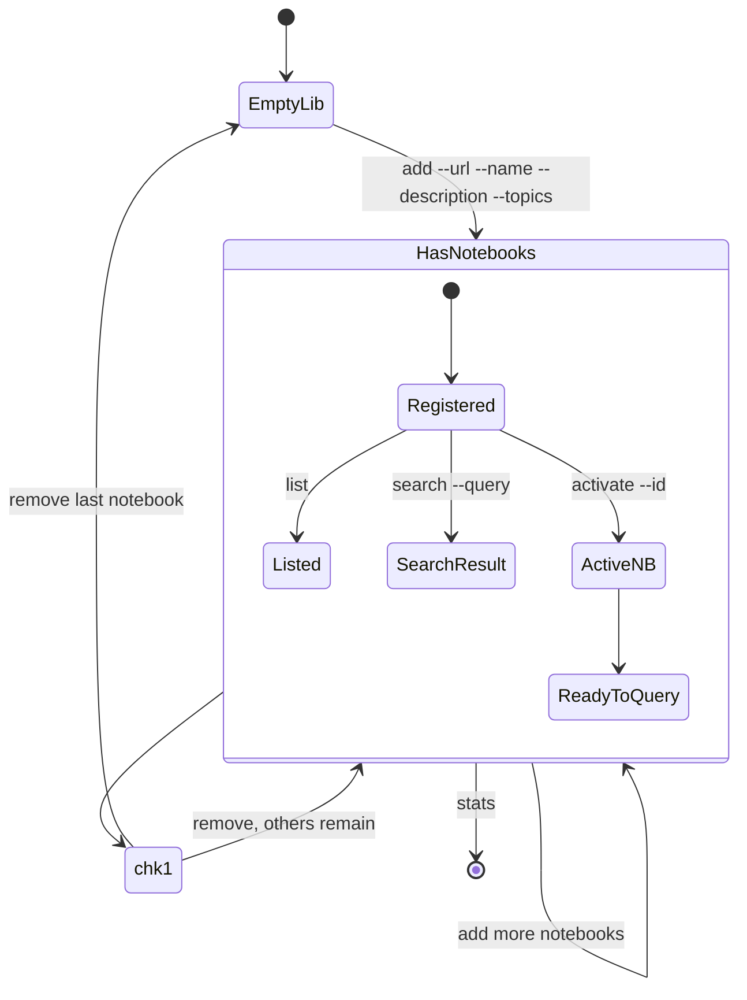
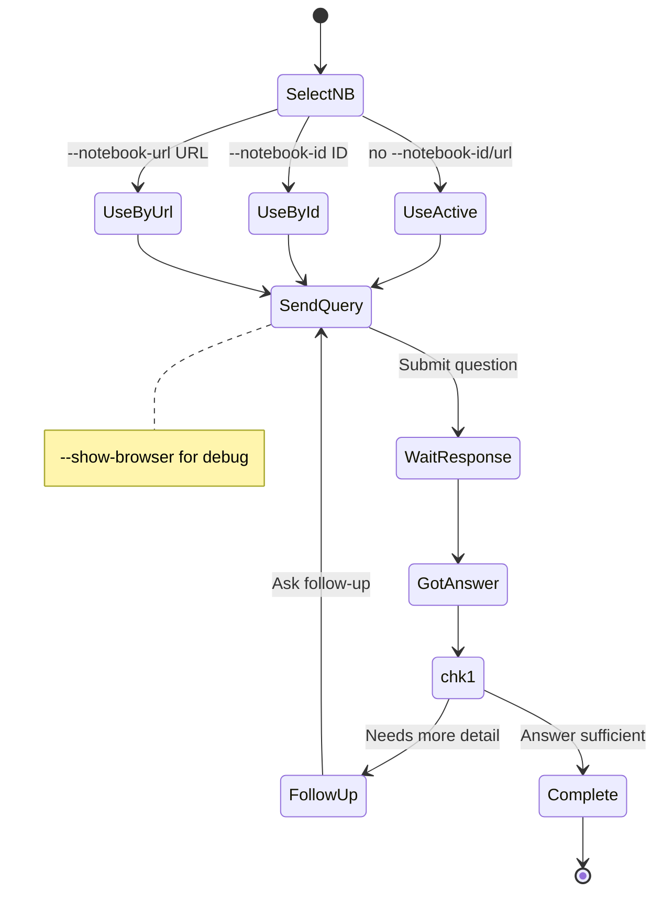
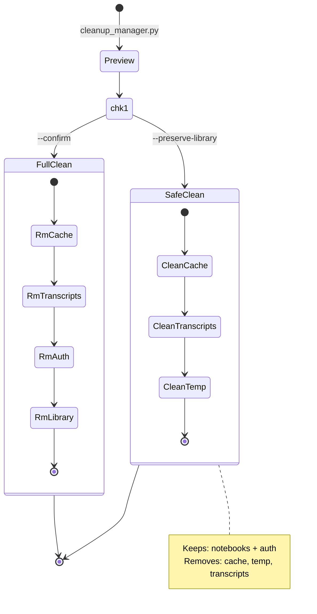
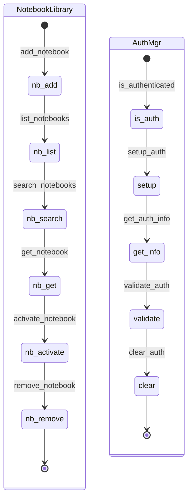

---
name: notebooklm
version: 1.0.0
description: Detailed API reference for all notebooklm scripts
---

# API Reference

## Overview



---

## Authentication Manager (`auth_manager.py`)



```bash
.\run.bat auth_manager.py setup    # First time / new account
.\run.bat auth_manager.py status   # Check session
.\run.bat auth_manager.py reauth   # Refresh expired session
.\run.bat auth_manager.py clear    # Remove all auth data
```

---

## Notebook Manager (`notebook_manager.py`)



```bash
.\run.bat notebook_manager.py add --url URL --name NAME --description DESC --topics TAGS
.\run.bat notebook_manager.py list
.\run.bat notebook_manager.py search --query KEYWORD
.\run.bat notebook_manager.py activate --id ID
.\run.bat notebook_manager.py remove --id ID
.\run.bat notebook_manager.py stats
```

| Parameter | Required | Example |
|-----------|----------|---------|
| `--url` | Yes | `https://notebooklm.google.com/notebook/...` |
| `--name` | Yes | `"API Documentation"` |
| `--description` | Yes | `"Complete REST API docs"` |
| `--topics` | Yes | `"api,rest,docs"` |

---

## Question Interface (`ask_question.py`)



```bash
.\run.bat ask_question.py --question "..."                          # Active notebook
.\run.bat ask_question.py --question "..." --notebook-id nb_abc123  # By ID
.\run.bat ask_question.py --question "..." --notebook-url URL       # By URL
.\run.bat ask_question.py --question "..." --show-browser           # Debug mode
```

| Parameter | Required | Description |
|-----------|----------|-------------|
| `--question` | Yes | Question to ask |
| `--notebook-id` | No* | Notebook ID from library |
| `--notebook-url` | No* | Direct notebook URL |
| `--show-browser` | No | Show browser window |

---

## Cleanup Manager (`cleanup_manager.py`)



```bash
.\run.bat cleanup_manager.py                    # Preview
.\run.bat cleanup_manager.py --confirm          # Full cleanup
.\run.bat cleanup_manager.py --preserve-library # Keep notebooks + auth
```

---

## Exit Codes

| Code | Meaning |
|------|---------|
| 0 | Success |
| 1 | General error |
| 2 | Authentication required |
| 3 | Notebook not found |
| 4 | Network error |
| 5 | Rate limit exceeded |

---

## Data File Structure

### `<skill-dir>/data/library.json`

```json
{
  "notebooks": [
    {
      "id": "nb_abc123",
      "name": "API Documentation",
      "description": "Complete REST API docs for v2.0",
      "topics": ["api", "rest", "documentation"],
      "url": "https://notebooklm.google.com/notebook/...",
      "added_at": "2024-01-10T12:00:00Z",
      "last_accessed": "2024-01-15T08:30:00Z"
    }
  ],
  "active_notebook_id": "nb_abc123",
  "version": "1.0.0"
}
```

### `<skill-dir>/data/auth_info.json`

```json
{
  "authenticated": true,
  "email": "user@example.com",
  "session_expires": "2024-01-20T00:00:00Z",
  "last_verified": "2024-01-15T10:00:00Z"
}
```

---

## Module Classes


