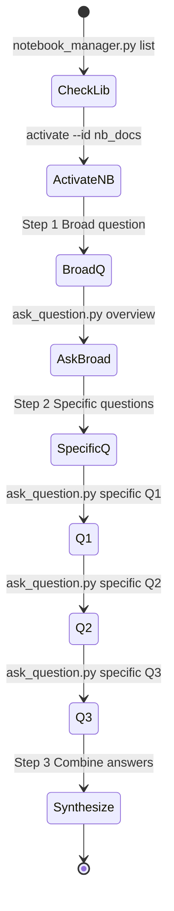
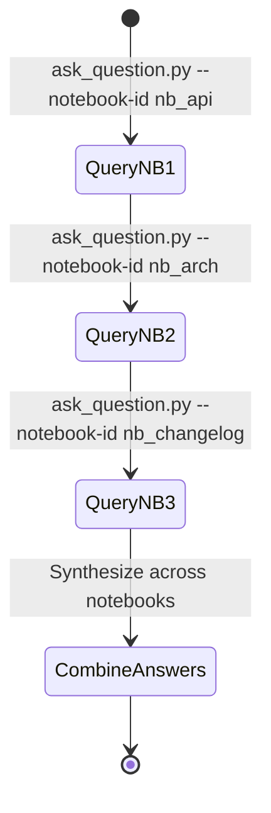
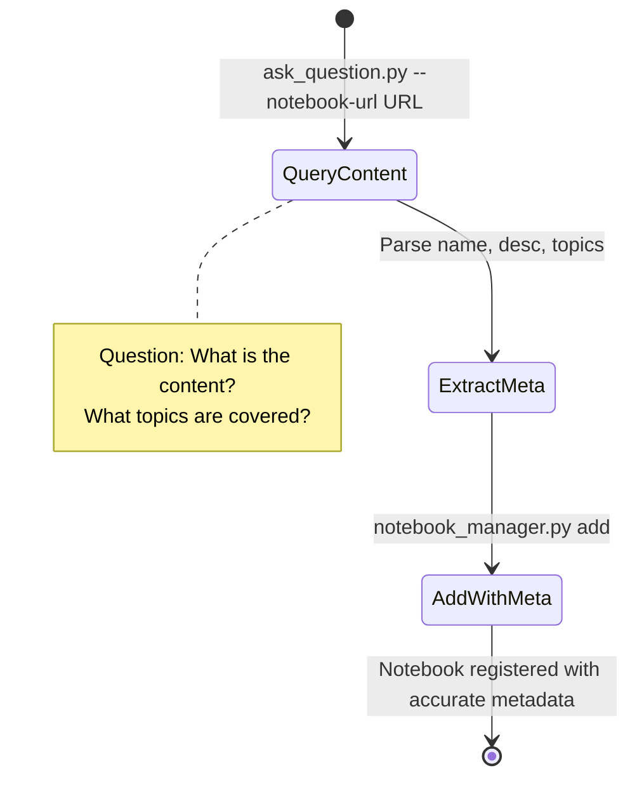
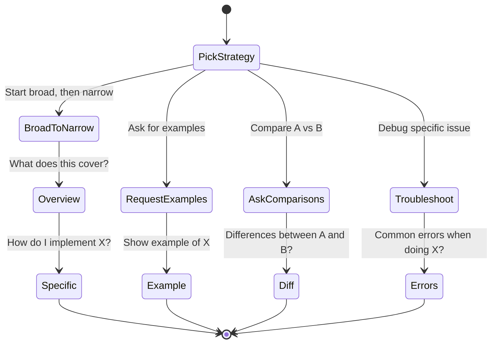
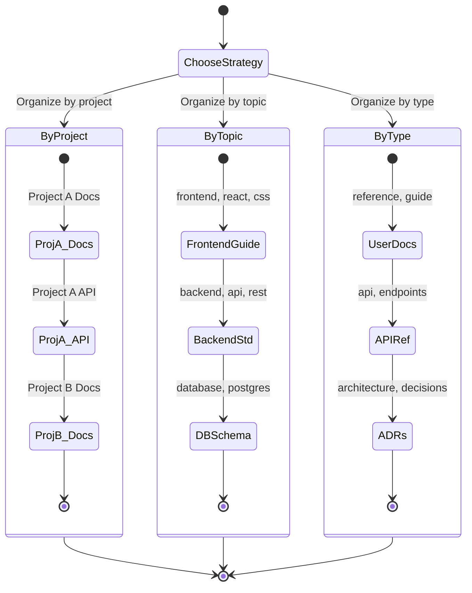
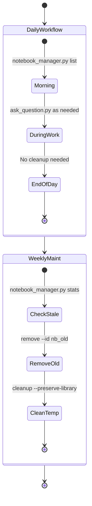
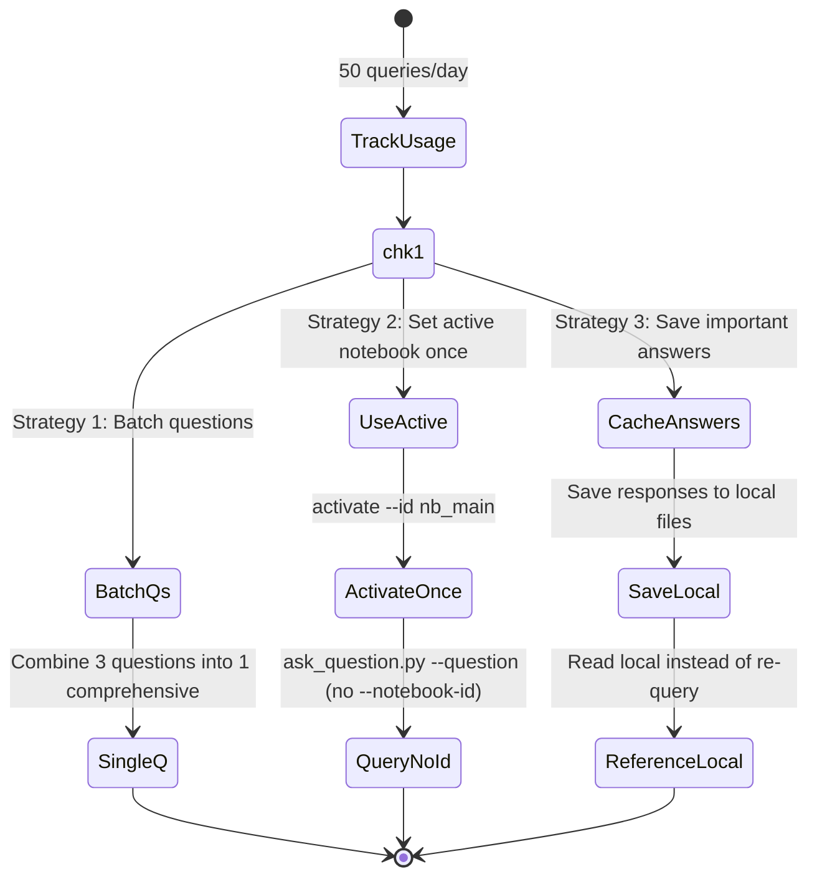
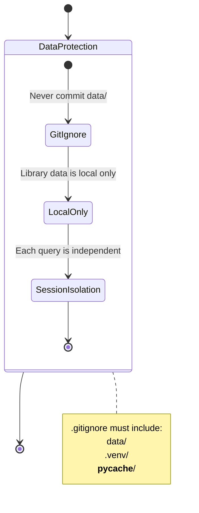
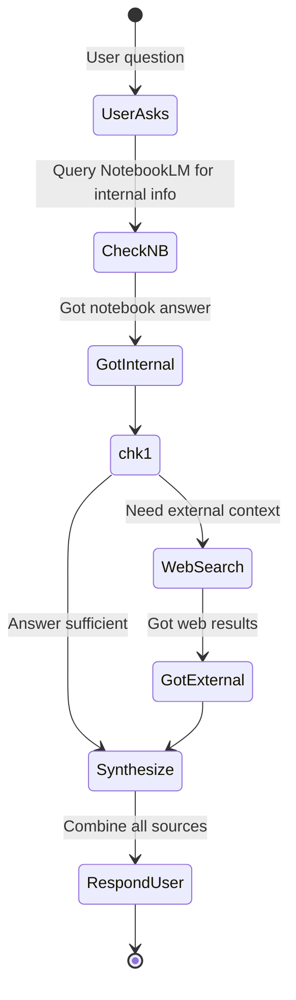

---
name: notebooklm
version: 1.0.0
description: Best practices and workflow patterns
---

# Best Practices

## Workflow Patterns

### Pattern 1: Research Session



---

### Pattern 2: Multi-Notebook Research



---

### Pattern 3: Discovery Before Add



---

## Question Strategies



### Anti-Patterns

| Avoid | Instead |
|-------|---------|
| "Tell me everything" | "What are the main sections?" |
| "What is on page 47?" | "Configuration options for X?" |
| "Fix this code" | "How to implement Y feature?" |
| "Why did they design it?" | "What does docs say about Z decision?" |

---

## Library Organization



---

## Session Management



---

## Rate Limit Management



---

## Security



---

## Integration



---

## Performance Optimization

### Query Optimization

**Fast queries:**
- Specific, focused questions
- Reference known sections
- Request specific formats

```bash
.\\run.bat ask_question.py \
  --question "List the three authentication methods from the API reference"
```

**Slower queries:**
- Open-ended questions
- Synthesis across documents
- Complex comparisons

```bash
.\\run.bat ask_question.py \
  --question "Analyze the evolution of our architecture decisions"
```

### Notebook Optimization

**For faster responses:**
- Upload focused documents (not entire wikis)
- Remove duplicate content
- Organize by topic
- Limit to 50-100 sources per notebook

---

## Common Workflows

### Onboarding New Team Member

```bash
# 1. Add onboarding docs
.\\run.bat notebook_manager.py add \
  --url "..." \
  --name "Engineering Onboarding" \
  --description "New hire guide and setup instructions" \
  --topics "onboarding,engineering,setup"

# 2. Answer their questions as they come up
.\\run.bat ask_question.py \
  --question "How do I set up the development environment?"
```

### Pre-Meeting Prep

```bash
# Query meeting notes from previous sessions
.\\run.bat ask_question.py \
  --question "What were the action items from last week's architecture review?"
```

### Code Review Context

```bash
# Query architecture docs for context
.\\run.bat ask_question.py \
  --question "What are the coding standards for this module?"
```
