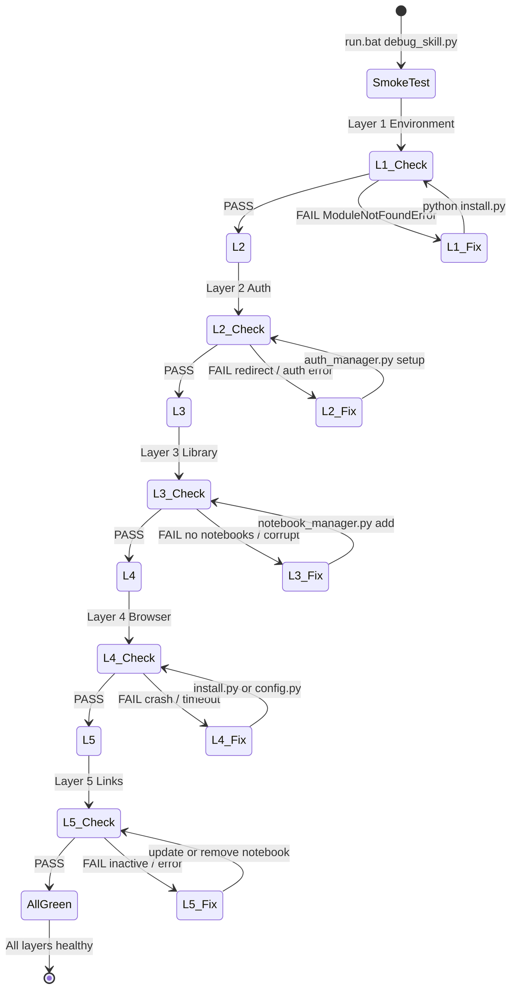
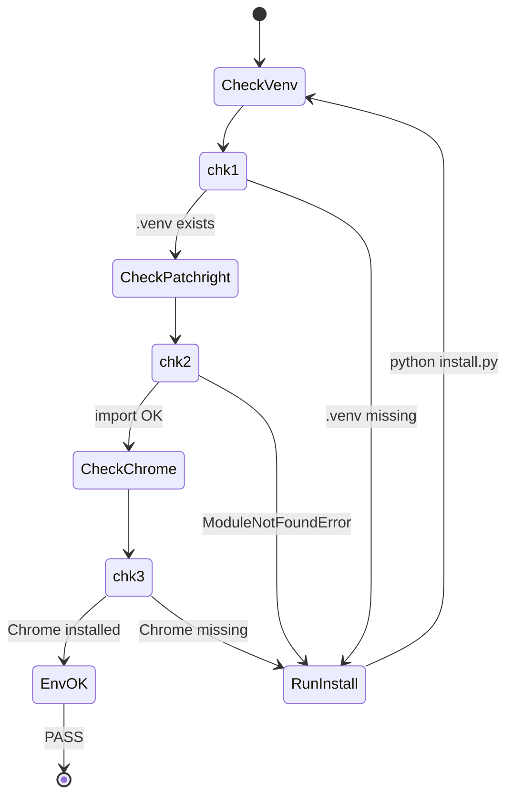
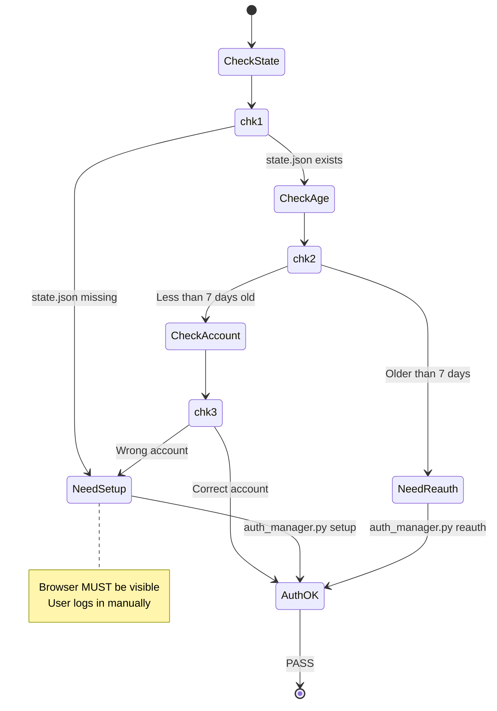
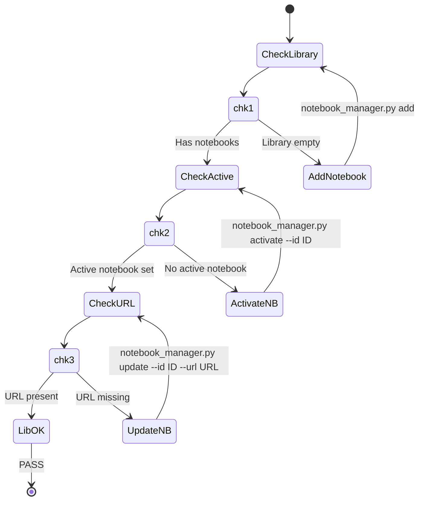
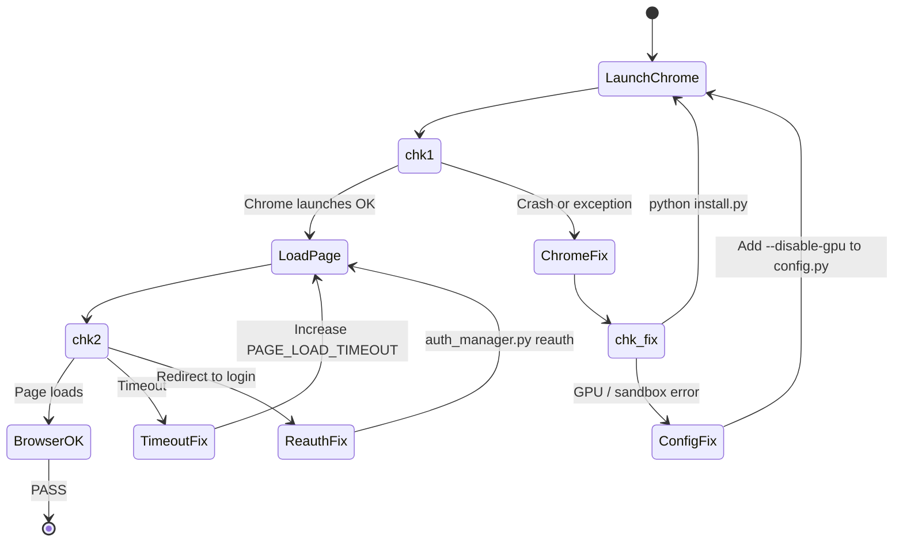
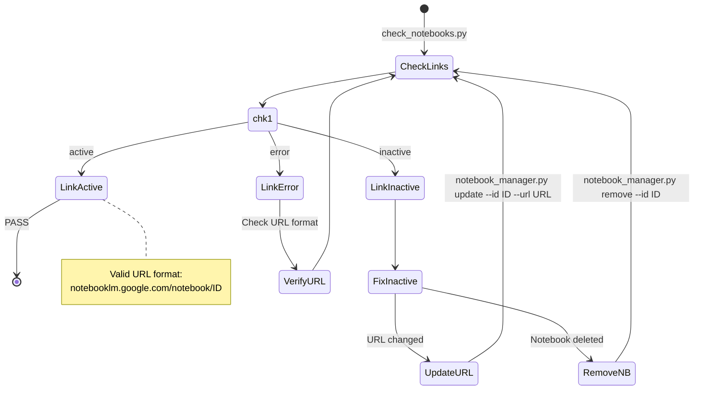
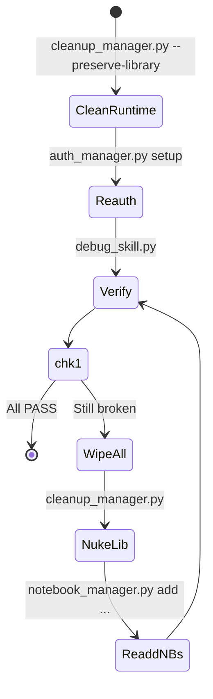

# NotebookLM Skill — Debugging Guide

```bat
.\run.bat debug_skill.py               :: Quick check
.\run.bat debug_skill.py --no-browser  :: Skip Chrome (fastest)
.\run.bat debug_skill.py --check-links :: Full check including URLs
```

---

## Debug Flow (5 Layers)



---

## Layer 1: Environment



```bat
:: Manual verify
.\.venv\Scripts\python.exe -c "import patchright; print('OK')"
```

---

## Layer 2: Auth



```bat
.\run.bat auth_manager.py status
```

---

## Layer 3: Library



```bat
.\run.bat notebook_manager.py list
.\run.bat notebook_manager.py add --url URL --name NAME --description DESC --topics TAGS
```

---

## Layer 4: Browser



```bat
:: Debug with visible browser
.\run.bat ask_question.py --question "ping" --headful
```

---

## Layer 5: Notebook Links



```bat
.\run.bat check_notebooks.py
.\run.bat notebook_manager.py update --id ID --url NEW_URL
.\run.bat notebook_manager.py remove --id ID
```

---

## Full Reset (Last Resort)



---

## Smoke Test Output

| Symbol | Meaning | Action |
|--------|---------|--------|
| `[PASS]` | Healthy | None |
| `[WARN]` | Degraded | Fix when convenient |
| `[FAIL]` | Critical | Fix before using skill |
| `[SKIP]` | Not checked | Use --check-links |
