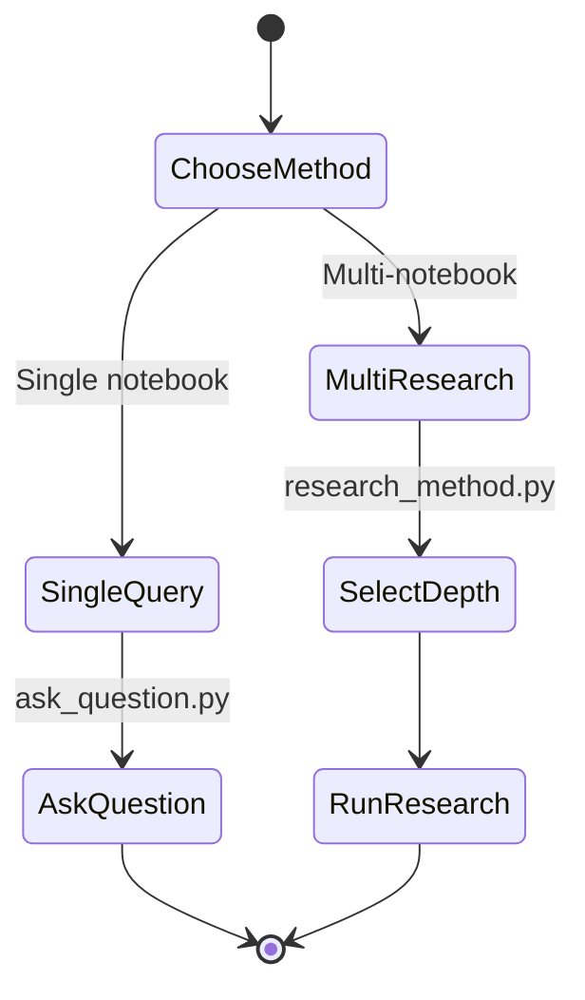
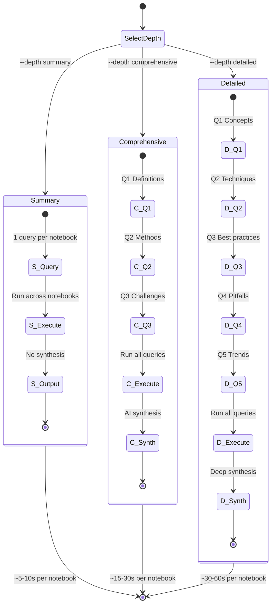
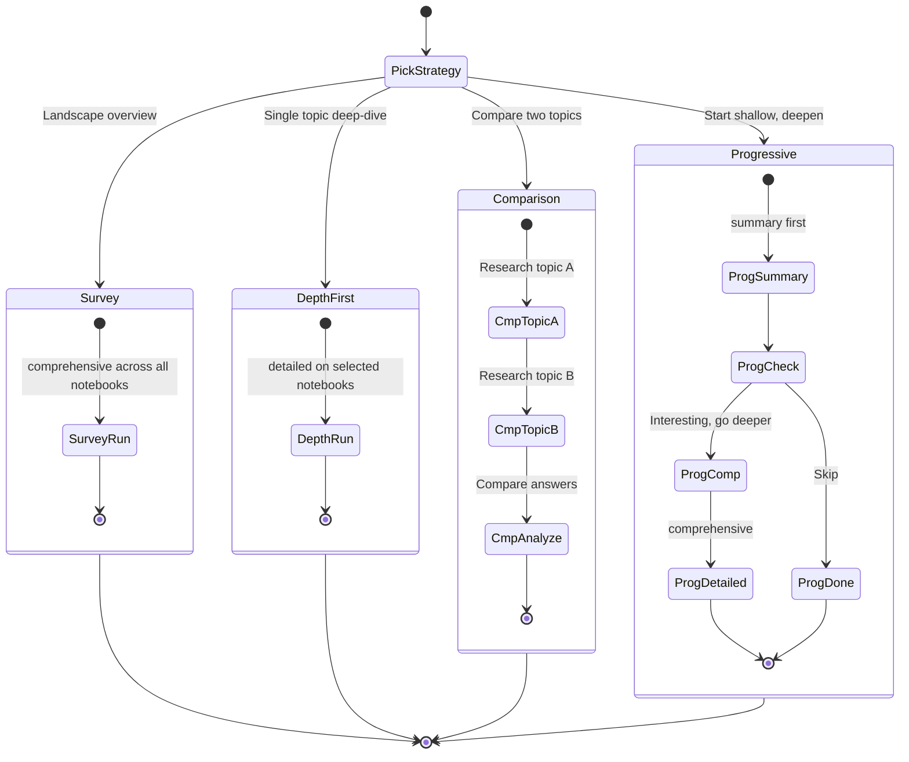
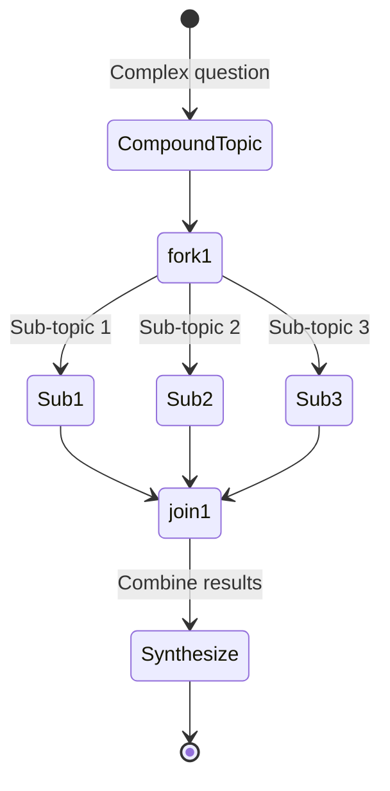

# Research Method Guide



---

## Research Depths



---

## Commands

```bash
# Single topic
.\run.bat research_method.py --topics "Authentication methods"

# Multiple topics
.\run.bat research_method.py --topics "REST APIs" "GraphQL" "gRPC" --depth comprehensive

# Specific notebooks
.\run.bat research_method.py --topics "Cloud architecture" --notebooks nb_123 nb_456

# Specific profile
.\run.bat research_method.py --topics "DevOps" --profile work-account

# Show browser
.\run.bat research_method.py --topics "Testing" --show-browser

# Export
.\run.bat research_method.py --topics "Performance" --export json
.\run.bat research_method.py --topics "Security" --export markdown
```

---

## Research Strategies



---

## Topic Decomposition



```bash
.\run.bat research_method.py \
  --topics "What is cloud computing?" "Cloud deployment models?" "Cloud service models?" \
  --depth comprehensive
```

---

## Export Formats

| Format | File | Content |
|--------|------|---------|
| JSON | `research_TOPIC_TIMESTAMP.json` | Structured data with metadata |
| Markdown | `research_TOPIC_TIMESTAMP.md` | Formatted report |
}
```

**Use JSON when:** Programmatic analysis, importing into databases, version control

### Markdown Export

**File:** `research_topic_timestamp.md`

Human-readable format with all queries and answers organized by notebook.

**Use Markdown when:** Sharing with humans, converting to docs, further editing

---

## Best Practices

### ✅ DO

- **Use specific, detailed topics** — "How do we implement caching?" vs "Caching"
- **Start with Summary** for unfamiliar topics to find relevant notebooks
- **Export and review** results before making decisions
- **Use Comprehensive for most work** — best balance of thoroughness and speed
- **Combine with ask_question.py** — follow-up on interesting findings with deeper questions

### ❌ DON'T

- **Use Detailed for casual research** — too slow, overkill for most use cases
- **Skip synthesis review** — read AI summaries critically, verify against answers
- **Research without related notebooks** — ensure your notebooks cover topic
- **Treat NotebookLM as ground truth** — always verify critical information
- **Ignore error messages** — research will note which notebooks failed

---

## Troubleshooting

### No results or empty answers

**Cause:** Topic not covered in notebooks

**Solution:**
1. Check notebook content: `.\run.bat notebook_manager.py list`
2. Add more relevant notebooks: `.\run.bat notebook_manager.py add --url ...`
3. Rephrase topic more specifically

### Research takes too long

**Cause:** Using `--depth detailed` with many notebooks

**Solution:**
1. Start with `--depth summary`
2. Use `--depth comprehensive` instead
3. Limit notebooks: `--notebooks nb1 nb2` (instead of all)

### Some notebooks fail

**Cause:** Notebook content changed or became inaccessible

**Solution:**
1. Verify notebook still works: `.\run.bat ask_question.py --notebook-id <id> --question "test"`
2. Remove inaccessible notebook: `.\run.bat notebook_manager.py remove --id <id>`
3. Re-add notebook: `.\run.bat notebook_manager.py add --url ...`

### Rate limit exceeded

**Cause:** Too many queries too fast on free Google account

**Solution:**
1. Wait until tomorrow (reset at ~midnight PST)
2. Use different Google account: `.\run.bat auth_manager.py setup --name "Account2"`
3. Use Comprehensive instead of Detailed to reduce queries

---

## Integration with ask_question.py

**Research reveals interesting findings → ask deeper questions:**

```bash
# Step 1: Research broadly
.\run.bat research_method.py --topics "Observability" --depth comprehensive

# Step 2: Pick most relevant notebook from results
# (e.g., "Platform Engineering Best Practices")

# Step 3: Ask follow-up question
.\run.bat ask_question.py \
  --question "How do we implement trace-based observability?" \
  --notebook-id <id-from-research>
```

---

## See Also

- **`api-reference.md`** — Complete API & parameters
- **`best-practices.md`** — General workflow patterns
- **`troubleshooting.md`** — Error resolution
