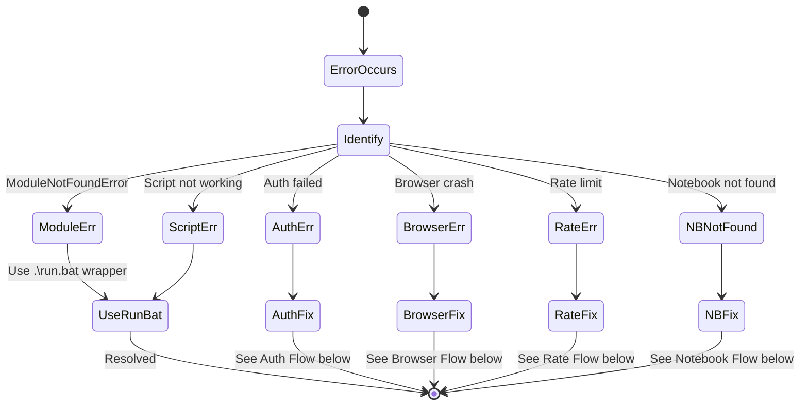
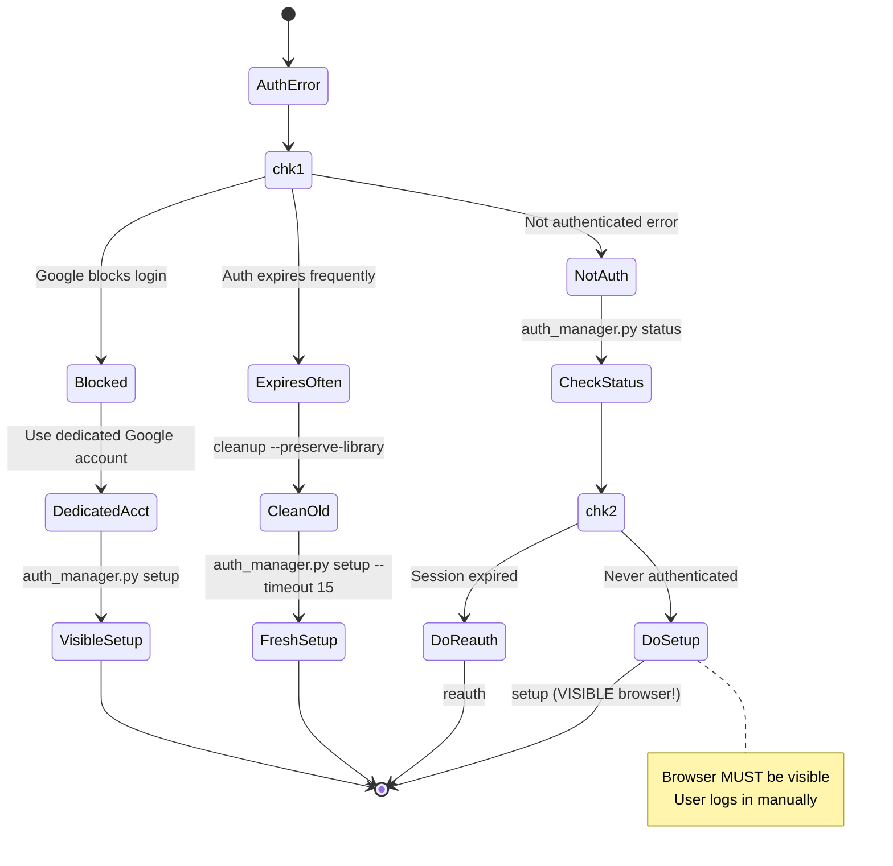
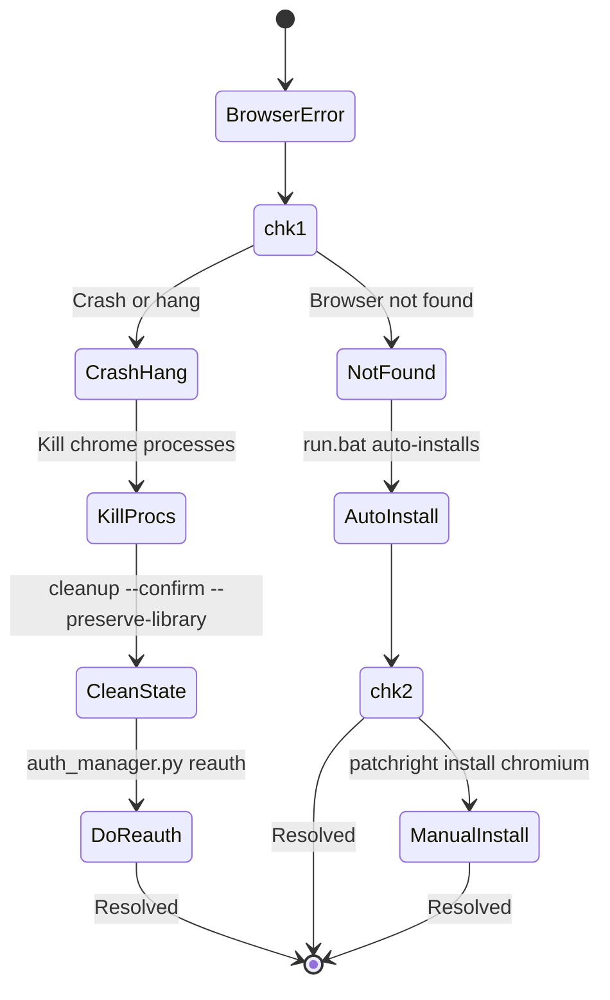
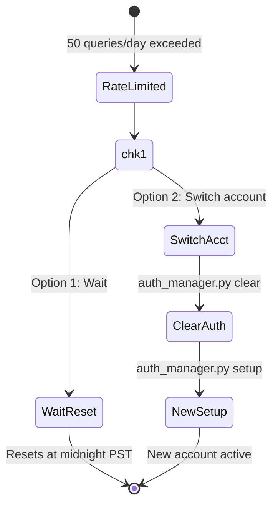
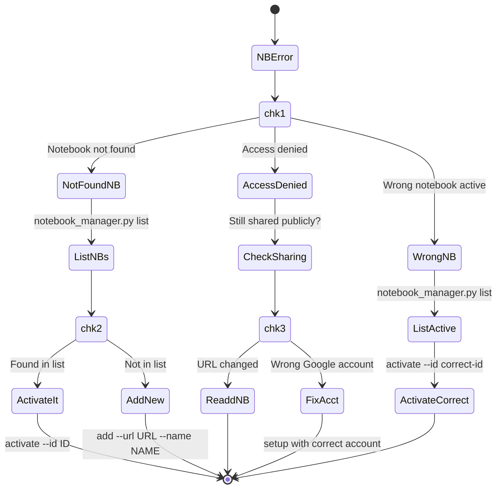
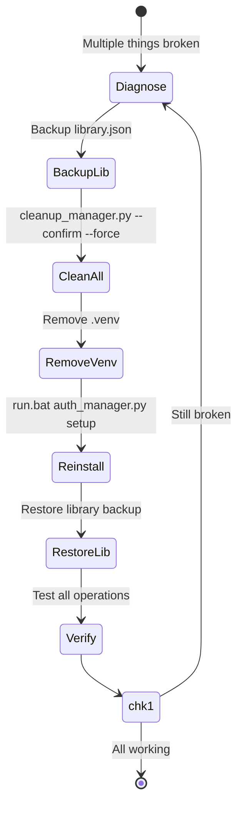

# NotebookLM Skill Troubleshooting

## Error Decision Tree



---

## Auth Errors



```bash
.\run.bat auth_manager.py status
.\run.bat auth_manager.py setup
.\run.bat auth_manager.py reauth
```

---

## Browser Errors



---

## Rate Limiting



---

## Notebook Access Errors



---

## Recovery Flow


```

### Partial recovery (keep data)
```bash
# Keep auth and library, fix execution
cd <skill-dir>
rm -rf .venv

# run.py will recreate venv automatically
.\\run.bat auth_manager.py status
```

## Error Messages Reference

### Authentication Errors
| Error | Cause | Solution |
|-------|-------|----------|
| Not authenticated | No valid auth | `run.py auth_manager.py setup` |
| Authentication expired | Session old | `run.py auth_manager.py reauth` |
| Invalid credentials | Wrong account | Check Google account |
| 2FA required | Security challenge | Complete in visible browser |

### Browser Errors
| Error | Cause | Solution |
|-------|-------|----------|
| Browser not found | Chromium missing | Use run.py (auto-installs) |
| Connection refused | Browser crashed | Kill processes, restart |
| Timeout waiting | Page slow | Increase timeout |
| Context closed | Browser terminated | Check logs for crashes |

### Notebook Errors
| Error | Cause | Solution |
|-------|-------|----------|
| Notebook not found | Invalid ID | `run.py notebook_manager.py list` |
| Access denied | Not shared | Re-share in NotebookLM |
| Invalid URL | Wrong format | Use full NotebookLM URL |
| No active notebook | None selected | `run.py notebook_manager.py activate` |

## Prevention Tips

1. **Always use run.py** - Prevents 90% of issues
2. **Regular maintenance** - Clear browser state weekly
3. **Monitor queries** - Track daily count to avoid limits
4. **Backup library** - Export notebook list regularly
5. **Use dedicated account** - Separate Google account for automation

## Getting Help

### Diagnostic information to collect
```bash
# System info
python --version
cd <skill-dir>
ls -la

# Skill status
.\\run.bat auth_manager.py status
.\\run.bat notebook_manager.py list | head -5

# Check data directory
ls -la <skill-dir>/data/
```

### Common questions

**Q: Why doesn't this work without network access?**
A: This skill requires a local environment with browser access. Use GitHub Copilot in VS Code with the skill installed locally.

**Q: Can I use multiple Google accounts?**
A: Yes, use `run.py auth_manager.py reauth` to switch.

**Q: How to increase rate limit?**
A: Use multiple accounts or upgrade to Google Workspace.

**Q: Is this safe for my Google account?**
A: Use dedicated account for automation. Only accesses NotebookLM.
