# NotebookLM Skill Usage Patterns

## Pattern 1: Initial Setup

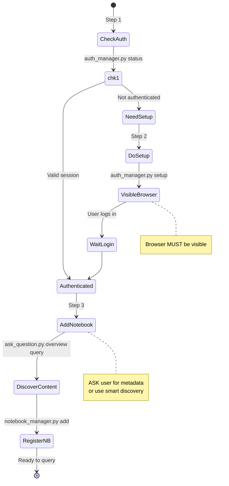

---

## Pattern 2: Adding Notebooks

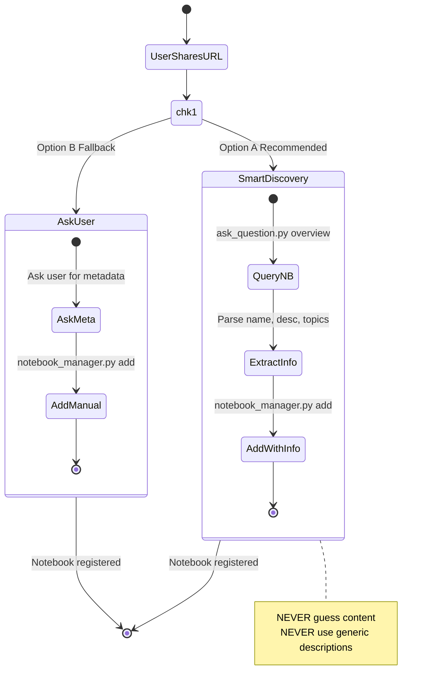

---

## Pattern 3: Daily Research

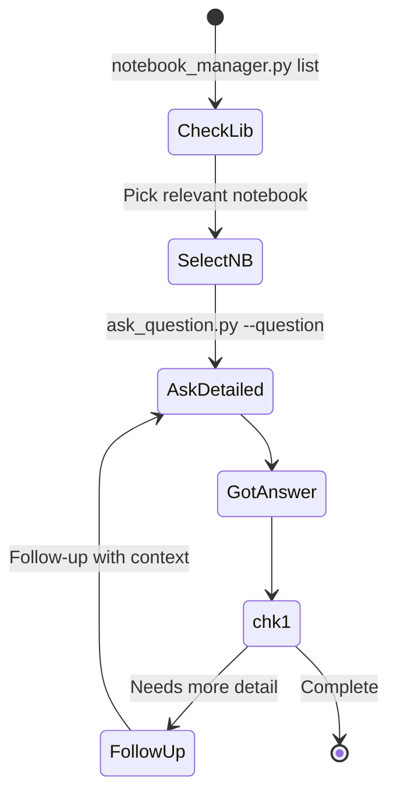

---

## Pattern 4: Follow-Up Questions

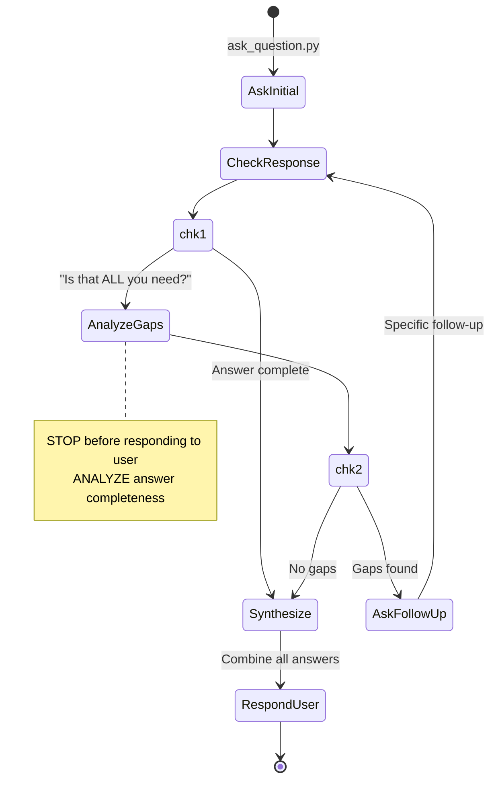

---

## Pattern 5: Multi-Notebook Research

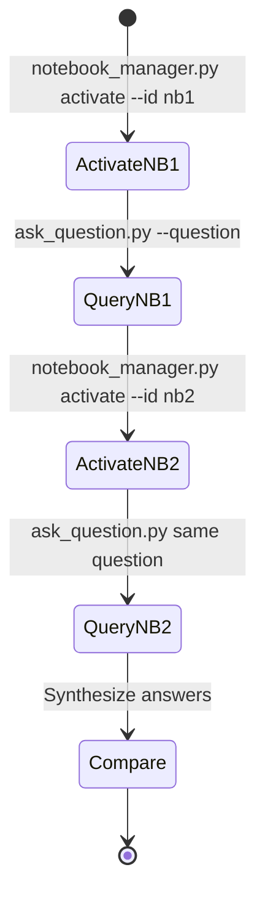

---

## Pattern 6: Error Recovery

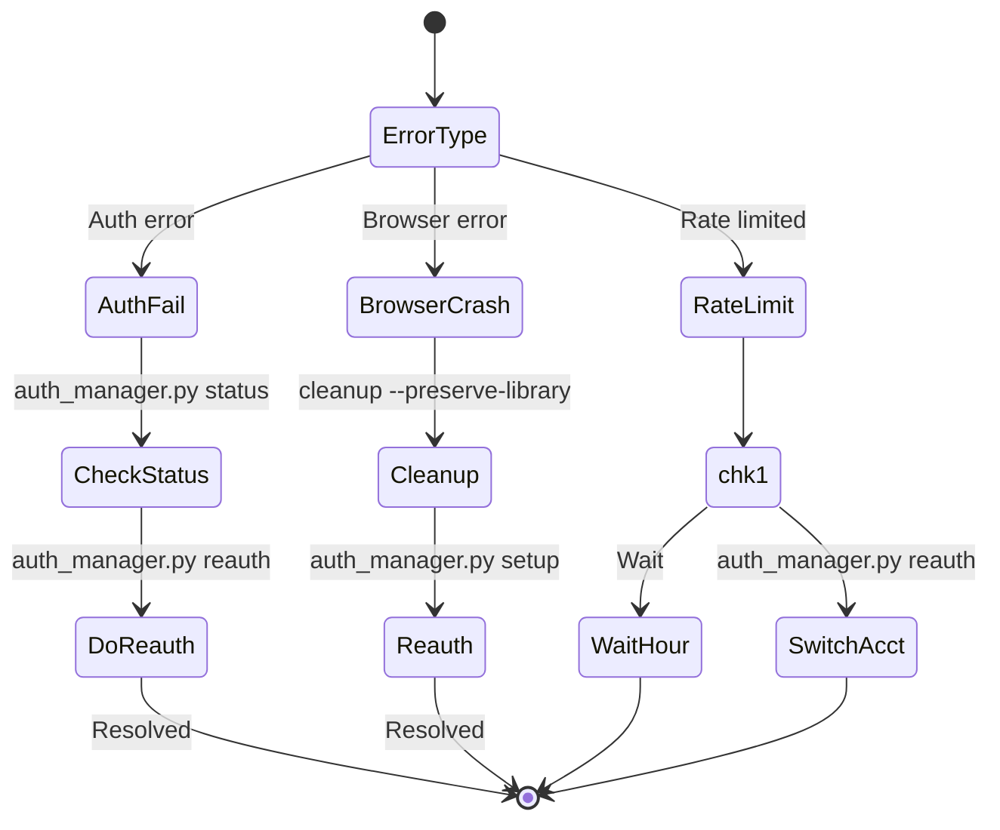

---

## Pattern 7: Batch Processing

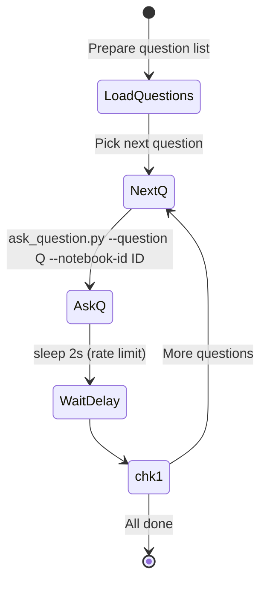

---

## Pattern 8: Notebook Organization

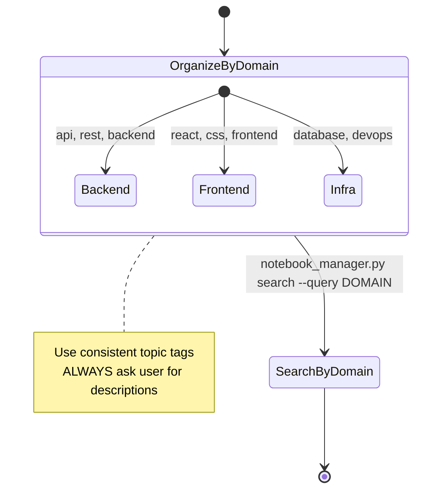

---

## Pattern 9: Library Management

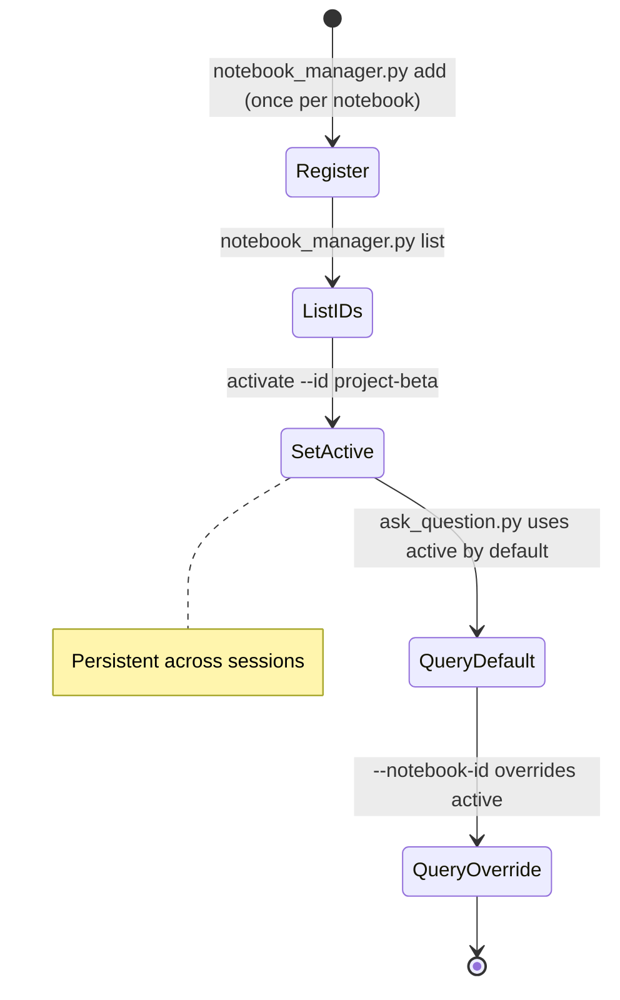

---

## Copilot Workflow: User Sends URL

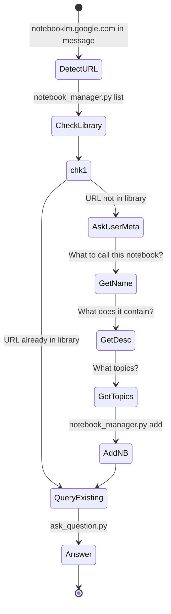

---

## Copilot Workflow: Research Task

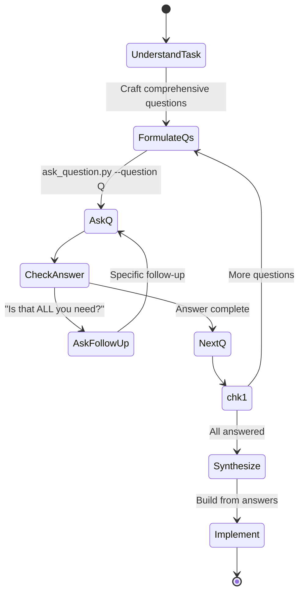
9. **Test auth regularly** - Before important tasks
10. **Document everything** - Keep notes on notebooks

## Quick Reference

```bash
# Always use run.py!
.\\run.bat [script].py [args]

# Common operations
run.py auth_manager.py status          # Check auth
run.py auth_manager.py setup           # Login (browser visible!)
run.py notebook_manager.py list        # List notebooks
run.py notebook_manager.py add ...     # Add (ask user for metadata!)
run.py ask_question.py --question ...  # Query
run.py cleanup_manager.py ...          # Clean up
```

**Remember:** When in doubt, use run.py and ask the user for notebook details!
