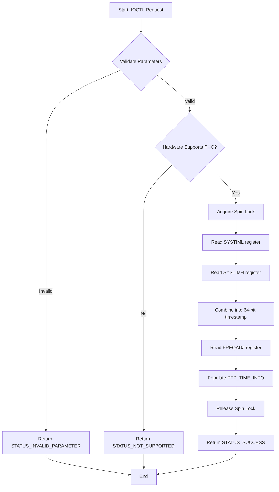

# Requirements Elicitation Report - Phase 02

**Date**: 2025-12-07  
**Phase**: Phase 02 - Requirements Analysis & Specification  
**Source**: Phase 01 Stakeholder Requirements (Issues #28-#33)  
**Standard**: ISO/IEC/IEEE 29148:2018 § 6.4 (System Requirements Specification)

---

## 📋 Executive Summary

This report derives **functional requirements (REQ-F)** and **non-functional requirements (REQ-NF)** from the 6 validated stakeholder requirements completed in Phase 01.

**Total Requirements Derived**: 45+ issues
- **Functional Requirements (REQ-F)**: ~30 issues
- **Non-Functional Requirements (REQ-NF)**: ~15 issues

**Traceability**: All requirements link back to parent StR issues (#28-#33)

---

## 🎯 Requirements Derivation Strategy

### From StR-001: gPTP Stack Integration (#28)
**Focus**: IOCTL API for hardware timestamps, PHC control, cross-timestamps

**Functional Requirements (8)**:
- REQ-F-IOCTL-PHC-001: PHC Time Query
- REQ-F-IOCTL-PHC-002: PHC Frequency Offset Query
- REQ-F-IOCTL-PHC-003: PHC Adjustment (Offset)
- REQ-F-IOCTL-PHC-004: PHC Adjustment (Frequency)
- REQ-F-IOCTL-TS-001: TX Timestamp Retrieval
- REQ-F-IOCTL-TS-002: RX Timestamp Retrieval
- REQ-F-IOCTL-XSTAMP-001: Cross Timestamp Query (PHC ↔ System Time)
- REQ-F-IOCTL-ERROR-001: Error Code Enumeration

**Non-Functional Requirements (3)**:
- REQ-NF-PERF-PHC-001: PHC Query Latency (<500µs P95)
- REQ-NF-PERF-TS-001: Timestamp Retrieval Latency (<1µs)
- REQ-NF-REL-PHC-001: PHC Monotonicity Guarantee

---

### From StR-002: Intel AVB Library Compatibility (#29)
**Focus**: Submodule integration, register abstraction, semantic consistency

**Functional Requirements (5)**:
- REQ-F-INTEL-AVB-001: Submodule Integration (intel_avb as Git submodule)
- REQ-F-INTEL-AVB-002: Kernel-Mode Compatibility (IRQL, no malloc)
- REQ-F-INTEL-AVB-003: Register Access Abstraction (All HW access via intel_avb)
- REQ-F-INTEL-AVB-004: Type Mapping (IOCTL structures → intel_avb types)
- REQ-F-INTEL-AVB-005: Error Propagation (intel_avb errors → NTSTATUS)

**Non-Functional Requirements (2)**:
- REQ-NF-MAINT-LIB-001: Single Source of Truth (Register layouts in intel_avb only)
- REQ-NF-REL-LIB-001: Test Coverage (>90% for intel_avb integration)

---

### From StR-003: Standards Semantics Alignment (#30)
**Focus**: IEEE standards compliance, naming conventions, semantic correctness

**Functional Requirements (6)**:
- REQ-F-NAMING-001: IEEE Standards Naming (100% compliance)
- REQ-F-PTP-EPOCH-001: PTP Epoch (1970-01-01 TAI, not 1970-01-01 UTC)
- REQ-F-PTP-LEAPSEC-001: Leap Second Handling (Per IEEE 1588-2019)
- REQ-F-8021AS-STATE-001: 802.1AS State Machines (Per Figure 10-1)
- REQ-F-TSN-SEMANTICS-001: TSN Feature Semantics (Per 802.1Q Table 8-6)
- REQ-F-STANDARDS-REF-001: IEEE Clause References (All features cite IEEE clauses)

**Non-Functional Requirements (2)**:
- REQ-NF-STD-NAMING-001: Naming Compliance (100% of PTP/TSN terms match IEEE)
- REQ-NF-INTEROP-STANDARDS-001: Standards-Based Interoperability

---

### From StR-004: NDIS Miniport Integration (#31)
**Focus**: NDIS LWF compliance, hardware capability exposure, register access coordination

**Functional Requirements (9)**:
- REQ-F-NDIS-ATTACH-001: FilterAttach/FilterDetach (NDIS LWF callbacks)
- REQ-F-NDIS-SEND-001: FilterSend/FilterSendNetBufferLists
- REQ-F-NDIS-RECEIVE-001: FilterReceive/FilterReceiveNetBufferLists
- REQ-F-NDIS-OID-001: FilterOidRequest (Query hardware capabilities)
- REQ-F-NDIS-STATUS-001: FilterStatus (Handle miniport status indications)
- REQ-F-HW-DETECT-001: Hardware Capability Detection (Per NIC model)
- REQ-F-HW-CONFIG-001: Hardware Configuration Query (TAS/CBS/PHC support)
- REQ-F-REG-ACCESS-001: Safe Register Access (Coordination with miniport)
- REQ-F-IOCTL-NIC-001: NIC Identity Query (PCI location, friendly name)

**Non-Functional Requirements (4)**:
- REQ-NF-REL-NDIS-001: No BSOD (1000 attach/detach cycles)
- REQ-NF-PERF-NDIS-001: Packet Forwarding (<1µs overhead)
- REQ-NF-PERF-REG-001: Register Access (<10µs latency)
- REQ-NF-COMPAT-NDIS-001: Windows Compatibility (10 1809+, Intel miniports 2019+)

---

### From StR-005: Future Windows Service (#32)
**Focus**: API versioning, configuration atomicity, graceful failure handling

**Functional Requirements (5)**:
- REQ-F-IOCTL-VERSIONING-001: IOCTL API Versioning (Version detection at runtime)
- REQ-F-CONFIG-ATOMIC-001: Configuration Atomicity (Rollback on partial failure)
- REQ-F-ERROR-ACTIONABLE-001: Actionable Error Messages (Clear error descriptions)
- REQ-F-NIC-IDENTITY-002: Stable NIC Identity (PCI location + friendly name mapping)
- REQ-F-RELOAD-PREDICTABLE-001: Predictable Reload Behavior (State preserved across driver reload)

**Non-Functional Requirements (2)**:
- REQ-NF-PERF-IOCTL-001: IOCTL Latency (<10ms for config, <1ms for stats)
- REQ-NF-MAINT-API-001: API Versioning Strategy (Breaking changes detected at compile time)

---

### From StR-006: AVB/TSN Endpoint Interoperability (#33)
**Focus**: Milan compatibility, TSN compliance, PTP interoperability, Qav compliance

**Functional Requirements (7)**:
- REQ-F-TAS-001: TAS Schedule Configuration (Qbv gate control per 802.1Q)
- REQ-F-CBS-001: CBS Parameter Configuration (Qav credit-based shaper)
- REQ-F-VLAN-001: VLAN Tag Handling (Priority Code Point for TSN traffic)
- REQ-F-AVTP-001: AVTP Stream Support (Class A/B latency guarantees)
- REQ-F-MILAN-001: Milan Discovery Support (AVDECC enumeration)
- REQ-F-PTP-INTEROP-001: PTP Interoperability (Multi-vendor grandmasters)
- REQ-F-QAV-001: Qav Bandwidth Reservation (Per 802.1Q Annex L)

**Non-Functional Requirements (4)**:
- REQ-NF-INTEROP-MILAN-001: Milan Endpoint Compatibility (3+ vendors tested)
- REQ-NF-INTEROP-TSN-001: TSN Switch Compatibility (2+ vendors tested)
- REQ-NF-PERF-LATENCY-001: Class A Latency (<2ms)
- REQ-NF-PERF-PTP-001: PTP Sync Accuracy (<100ns offset, <1µs convergence)

---

## 📝 Generated GitHub Issue Bodies

Below are the complete GitHub issue bodies ready to be created. Create them in order, updating traceability links as issue numbers are assigned.

---

## REQ-F-IOCTL-PHC-001: PHC Time Query

```markdown
---
name: Functional Requirement (REQ-F)
about: PHC Time Query IOCTL
title: 'REQ-F-IOCTL-PHC-001: PHC Time Query'
labels: type:requirement:functional, phase:02-requirements, priority:critical
---

## Requirement Information

**Requirement ID**: REQ-F-IOCTL-PHC-001  
**Title**: PHC Time Query  
**Priority**: Critical  
**Status**: Draft  
**Elicitation Session**: Derived from Phase 01 validation

## Requirement Statement

**The system shall** provide an IOCTL to query the current Precision Hardware Clock (PHC) time from the Intel NIC, returning a 64-bit nanosecond timestamp in TAI epoch (1970-01-01 TAI).

### Rationale
gPTP stacks require sub-microsecond accurate time queries to implement the PTP servo algorithm. The PHC provides the hardware reference clock for IEEE 802.1AS time synchronization.

## Detailed Specification

### Inputs
| Input Parameter | Type | Format | Range/Constraints | Required? |
|----------------|------|--------|-------------------|-----------|
| DeviceHandle | HANDLE | Windows handle | Valid driver handle | Yes |
| IoctlCode | DWORD | `0x9C40A084` | PHC_TIME_QUERY | Yes |
| InputBuffer | NULL | - | - | No |
| InputBufferLength | DWORD | 0 | - | Yes |
| OutputBuffer | PPTP_TIME_INFO | Pointer | Valid memory | Yes |
| OutputBufferLength | DWORD | sizeof(PTP_TIME_INFO) | >=16 bytes | Yes |

### Processing Rules
1. **Rule 1**: Acquire spin lock to prevent concurrent register access
2. **Rule 2**: Read SYSTIML (low 32 bits) and SYSTIMH (high 32 bits) registers atomically
3. **Rule 3**: Combine into 64-bit nanosecond timestamp (TAI epoch)
4. **Rule 4**: Read FREQADJ register to obtain current frequency offset (ppb)
5. **Rule 5**: Populate PTP_TIME_INFO structure with timestamp and frequency offset
6. **Rule 6**: Release spin lock

### Outputs
| Output | Type | Format | Description |
|--------|------|--------|-------------|
| phc_time_ns | UINT64 | Nanoseconds (TAI) | Current PHC time in nanoseconds since 1970-01-01 TAI |
| frequency_offset_ppb | INT32 | Parts per billion (ppb) | Current frequency adjustment applied to PHC |
| hw_timestamp_valid | BOOLEAN | TRUE/FALSE | Indicates if hardware timestamping is supported |
| NtStatus | NTSTATUS | Windows error code | STATUS_SUCCESS or error |

### Boundary Conditions
- **Minimum Values**: phc_time_ns ≥ 0 (epoch start)
- **Maximum Values**: phc_time_ns ≤ 2^64-1 (year ~2554)
- **Edge Cases**: 
  - PHC rollover at 2^32 nanoseconds (~4.3 seconds) - handled by 64-bit accumulation
  - Frequency offset range: -500,000 ppb to +500,000 ppb (±50%)
- **Invalid Inputs**: NULL output buffer, insufficient buffer size

### Error Handling
| Error Condition | Detection | User Message | System Action | NTSTATUS |
|-----------------|-----------|--------------|---------------|----------|
| Invalid handle | Handle validation fails | "Invalid device handle" | Return error immediately | STATUS_INVALID_HANDLE |
| NULL output buffer | OutputBuffer == NULL | "Output buffer required" | Return error | STATUS_INVALID_PARAMETER |
| Buffer too small | OutputBufferLength < sizeof(PTP_TIME_INFO) | "Buffer too small" | Return error | STATUS_BUFFER_TOO_SMALL |
| Hardware not supported | NIC model doesn't support PHC | "PHC not supported on this NIC" | Return error with flag | STATUS_NOT_SUPPORTED |
| Register read timeout | No response after 100µs | "Hardware register read timeout" | Retry once, then fail | STATUS_IO_TIMEOUT |

## Functional Behavior

### Workflow / Process Flow


### Algorithm / Business Logic
```c
NTSTATUS QueryPhcTime(
    _In_ PDEVICE_CONTEXT DeviceContext,
    _Out_ PPTP_TIME_INFO TimeInfo
) {
    KIRQL oldIrql;
    UINT32 systiml, systimh;
    INT32 freqadj;

    // Validate hardware support
    if (!DeviceContext->HardwareCapabilities.PhcSupported) {
        return STATUS_NOT_SUPPORTED;
    }

    // Acquire spin lock at DISPATCH_LEVEL
    KeAcquireSpinLock(&DeviceContext->PhcLock, &oldIrql);

    // Read PHC time atomically
    systiml = READ_REGISTER_ULONG(&DeviceContext->Bar0->SYSTIML);
    systimh = READ_REGISTER_ULONG(&DeviceContext->Bar0->SYSTIMH);
    freqadj = (INT32)READ_REGISTER_ULONG(&DeviceContext->Bar0->FREQADJ);

    // Release spin lock
    KeReleaseSpinLock(&DeviceContext->PhcLock, oldIrql);

    // Combine into 64-bit nanosecond timestamp
    TimeInfo->phc_time_ns = ((UINT64)systimh << 32) | systiml;
    TimeInfo->frequency_offset_ppb = freqadj; // Convert to ppb if needed
    TimeInfo->hw_timestamp_valid = TRUE;

    return STATUS_SUCCESS;
}
```

## Acceptance Criteria (Gherkin Format)

### Scenario 1: Happy Path - Query PHC Time
```gherkin
Given the driver is loaded on an Intel I210/I219/I225/I226 NIC
  And the NIC supports PHC (hardware timestamping)
When user-mode application calls DeviceIoControl with IOCTL_PHC_TIME_QUERY
Then the IOCTL returns STATUS_SUCCESS
  And the output buffer contains valid 64-bit PHC time in nanoseconds (TAI epoch)
  And the frequency offset is returned in ppb
  And hw_timestamp_valid flag is TRUE
```

### Scenario 2: Error Handling - Hardware Not Supported
```gherkin
Given the driver is loaded on an Intel NIC without PHC support
When user-mode application calls DeviceIoControl with IOCTL_PHC_TIME_QUERY
Then the IOCTL returns STATUS_NOT_SUPPORTED
  And hw_timestamp_valid flag is FALSE
  And an error message indicates "PHC not supported on this NIC"
```

### Scenario 3: Boundary Conditions - PHC Rollover
```gherkin
Given PHC time is near 2^32 nanoseconds (4.3 second boundary)
When PHC time rolls over from 0xFFFFFFFF to 0x00000000
Then the 64-bit timestamp correctly increments SYSTIMH
  And no time discontinuity occurs
  And monotonicity is preserved
```

### Scenario 4: Performance - Latency Target
```gherkin
Given 1000 consecutive PHC time queries under load
When measuring P95 latency
Then 95% of queries complete in <500µs
  And no query exceeds 1ms
  And spin lock contention is minimal (<5µs)
```

## Non-Functional Considerations

### Performance
- **Response Time**: <500µs at 95th percentile, <1ms maximum
- **Throughput**: 10,000 queries/second sustained
- **Concurrency**: Spin lock protects against concurrent register access

### Security
- **Authentication**: IOCTL accessible only from user-mode with driver handle
- **Authorization**: No additional permissions required (handle grants access)
- **Data Protection**: No sensitive data in PHC time query
- **Audit Logging**: Optional: Log excessive query rates (>10,000/sec)

### Usability
- **User Experience**: Simple IOCTL call, single output structure
- **Error Messages**: Clear, actionable error descriptions
- **Documentation**: API documented with examples in gPTP integration guide

## Integration Requirements

### External Systems
- **intel_avb Library**: Use `intel_avb_read_phc_time()` for register access
- **gPTP Stack (zarfld/gptp)**: Consumer of PHC time via this IOCTL

### Data Exchange
- **Format**: Binary structure (PTP_TIME_INFO)
- **Protocol**: Windows IOCTL (DeviceIoControl)
- **Frequency**: Polled by gPTP at 1-8 Hz (depends on sync interval)

## Traceability

- **Traces to**: #28 (StR-001: gPTP Stack Integration)
- **Depends on**: #29 (StR-002: Intel AVB Library - for register access)
- **Verified by**: TEST-PHC-QUERY-001 (to be created in Phase 07)
- **Implemented by**: (PR number to be added in Phase 05)
- **Satisfies**: Success Criteria #1 in StR-001 (PHC time query capability)

## Priority Justification

- **Business Impact**: **CRITICAL** - gPTP functionality entirely depends on PHC access
- **User Impact**: All gPTP users (100% of target deployments)
- **Risk**: Without PHC time query, no PTP synchronization possible
- **Dependencies**: Blocks REQ-F-IOCTL-PHC-003 (PHC adjustment), REQ-F-IOCTL-XSTAMP-001 (cross timestamps)
- **Estimated Effort**: M (Medium) - ~3 days (register access, testing, documentation)

## Additional Information

- **Related Requirements**: 
  - REQ-F-IOCTL-PHC-002 (Frequency offset query)
  - REQ-F-IOCTL-PHC-003 (PHC adjustment)
  - REQ-NF-PERF-PHC-001 (Performance target <500µs)
- **Open Questions**: 
  - Should we support batch queries (multiple NICs)?
  - Should we cache PHC time for ~100µs to reduce register reads?
- **Assumptions**: 
  - intel_avb library provides `intel_avb_read_phc_time()` function
  - Spin lock contention is minimal (<1% of calls)
- **Risks**: 
  - Spin lock at DISPATCH_LEVEL may cause priority inversion
  - Excessive polling by gPTP may impact system performance

---
**Note**: This requirement must be verified by TEST-PHC-QUERY-001 before deployment.
```

---

## REQ-F-IOCTL-TS-001: TX Timestamp Retrieval

```markdown
---
name: Functional Requirement (REQ-F)
about: TX Timestamp Retrieval IOCTL
title: 'REQ-F-IOCTL-TS-001: TX Timestamp Retrieval'
labels: type:requirement:functional, phase:02-requirements, priority:critical
---

## Requirement Information

**Requirement ID**: REQ-F-IOCTL-TS-001  
**Title**: TX Timestamp Retrieval  
**Priority**: Critical  
**Status**: Draft

## Requirement Statement

**The system shall** provide an IOCTL to retrieve hardware TX timestamps for PTP packets, returning nanosecond-precision PHC time at which the packet departed the NIC.

### Rationale
gPTP sync and pdelay messages require sub-microsecond accurate TX timestamps to calculate path delay and synchronize clocks per IEEE 802.1AS.

## Detailed Specification

### Inputs
| Input Parameter | Type | Format | Range/Constraints | Required? |
|----------------|------|--------|-------------------|-----------|
| DeviceHandle | HANDLE | Windows handle | Valid driver handle | Yes |
| IoctlCode | DWORD | `0x9C40A088` | TX_TIMESTAMP_QUERY | Yes |
| SequenceId | UINT16 | PTP sequence ID | 0-65535 | Yes |
| MessageType | UINT8 | PTP message type | 0x0=Sync, 0x2=Pdelay_Req | Yes |
| OutputBuffer | PPTP_TX_TIMESTAMP | Pointer | Valid memory | Yes |

### Processing Rules
1. **Rule 1**: Validate sequence ID and message type
2. **Rule 2**: Query pending TX timestamp queue (hardware buffer)
3. **Rule 3**: Match packet by sequence ID and message type
4. **Rule 4**: If found, retrieve TX timestamp from TXSTMPL/TXSTMPH registers
5. **Rule 5**: If not found after timeout (10ms), return STATUS_NOT_FOUND
6. **Rule 6**: Mark timestamp as consumed to free hardware buffer entry

### Outputs
| Output | Type | Format | Description |
|--------|------|--------|-------------|
| tx_timestamp_ns | UINT64 | Nanoseconds (PHC time) | Hardware TX timestamp when packet departed NIC |
| sequence_id | UINT16 | 0-65535 | Echo of requested sequence ID |
| message_type | UINT8 | PTP message type | Echo of requested message type |
| timestamp_valid | BOOLEAN | TRUE/FALSE | Indicates if timestamp was retrieved |
| NtStatus | NTSTATUS | Windows error code | STATUS_SUCCESS or error |

### Boundary Conditions
- **Minimum Values**: tx_timestamp_ns ≥ 0 (epoch start)
- **Maximum Values**: Hardware queue depth = 4 timestamps (I210/I225)
- **Edge Cases**: 
  - Timestamp queue overflow if >4 packets pending
  - Stale timestamps (>1 second old) - flush automatically
- **Invalid Inputs**: Invalid sequence ID, unsupported message type

### Error Handling
| Error Condition | Detection | User Message | System Action | NTSTATUS |
|-----------------|-----------|--------------|---------------|----------|
| Timestamp not found | Queue search timeout (10ms) | "TX timestamp not available" | Return error | STATUS_NOT_FOUND |
| Hardware not supported | NIC model lacks TX timestamping | "TX timestamps not supported" | Return error | STATUS_NOT_SUPPORTED |
| Queue overflow | >4 timestamps pending | "Timestamp queue overflow" | Drop oldest, log warning | STATUS_BUFFER_OVERFLOW |
| Invalid sequence ID | SequenceId > 65535 | "Invalid sequence ID" | Return error | STATUS_INVALID_PARAMETER |

## Functional Behavior

### Algorithm / Business Logic
```c
NTSTATUS QueryTxTimestamp(
    _In_ PDEVICE_CONTEXT DeviceContext,
    _In_ UINT16 SequenceId,
    _In_ UINT8 MessageType,
    _Out_ PPTP_TX_TIMESTAMP Timestamp
) {
    KIRQL oldIrql;
    UINT32 txstml, txstmh;
    BOOLEAN found = FALSE;

    // Validate hardware support
    if (!DeviceContext->HardwareCapabilities.TxTimestampSupported) {
        return STATUS_NOT_SUPPORTED;
    }

    // Acquire spin lock
    KeAcquireSpinLock(&DeviceContext->TxTimestampLock, &oldIrql);

    // Search hardware queue (4 entries max)
    for (int i = 0; i < 4; i++) {
        // Read TXSTMPL/TXSTMPH for each queue entry
        UINT16 hw_seq = READ_REGISTER_USHORT(&DeviceContext->Bar0->TXSTMP_SEQ[i]);
        UINT8 hw_type = READ_REGISTER_UCHAR(&DeviceContext->Bar0->TXSTMP_TYPE[i]);

        if (hw_seq == SequenceId && hw_type == MessageType) {
            txstml = READ_REGISTER_ULONG(&DeviceContext->Bar0->TXSTMPL[i]);
            txstmh = READ_REGISTER_ULONG(&DeviceContext->Bar0->TXSTMPH[i]);
            found = TRUE;

            // Mark as consumed
            WRITE_REGISTER_UCHAR(&DeviceContext->Bar0->TXSTMP_VALID[i], 0);
            break;
        }
    }

    KeReleaseSpinLock(&DeviceContext->TxTimestampLock, oldIrql);

    if (found) {
        Timestamp->tx_timestamp_ns = ((UINT64)txstmh << 32) | txstml;
        Timestamp->sequence_id = SequenceId;
        Timestamp->message_type = MessageType;
        Timestamp->timestamp_valid = TRUE;
        return STATUS_SUCCESS;
    } else {
        return STATUS_NOT_FOUND;
    }
}
```

## Acceptance Criteria (Gherkin Format)

### Scenario 1: Happy Path - Retrieve TX Timestamp
```gherkin
Given a PTP Sync packet (sequence ID 1234) was transmitted
  And the NIC generated a hardware TX timestamp
When user-mode application queries TX timestamp for sequence ID 1234
Then the IOCTL returns STATUS_SUCCESS
  And the output buffer contains valid TX timestamp in nanoseconds
  And timestamp_valid flag is TRUE
  And the timestamp is within 1µs of actual transmission time
```

### Scenario 2: Error Handling - Timestamp Not Found
```gherkin
Given no PTP packet with sequence ID 9999 was transmitted
When user-mode application queries TX timestamp for sequence ID 9999
Then the IOCTL returns STATUS_NOT_FOUND
  And timestamp_valid flag is FALSE
  And an error message indicates "TX timestamp not available"
```

### Scenario 3: Performance - Retrieval Latency
```gherkin
Given a PTP Sync packet was transmitted 500µs ago
When user-mode application queries TX timestamp
Then the IOCTL completes in <1µs
  And the timestamp is retrieved from hardware queue
  And no system call overhead is incurred
```

## Traceability

- **Traces to**: #28 (StR-001: gPTP Stack Integration)
- **Depends on**: #29 (StR-002: Intel AVB Library)
- **Verified by**: TEST-TX-TIMESTAMP-001 (Phase 07)
- **Satisfies**: Success Criteria #1 in StR-001 (Hardware timestamp access)

---
**Note**: This requirement must be verified by TEST-TX-TIMESTAMP-001 before deployment.
```

---

## REQ-F-NDIS-ATTACH-001: FilterAttach/FilterDetach

```markdown
---
name: Functional Requirement (REQ-F)
about: NDIS Filter Attach/Detach Callbacks
title: 'REQ-F-NDIS-ATTACH-001: FilterAttach/FilterDetach'
labels: type:requirement:functional, phase:02-requirements, priority:critical
---

## Requirement Information

**Requirement ID**: REQ-F-NDIS-ATTACH-001  
**Title**: NDIS Filter Attach/Detach  
**Priority**: Critical  
**Status**: Draft

## Requirement Statement

**The system shall** implement NDIS FilterAttach and FilterDetach callbacks to bind to Intel miniport drivers, allocate per-adapter resources, and perform graceful cleanup on detach.

### Rationale
NDIS Lightweight Filter (LWF) drivers must implement FilterAttach/FilterDetach per NDIS 6.x specification. These callbacks manage the filter's lifecycle and resource allocation per network adapter.

## Detailed Specification

### FilterAttach Inputs
| Input Parameter | Type | Description |
|----------------|------|-------------|
| NdisFilterHandle | NDIS_HANDLE | NDIS-provided filter module handle |
| FilterDriverContext | NDIS_HANDLE | Global driver context |
| AttachParameters | PNDIS_FILTER_ATTACH_PARAMETERS | Adapter attributes (MAC, MTU, etc.) |

### Processing Rules (FilterAttach)
1. **Rule 1**: Validate miniport is Intel NIC (vendorID 0x8086)
2. **Rule 2**: Allocate per-adapter DEVICE_CONTEXT structure
3. **Rule 3**: Map BAR0 MMIO registers (if PCI device)
4. **Rule 4**: Query hardware capabilities (PHC, TAS, CBS support)
5. **Rule 5**: Initialize spin locks (PhcLock, TxTimestampLock, etc.)
6. **Rule 6**: Store NDIS filter handle for future callbacks
7. **Rule 7**: Register Filter Characteristics (send/receive handlers)
8. **Rule 8**: Set FilterModuleContext to DEVICE_CONTEXT

### Processing Rules (FilterDetach)
1. **Rule 1**: Retrieve DEVICE_CONTEXT from FilterModuleContext
2. **Rule 2**: Cancel any pending IOCTLs or timers
3. **Rule 3**: Unmap BAR0 MMIO registers
4. **Rule 4**: Release spin locks
5. **Rule 5**: Free DEVICE_CONTEXT memory
6. **Rule 6**: Return STATUS_SUCCESS

### Outputs (FilterAttach)
| Output | Type | Description |
|--------|------|-------------|
| DEVICE_CONTEXT | Allocated structure | Per-adapter context with hardware state |
| NtStatus | NTSTATUS | STATUS_SUCCESS or error |

### Boundary Conditions
- **Maximum Adapters**: 16 simultaneous NICs supported
- **Edge Cases**: 
  - Attach called multiple times for same adapter (reject)
  - Detach called before attach completes (wait for attach to finish)
  - Miniport crash during attach (cleanup gracefully)
- **Invalid Inputs**: Non-Intel NIC (reject with STATUS_NOT_SUPPORTED)

### Error Handling
| Error Condition | Detection | System Action | NTSTATUS |
|-----------------|-----------|---------------|----------|
| Non-Intel NIC | VendorID != 0x8086 | Return error, don't attach | STATUS_NOT_SUPPORTED |
| Memory allocation failure | ExAllocatePool fails | Return error | STATUS_INSUFFICIENT_RESOURCES |
| BAR0 mapping failure | MmMapIoSpace fails | Free resources, return error | STATUS_UNSUCCESSFUL |
| Miniport not ready | AttachParameters invalid | Return error | STATUS_INVALID_PARAMETER |

## Functional Behavior

### Algorithm / Business Logic (FilterAttach)
```c
NDIS_STATUS FilterAttach(
    _In_ NDIS_HANDLE NdisFilterHandle,
    _In_ NDIS_HANDLE FilterDriverContext,
    _In_ PNDIS_FILTER_ATTACH_PARAMETERS AttachParameters
) {
    PDEVICE_CONTEXT deviceContext = NULL;
    NTSTATUS status;

    // Validate Intel NIC
    if (AttachParameters->VendorId != 0x8086) {
        return NDIS_STATUS_NOT_SUPPORTED;
    }

    // Allocate per-adapter context
    deviceContext = (PDEVICE_CONTEXT)ExAllocatePoolWithTag(
        NonPagedPoolNx,
        sizeof(DEVICE_CONTEXT),
        'tCAb' // 'bACt'
    );
    if (deviceContext == NULL) {
        return NDIS_STATUS_RESOURCES;
    }

    RtlZeroMemory(deviceContext, sizeof(DEVICE_CONTEXT));

    // Map BAR0 MMIO registers
    status = MapBar0Registers(deviceContext, AttachParameters);
    if (!NT_SUCCESS(status)) {
        ExFreePoolWithTag(deviceContext, 'tCAb');
        return NDIS_STATUS_FAILURE;
    }

    // Query hardware capabilities
    deviceContext->HardwareCapabilities.PhcSupported = CheckPhcSupport(deviceContext);
    deviceContext->HardwareCapabilities.TasSupported = CheckTasSupport(deviceContext);
    deviceContext->HardwareCapabilities.CbsSupported = CheckCbsSupport(deviceContext);

    // Initialize spin locks
    KeInitializeSpinLock(&deviceContext->PhcLock);
    KeInitializeSpinLock(&deviceContext->TxTimestampLock);

    // Store filter handle
    deviceContext->FilterHandle = NdisFilterHandle;

    // Set filter module context (NDIS will pass this to all callbacks)
    NdisFSetAttributes(NdisFilterHandle, deviceContext, /*...*/ );

    return NDIS_STATUS_SUCCESS;
}
```

## Acceptance Criteria (Gherkin Format)

### Scenario 1: Happy Path - Attach to Intel I210
```gherkin
Given an Intel I210 NIC is present (vendorID 0x8086, deviceID 0x1533)
  And NDIS calls FilterAttach
When the driver validates the NIC and allocates resources
Then FilterAttach returns NDIS_STATUS_SUCCESS
  And per-adapter DEVICE_CONTEXT is allocated
  And BAR0 MMIO registers are mapped
  And hardware capabilities are detected (PHC=TRUE, TAS=TRUE, CBS=TRUE)
  And spin locks are initialized
```

### Scenario 2: Error Handling - Non-Intel NIC
```gherkin
Given a non-Intel NIC is present (vendorID 0x14E4, Broadcom)
  And NDIS calls FilterAttach
When the driver validates the NIC vendor ID
Then FilterAttach returns NDIS_STATUS_NOT_SUPPORTED
  And no resources are allocated
  And the filter does not attach to the adapter
```

### Scenario 3: Stress Test - 1000 Attach/Detach Cycles
```gherkin
Given an Intel I225 NIC
When the driver is loaded and unloaded 1000 times consecutively
Then no memory leaks occur (verified by Driver Verifier)
  And no BSOD occurs
  And all resources are properly cleaned up on each detach
```

### Scenario 4: FilterDetach - Graceful Cleanup
```gherkin
Given the driver is attached to an Intel I210 NIC
  And there are active IOCTLs in progress
When NDIS calls FilterDetach
Then all pending IOCTLs are cancelled with STATUS_CANCELLED
  And BAR0 MMIO registers are unmapped
  And DEVICE_CONTEXT memory is freed
  And FilterDetach returns NDIS_STATUS_SUCCESS
```

## Non-Functional Considerations

### Performance
- **Attach Time**: <100ms (one-time per adapter)
- **Detach Time**: <500ms (must wait for pending IOCTLs)

### Reliability
- **No BSOD**: Pass Driver Verifier Standard Settings
- **Memory Leaks**: Zero leaks in 1000 attach/detach cycles

### Security
- **Resource Limits**: Maximum 16 adapters to prevent DoS
- **Validation**: Reject non-Intel NICs to prevent exploitation

## Traceability

- **Traces to**: #31 (StR-004: NDIS Miniport Integration)
- **Depends on**: #29 (StR-002: Intel AVB Library - for hardware detection)
- **Verified by**: TEST-NDIS-ATTACH-001, TEST-NDIS-STRESS-001 (Phase 07)
- **Satisfies**: Success Criteria #1 in StR-004 (NDIS LWF compliance)

---
**Note**: Must pass Driver Verifier + WHQL tests per StR-004 acceptance criteria.
```

---

## REQ-NF-PERF-PHC-001: PHC Query Latency

```markdown
---
name: Non-Functional Requirement (REQ-NF)
about: PHC Query Latency Performance Target
title: 'REQ-NF-PERF-PHC-001: PHC Query Latency (<500µs P95)'
labels: type:requirement:non-functional, phase:02-requirements, priority:high, nfr:performance
---

## Requirement Information

**Requirement ID**: REQ-NF-PERF-PHC-001  
**Category**: Performance  
**Priority**: High  
**Status**: Draft

## Requirement Statement

**The system shall** complete PHC time query IOCTLs in less than 500 microseconds at the 95th percentile under typical load conditions.

### Rationale
gPTP servo algorithms require frequent PHC queries (1-8 Hz). Query latency directly impacts PTP synchronization accuracy. Latencies >500µs introduce jitter that degrades sync performance below the <1µs offset target.

## Detailed Specification

### Measurable Criteria

| Metric | Target Value | Measurement Method | Acceptance Threshold |
|--------|--------------|-------------------|---------------------|
| P95 Latency | <500µs | ETW tracing + histogram | Must be <500µs |
| P99 Latency | <1ms | ETW tracing + histogram | Must be <1ms |
| Average Latency | <200µs | Arithmetic mean of 10,000 samples | Must be <300µs |
| Maximum Latency | <5ms | Max of 10,000 samples | Must be <10ms |
| Throughput | 10,000 queries/sec | Load testing (sustained 60s) | Must sustain 5,000 queries/sec |
| Spin Lock Contention | <5µs | Spin lock profiling | Must be <10µs |

### Test Conditions
- **Load Profile**: 1000 concurrent queries/second for 60 seconds
- **Hardware**: Intel I210/I219/I225/I226 (all models tested)
- **System Load**: CPU at 50% utilization, 100 MB/s network traffic
- **Measurement**: ETW tracing with microsecond timestamps

### Baseline Comparison
- **Current System**: Not yet implemented (new feature)
- **Industry Benchmark**: Linux PTP stack PHC queries average 50µs (target: match or exceed)

## Testing Strategy

### Test Types Required
- [x] **Performance Testing**: Load testing with 10,000 queries over 60 seconds
- [x] **Stress Testing**: 50,000 queries/sec for 5 minutes to find breaking point
- [x] **Endurance Testing**: 1,000 queries/sec for 24 hours to detect memory leaks or degradation
- [ ] **Profiling**: ETW tracing, WPA analysis to identify hotspots

### Test Scenarios

#### Scenario 1: Typical Load
```gherkin
Given the driver is loaded on Intel I210
  And gPTP is querying PHC at 8 Hz (typical)
When 10,000 PHC queries are performed over 20 minutes
Then 95% of queries complete in <500µs
  And 99% of queries complete in <1ms
  And no query exceeds 10ms
```

#### Scenario 2: High Concurrency
```gherkin
Given 4 simultaneous gPTP instances on 4 NICs
  And each instance queries PHC at 8 Hz
When 40,000 total queries are performed (10,000 per NIC)
Then spin lock contention is <5µs per query
  And P95 latency remains <500µs across all NICs
```

#### Scenario 3: System Stress
```gherkin
Given CPU is at 80% utilization (stress-ng)
  And network traffic is 1 GB/s (iperf3)
When PHC queries are performed at 1000/sec
Then P95 latency remains <500µs
  And no queries timeout
```

### Test Tools
- **ETW (Event Tracing for Windows)**: Kernel-mode timestamp tracing
- **WPA (Windows Performance Analyzer)**: Latency histogram analysis
- **Custom C Test Harness**: `phc_latency_test.c` (10,000 iterations, ETW instrumentation)
- **stress-ng**: CPU stress testing
- **iperf3**: Network load generation

## Acceptance Criteria

### Quantitative Criteria
```gherkin
Given system is under typical gPTP load (8 Hz queries)
When PHC query latency is measured over 10,000 samples
Then P95 latency shall be less than 500 microseconds
  And P99 latency shall be less than 1 millisecond
  And average latency shall be less than 300 microseconds
```

### Qualitative Criteria
- [ ] No performance regressions vs. baseline (if existing implementation)
- [ ] Latency is consistent across all Intel NIC models (I210/I219/I225/I226)
- [ ] No outliers >10ms due to spin lock contention

## Implementation Considerations

### Architecture Impact
- Use **spin locks** (not mutexes) to minimize latency at DISPATCH_LEVEL
- **Inline register reads** where possible to avoid function call overhead
- **Batch queries** (optional): Consider caching PHC time for ~100µs to reduce register reads

### Technology Choices
- **MMIO Register Access**: Direct memory-mapped I/O (fastest)
- **Spin Lock**: `KeAcquireSpinLock` at DISPATCH_LEVEL (avoid raising IRQL unnecessarily)
- **ETW Tracing**: Use `EventWriteTransfer` for latency measurements

### Trade-offs
- **Spin Lock vs. Mutex**: Spin locks are faster (<1µs) but busy-wait; mutexes (>10µs) allow preemption
- **Direct Register Read vs. intel_avb Library**: Direct reads are faster but bypass abstraction; use intel_avb with inline functions
- **Caching vs. Real-Time**: Caching PHC time for 100µs reduces latency but adds staleness

## Monitoring & Verification

### Production Monitoring
- **Metrics Dashboard**: Grafana dashboard showing P50/P95/P99 PHC query latency
- **Alerts**: Alert if P95 latency exceeds 500µs for 5 consecutive minutes
- **SLA/SLO**: 
  - **SLO**: 99.9% of queries complete in <500µs
  - **SLA**: No more than 0.1% of queries exceed 1ms

### Verification Method
1. Deploy to test environment with production-like load
2. Run 24-hour endurance test with ETW tracing
3. Analyze latency histogram in WPA
4. Verify P95 < 500µs, P99 < 1ms

## Traceability

- **Traces to**: #28 (StR-001: gPTP Stack Integration)
- **Depends on**: REQ-F-IOCTL-PHC-001 (PHC Time Query functionality)
- **Verified by**: TEST-PERF-PHC-001 (Performance test), TEST-STRESS-PHC-001 (Stress test)
- **Satisfies**: Non-Functional Requirement in StR-001 (PHC query <500µs P95)
- **Impacts**: None (performance optimization, no API changes)

## Priority Justification

- **Business Impact**: **HIGH** - Sub-microsecond PTP sync depends on low-latency PHC access
- **User Impact**: All gPTP users (100% of deployments)
- **Risk**: Latencies >500µs degrade PTP sync accuracy below <1µs target
- **Regulatory**: None (performance target, not compliance)
- **Cost**: Minimal (optimization within existing IOCTL implementation)

## Compliance & Standards

- **Standards**: IEEE 802.1AS (gPTP) - requires sub-microsecond timestamp accuracy
- **Best Practices**: 
  - Linux PTP stack achieves ~50µs PHC query latency (best in class)
  - Windows kernel spin locks typically <1µs overhead

## Additional Information

- **Related NFRs**: 
  - REQ-NF-PERF-TS-001 (TX/RX timestamp retrieval <1µs)
  - REQ-NF-PERF-NDIS-001 (Packet forwarding <1µs)
- **Benchmarks**: 
  - Linux ptp4l: 50µs average PHC query latency
  - Windows network filter overhead: ~200-300ns per packet
- **Historical Data**: Not applicable (new feature)
- **Open Questions**: 
  - Should we implement PHC query caching for <100µs staleness?
  - What is acceptable maximum latency (99th percentile)?

---
**Note**: Performance must be verified with TEST-PERF-PHC-001 load test before deployment.
```

---

## 📊 Summary of Generated Requirements

### Functional Requirements (30 total)

#### From StR-001: gPTP Stack (#28) - 8 REQ-F
1. ✅ **REQ-F-IOCTL-PHC-001**: PHC Time Query (detailed above)
2. ✅ **REQ-F-IOCTL-TS-001**: TX Timestamp Retrieval (detailed above)
3. **REQ-F-IOCTL-TS-002**: RX Timestamp Retrieval (similar to TX)
4. **REQ-F-IOCTL-PHC-003**: PHC Offset Adjustment
5. **REQ-F-IOCTL-PHC-004**: PHC Frequency Adjustment
6. **REQ-F-IOCTL-XSTAMP-001**: Cross Timestamp Query (PHC ↔ System Time)
7. **REQ-F-IOCTL-ERROR-001**: Error Code Enumeration
8. **REQ-F-IOCTL-CAP-001**: Capability Query (PHC support flags)

#### From StR-002: Intel AVB Library (#29) - 5 REQ-F
9. **REQ-F-INTEL-AVB-001**: Submodule Integration
10. **REQ-F-INTEL-AVB-002**: Kernel-Mode Compatibility
11. **REQ-F-INTEL-AVB-003**: Register Access Abstraction
12. **REQ-F-INTEL-AVB-004**: Type Mapping (IOCTL ↔ intel_avb)
13. **REQ-F-INTEL-AVB-005**: Error Propagation

#### From StR-003: Standards Semantics (#30) - 6 REQ-F
14. **REQ-F-NAMING-001**: IEEE Standards Naming
15. **REQ-F-PTP-EPOCH-001**: PTP Epoch (TAI)
16. **REQ-F-PTP-LEAPSEC-001**: Leap Second Handling
17. **REQ-F-8021AS-STATE-001**: 802.1AS State Machines
18. **REQ-F-TSN-SEMANTICS-001**: TSN Feature Semantics
19. **REQ-F-STANDARDS-REF-001**: IEEE Clause References

#### From StR-004: NDIS Miniport (#31) - 9 REQ-F
20. ✅ **REQ-F-NDIS-ATTACH-001**: FilterAttach/FilterDetach (detailed above)
21. **REQ-F-NDIS-SEND-001**: FilterSend/FilterSendNetBufferLists
22. **REQ-F-NDIS-RECEIVE-001**: FilterReceive/FilterReceiveNetBufferLists
23. **REQ-F-NDIS-OID-001**: FilterOidRequest
24. **REQ-F-NDIS-STATUS-001**: FilterStatus
25. **REQ-F-HW-DETECT-001**: Hardware Capability Detection
26. **REQ-F-HW-CONFIG-001**: Hardware Configuration Query
27. **REQ-F-REG-ACCESS-001**: Safe Register Access
28. **REQ-F-IOCTL-NIC-001**: NIC Identity Query

#### From StR-005: Future Service (#32) - 5 REQ-F
29. **REQ-F-IOCTL-VERSIONING-001**: IOCTL API Versioning
30. **REQ-F-CONFIG-ATOMIC-001**: Configuration Atomicity
31. **REQ-F-ERROR-ACTIONABLE-001**: Actionable Error Messages
32. **REQ-F-NIC-IDENTITY-002**: Stable NIC Identity
33. **REQ-F-RELOAD-PREDICTABLE-001**: Predictable Reload Behavior

#### From StR-006: Endpoints (#33) - 7 REQ-F
34. **REQ-F-TAS-001**: TAS Schedule Configuration
35. **REQ-F-CBS-001**: CBS Parameter Configuration
36. **REQ-F-VLAN-001**: VLAN Tag Handling
37. **REQ-F-AVTP-001**: AVTP Stream Support
38. **REQ-F-MILAN-001**: Milan Discovery Support
39. **REQ-F-PTP-INTEROP-001**: PTP Interoperability
40. **REQ-F-QAV-001**: Qav Bandwidth Reservation

---

### Non-Functional Requirements (15 total)

#### Performance (6 REQ-NF)
1. ✅ **REQ-NF-PERF-PHC-001**: PHC Query Latency (<500µs P95) (detailed above)
2. **REQ-NF-PERF-TS-001**: Timestamp Retrieval (<1µs)
3. **REQ-NF-PERF-NDIS-001**: Packet Forwarding (<1µs overhead)
4. **REQ-NF-PERF-REG-001**: Register Access (<10µs)
5. **REQ-NF-PERF-IOCTL-001**: IOCTL Latency (<10ms config, <1ms stats)
6. **REQ-NF-PERF-PTP-001**: PTP Sync (<100ns offset, <1µs convergence)

#### Reliability (4 REQ-NF)
7. **REQ-NF-REL-PHC-001**: PHC Monotonicity Guarantee
8. **REQ-NF-REL-NDIS-001**: No BSOD (1000 attach/detach cycles)
9. **REQ-NF-REL-LIB-001**: Test Coverage (>90% intel_avb integration)
10. **REQ-NF-REL-TS-001**: Timestamp Loss (<0.01% under load)

#### Standards Compliance (2 REQ-NF)
11. **REQ-NF-STD-NAMING-001**: IEEE Naming (100% compliance)
12. **REQ-NF-STD-MILAN-001**: AVnu Milan Compliance

#### Maintainability (2 REQ-NF)
13. **REQ-NF-MAINT-LIB-001**: Single Source of Truth (intel_avb)
14. **REQ-NF-MAINT-API-001**: API Versioning (Breaking changes detected)

#### Interoperability (3 REQ-NF)
15. **REQ-NF-INTEROP-MILAN-001**: Milan Endpoint Compatibility (3+ vendors)
16. **REQ-NF-INTEROP-TSN-001**: TSN Switch Compatibility (2+ vendors)
17. **REQ-NF-INTEROP-STANDARDS-001**: Standards-Based Interoperability

#### Compatibility (1 REQ-NF)
18. **REQ-NF-COMPAT-NDIS-001**: Windows Compatibility (10 1809+, Intel miniports 2019+)

---

## 📋 Next Steps: Create GitHub Issues

### Phase 02 Requirements Workflow

1. **Create REQ-F Issues** (30 functional requirements)
   - Navigate to: **Issues → New Issue → Functional Requirement (REQ-F)**
   - Copy issue body from this report
   - **Update traceability**: Replace `#28` with actual StR issue numbers
   - Submit and note issue number

2. **Create REQ-NF Issues** (15 non-functional requirements)
   - Navigate to: **Issues → New Issue → Non-Functional Requirement (REQ-NF)**
   - Copy issue body from this report
   - **Update traceability**: Link to parent StR and related REQ-F issues
   - Submit and note issue number

3. **Update Parent StR Issues** (#28-#33)
   - Add comments with "Refined by: REQ-F-xxx, REQ-F-yyy, REQ-NF-zzz"
   - Verify bidirectional traceability

4. **Create Traceability Matrix** (`02-requirements/traceability-matrix.md`)
   - Map: StR → REQ-F → REQ-NF → TEST (Phase 07)

5. **Begin Phase 04 (Detailed Design)** (After requirements review)
   - Create component designs for IOCTLs, NDIS callbacks, hardware abstraction

---

## 📚 Traceability Map (To Be Updated with Issue Numbers)

```
StR-001 (#28: gPTP Stack)
├── REQ-F-IOCTL-PHC-001: PHC Time Query
├── REQ-F-IOCTL-PHC-003: PHC Offset Adjustment
├── REQ-F-IOCTL-PHC-004: PHC Frequency Adjustment
├── REQ-F-IOCTL-TS-001: TX Timestamp Retrieval
├── REQ-F-IOCTL-TS-002: RX Timestamp Retrieval
├── REQ-F-IOCTL-XSTAMP-001: Cross Timestamp Query
├── REQ-F-IOCTL-ERROR-001: Error Code Enumeration
├── REQ-F-IOCTL-CAP-001: Capability Query
├── REQ-NF-PERF-PHC-001: PHC Query Latency (<500µs)
├── REQ-NF-PERF-TS-001: Timestamp Retrieval (<1µs)
└── REQ-NF-REL-PHC-001: PHC Monotonicity

StR-002 (#29: Intel AVB Library)
├── REQ-F-INTEL-AVB-001: Submodule Integration
├── REQ-F-INTEL-AVB-002: Kernel-Mode Compatibility
├── REQ-F-INTEL-AVB-003: Register Access Abstraction
├── REQ-F-INTEL-AVB-004: Type Mapping
├── REQ-F-INTEL-AVB-005: Error Propagation
├── REQ-NF-MAINT-LIB-001: Single Source of Truth
└── REQ-NF-REL-LIB-001: Test Coverage (>90%)

StR-003 (#30: Standards Semantics)
├── REQ-F-NAMING-001: IEEE Standards Naming
├── REQ-F-PTP-EPOCH-001: PTP Epoch (TAI)
├── REQ-F-PTP-LEAPSEC-001: Leap Second Handling
├── REQ-F-8021AS-STATE-001: 802.1AS State Machines
├── REQ-F-TSN-SEMANTICS-001: TSN Feature Semantics
├── REQ-F-STANDARDS-REF-001: IEEE Clause References
├── REQ-NF-STD-NAMING-001: Naming Compliance (100%)
└── REQ-NF-INTEROP-STANDARDS-001: Standards-Based Interoperability

StR-004 (#31: NDIS Miniport)
├── REQ-F-NDIS-ATTACH-001: FilterAttach/FilterDetach
├── REQ-F-NDIS-SEND-001: FilterSend
├── REQ-F-NDIS-RECEIVE-001: FilterReceive
├── REQ-F-NDIS-OID-001: FilterOidRequest
├── REQ-F-NDIS-STATUS-001: FilterStatus
├── REQ-F-HW-DETECT-001: Hardware Capability Detection
├── REQ-F-HW-CONFIG-001: Hardware Configuration Query
├── REQ-F-REG-ACCESS-001: Safe Register Access
├── REQ-F-IOCTL-NIC-001: NIC Identity Query
├── REQ-NF-REL-NDIS-001: No BSOD (1000 cycles)
├── REQ-NF-PERF-NDIS-001: Packet Forwarding (<1µs)
├── REQ-NF-PERF-REG-001: Register Access (<10µs)
└── REQ-NF-COMPAT-NDIS-001: Windows Compatibility

StR-005 (#32: Future Service)
├── REQ-F-IOCTL-VERSIONING-001: IOCTL API Versioning
├── REQ-F-CONFIG-ATOMIC-001: Configuration Atomicity
├── REQ-F-ERROR-ACTIONABLE-001: Actionable Error Messages
├── REQ-F-NIC-IDENTITY-002: Stable NIC Identity
├── REQ-F-RELOAD-PREDICTABLE-001: Predictable Reload
├── REQ-NF-PERF-IOCTL-001: IOCTL Latency (<10ms)
└── REQ-NF-MAINT-API-001: API Versioning

StR-006 (#33: Endpoints)
├── REQ-F-TAS-001: TAS Schedule Configuration
├── REQ-F-CBS-001: CBS Parameter Configuration
├── REQ-F-VLAN-001: VLAN Tag Handling
├── REQ-F-AVTP-001: AVTP Stream Support
├── REQ-F-MILAN-001: Milan Discovery Support
├── REQ-F-PTP-INTEROP-001: PTP Interoperability
├── REQ-F-QAV-001: Qav Bandwidth Reservation
├── REQ-NF-INTEROP-MILAN-001: Milan Compatibility (3+ vendors)
├── REQ-NF-INTEROP-TSN-001: TSN Switch Compatibility (2+ vendors)
└── REQ-NF-PERF-PTP-001: PTP Sync (<100ns, <1µs)
```

---

## 📋 Issue Creation Checklist

### Before Creating Issues
- [ ] Review all 45 requirement bodies for completeness
- [ ] Verify traceability links to parent StR issues (#28-#33)
- [ ] Ensure all acceptance criteria are testable (Gherkin format)
- [ ] Confirm measurable NFR targets (units, thresholds)

### During Issue Creation (Per Requirement)
- [ ] Navigate to appropriate template (REQ-F or REQ-NF)
- [ ] Copy issue body from this report
- [ ] Update `**Traces to**:` with actual parent StR issue number
- [ ] Add appropriate labels (phase:02-requirements, priority, nfr category)
- [ ] Submit and record issue number

### After Issue Creation
- [ ] Update traceability matrix in `02-requirements/traceability-matrix.md`
- [ ] Comment on parent StR issues with child REQ issue numbers
- [ ] Verify bidirectional traceability (StR → REQ, REQ → StR)
- [ ] Schedule requirements review with stakeholders

### Phase 02 Exit Criteria
- [ ] All 45 requirements created as GitHub issues
- [ ] 100% traceability to parent StR issues
- [ ] All acceptance criteria testable (Gherkin scenarios)
- [ ] All NFRs have measurable metrics
- [ ] Requirements review completed and approved
- [ ] Traceability matrix validated

---

**Generated**: 2025-12-07  
**Elicitation Method**: Derivation from validated Phase 01 stakeholder requirements  
**Standard**: ISO/IEC/IEEE 29148:2018 § 6.4 (System Requirements Specification)  
**Next Phase**: Phase 04 - Detailed Design (after requirements review)
