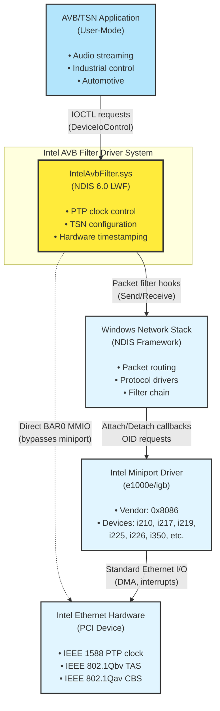
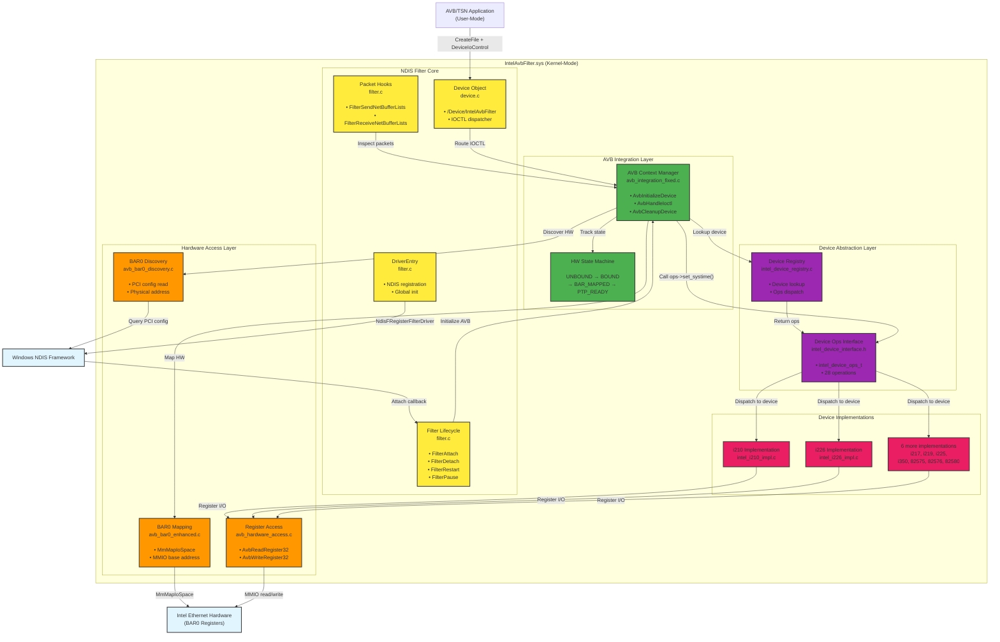
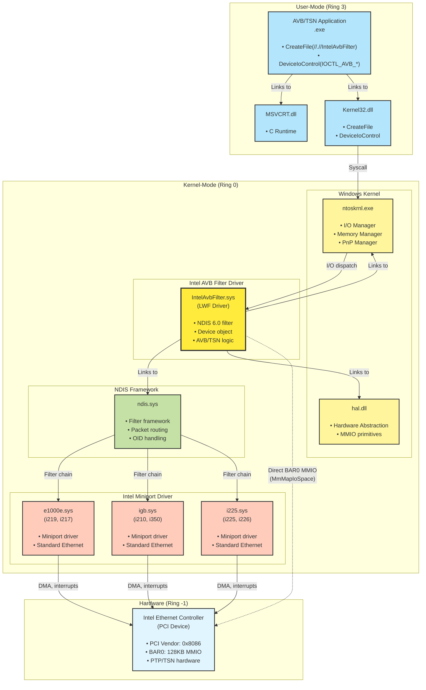
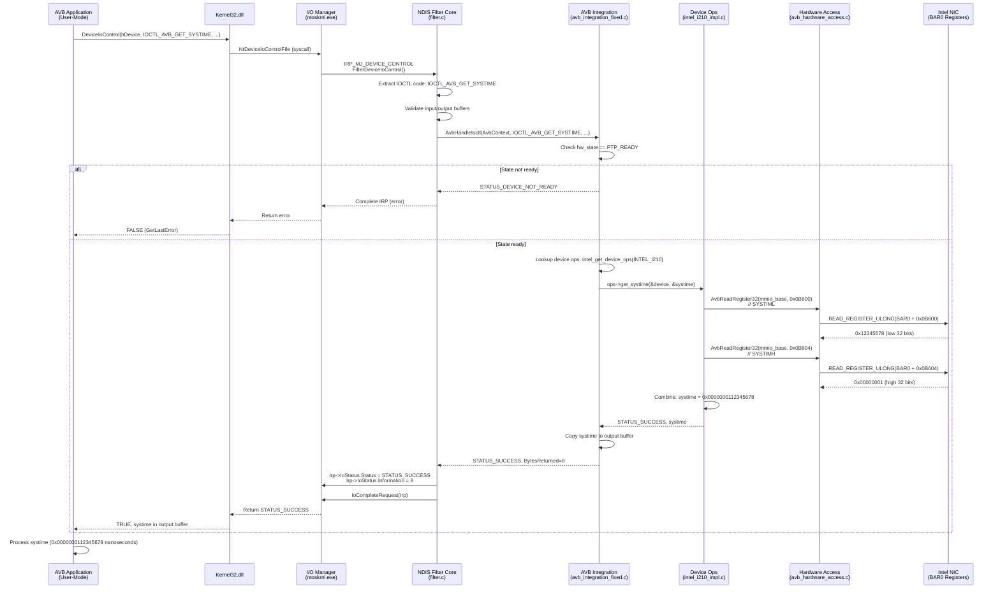

# C4 Architecture Diagrams (Mermaid Format)

**Purpose**: Visual architecture documentation using C4 model (Context, Container, Component, Code)

---

## C4 Level 1: System Context

Shows the Intel AVB Filter Driver in its operating environment with users and external systems.



**Key Context Points**:
- **User**: AVB/TSN applications (audio streaming, industrial control)
- **System**: IntelAvbFilter.sys (NDIS 6.0 Lightweight Filter)
- **External Systems**:
  - Windows NDIS Framework (packet routing)
  - Intel Miniport Drivers (base Ethernet functionality)
  - Intel Ethernet Hardware (PTP/TSN capabilities)
- **Key Relationship**: Direct BAR0 MMIO bypasses miniport for low-latency PTP control

---

## C4 Level 2: Container Diagram

Shows high-level technical building blocks within the driver system.



**Key Container Points**:
- **4 Major Layers**: NDIS Core → AVB Integration → Hardware Access → Device Abstraction
- **8 Device Implementations**: Strategy pattern for device-specific logic
- **State Machine**: UNBOUND → BOUND → BAR_MAPPED → PTP_READY
- **Direct MMIO**: Hardware Access Layer bypasses miniport for register I/O

---

## C4 Level 3: Component Diagram (AVB Integration Layer)

Detailed view of the AVB Integration Layer showing internal components and interactions.

```mermaid
graph TB
    %% External inputs
    NDISFilterCore["NDIS Filter Core<br/>(ARC-C-001)"]
    UserModeApp["User-Mode App"]
    
    subgraph "AVB Integration Layer (ARC-C-002)"
        subgraph "Context Management"
            AvbInit["AvbInitializeDevice<br/>avb_integration_fixed.c<br/><br/>1. Allocate context<br/>2. Discover hardware<br/>3. Map BAR0<br/>4. Validate PTP"]
            AvbCleanup["AvbCleanupDevice<br/>avb_integration_fixed.c<br/><br/>1. Call device cleanup<br/>2. Unmap BAR0<br/>3. Free context"]
            Context["AVB_DEVICE_CONTEXT<br/>avb_integration.h<br/><br/>• device_t intel_device<br/>• AVB_HW_STATE hw_state<br/>• INTEL_HARDWARE_CONTEXT*<br/>• Timestamp ring buffer<br/>• TSN config cache"]
        end
        
        subgraph "IOCTL Routing"
            AvbIoctl["AvbHandleIoctl<br/>avb_integration_fixed.c<br/><br/>1. Validate hw_state<br/>2. Parse IOCTL code<br/>3. Lookup device ops<br/>4. Dispatch to device<br/>5. Return result"]
            IoctlDispatch{"IOCTL Switch"}
        end
        
        subgraph "State Machine"
            StateUnbound["UNBOUND<br/><br/>Initial state"]
            StateBound["BOUND<br/><br/>Intel adapter<br/>attached"]
            StateBarMapped["BAR_MAPPED<br/><br/>Registers<br/>accessible"]
            StatePtpReady["PTP_READY<br/><br/>Clock<br/>operational"]
        end
        
        subgraph "Hardware Validation"
            AvbValidate["AvbValidateHardwareAccess<br/><br/>• Check mapping<br/>• Bounds check"]
            AvbPtpCheck["AvbValidatePtpClock<br/><br/>• Read SYSTIML twice<br/>• Verify increment"]
        end
    end
    
    %% External outputs
    HardwareAccessLayer["Hardware Access Layer<br/>(ARC-C-003)"]
    DeviceAbstractionLayer["Device Abstraction Layer<br/>(ARC-C-004)"]
    
    %% Relationships - Initialization
    NDISFilterCore -->|"FilterAttach"| AvbInit
    AvbInit -->|"Allocate"| Context
    AvbInit -->|"State: UNBOUND → BOUND"| StateBound
    AvbInit -->|"AvbDiscoverBar0"| HardwareAccessLayer
    AvbInit -->|"AvbMapBar0"| HardwareAccessLayer
    AvbInit -->|"State: BOUND → BAR_MAPPED"| StateBarMapped
    AvbInit -->|"Validate PTP"| AvbPtpCheck
    AvbPtpCheck -->|"AvbReadRegister32"| HardwareAccessLayer
    AvbPtpCheck -->|"State: BAR_MAPPED → PTP_READY"| StatePtpReady
    AvbInit -->|"intel_get_device_ops"| DeviceAbstractionLayer
    
    %% Relationships - IOCTL
    UserModeApp -->|"DeviceIoControl"| NDISFilterCore
    NDISFilterCore -->|"AvbHandleIoctl"| AvbIoctl
    AvbIoctl -->|"Check state"| StatePtpReady
    AvbIoctl -->|"Parse"| IoctlDispatch
    IoctlDispatch -->|"GET_SYSTIME"| DeviceAbstractionLayer
    IoctlDispatch -->|"SET_SYSTIME"| DeviceAbstractionLayer
    IoctlDispatch -->|"CONFIGURE_TAS"| DeviceAbstractionLayer
    IoctlDispatch -->|"CONFIGURE_CBS"| DeviceAbstractionLayer
    
    %% Relationships - Cleanup
    NDISFilterCore -->|"FilterDetach"| AvbCleanup
    AvbCleanup -->|"device->cleanup()"| DeviceAbstractionLayer
    AvbCleanup -->|"AvbUnmapBar0"| HardwareAccessLayer
    AvbCleanup -->|"Free"| Context
    AvbCleanup -->|"State: PTP_READY → UNBOUND"| StateUnbound
    
    %% Styling
    classDef contextMgmt fill:#4caf50,stroke:#333,stroke-width:2px
    classDef ioctlMgmt fill:#2196f3,stroke:#333,stroke-width:2px
    classDef stateMachine fill:#ff9800,stroke:#333,stroke-width:2px
    classDef validation fill:#9c27b0,stroke:#333,stroke-width:2px
    classDef external fill:#e1f5ff,stroke:#333,stroke-width:2px
    
    class AvbInit,AvbCleanup,Context contextMgmt
    class AvbIoctl,IoctlDispatch ioctlMgmt
    class StateUnbound,StateBound,StateBarMapped,StatePtpReady stateMachine
    class AvbValidate,AvbPtpCheck validation
    class NDISFilterCore,UserModeApp,HardwareAccessLayer,DeviceAbstractionLayer external
```



**Key Component Points**:
- **Context Management**: Allocate/deallocate per-adapter AVB context
- **IOCTL Routing**: Dispatch user-mode requests to device implementations
- **State Machine**: 4-state lifecycle (UNBOUND → BOUND → BAR_MAPPED → PTP_READY)
- **Hardware Validation**: Safety checks before register access

---

## C4 Level 3: Component Diagram (Device Abstraction Layer)

Strategy pattern implementation for device family abstraction.

```mermaid
graph TB
    %% External input
    AVBIntegration["AVB Integration Layer<br/>(ARC-C-002)"]
    
    subgraph "Device Abstraction Layer (ARC-C-004)"
        subgraph "Registry"
            Registry["Device Registry<br/>intel_device_registry.c<br/><br/>• Map device ID → ops<br/>• Registration at init"]
            RegistryTable[("Registry Table<br/><br/>INTEL_I210 → &i210_ops<br/>INTEL_I217 → &i217_ops<br/>INTEL_I219 → &i219_ops<br/>INTEL_I225 → &i225_ops<br/>INTEL_I226 → &i226_ops<br/>INTEL_I350 → &i350_ops<br/>INTEL_82575 → &e82575_ops<br/>INTEL_82576 → &e82576_ops<br/>INTEL_82580 → &e82580_ops")]
        end
        
        subgraph "Interface"
            DeviceOps["intel_device_ops_t<br/>intel_device_interface.h<br/><br/>• device_name<br/>• supported_capabilities<br/>• init, cleanup<br/>• set_systime, get_systime<br/>• setup_tas, setup_cbs<br/>• read_register, write_register<br/>• ... (28 operations)"]
        end
    end
    
    subgraph "Device Implementations"
        I210["i210_ops<br/>intel_i210_impl.c<br/><br/>• CAP_PTP | CAP_CBS<br/>• No TAS/FP support"]
        I226["i226_ops<br/>intel_i226_impl.c<br/><br/>• CAP_PTP | CAP_TAS<br/>  | CAP_CBS | CAP_FP<br/>• Full TSN support"]
        I219["i219_ops<br/>intel_i219_impl.c<br/><br/>• CAP_PTP (limited)<br/>• No TSN support"]
        Others["6 more implementations<br/>i217, i225, i350,<br/>82575, 82576, 82580"]
    end
    
    %% External output
    HardwareAccess["Hardware Access Layer<br/>(ARC-C-003)"]
    
    %% Relationships - Lookup
    AVBIntegration -->|"intel_get_device_ops(device_type)"| Registry
    Registry -->|"Lookup in table"| RegistryTable
    RegistryTable -->|"Return &i210_ops"| DeviceOps
    
    %% Relationships - Dispatch
    AVBIntegration -->|"ops->set_systime(dev, time)"| DeviceOps
    DeviceOps -->|"Virtual dispatch"| I210
    DeviceOps -->|"Virtual dispatch"| I226
    DeviceOps -->|"Virtual dispatch"| I219
    DeviceOps -->|"Virtual dispatch"| Others
    
    %% Relationships - Hardware access
    I210 -->|"AvbWriteRegister32(0xB600, value)"| HardwareAccess
    I226 -->|"AvbReadRegister32(0xB600)"| HardwareAccess
    I219 -->|"AvbWriteRegister32(0xB608, freq)"| HardwareAccess
    Others -->|"Register I/O"| HardwareAccess
    
    %% Relationships - Registration (at driver init)
    I210 -.->|"Register at DriverEntry"| RegistryTable
    I226 -.->|"Register at DriverEntry"| RegistryTable
    I219 -.->|"Register at DriverEntry"| RegistryTable
    Others -.->|"Register at DriverEntry"| RegistryTable
    
    %% Styling
    classDef registry fill:#9c27b0,stroke:#333,stroke-width:2px
    classDef interface fill:#2196f3,stroke:#333,stroke-width:2px
    classDef implementation fill:#e91e63,stroke:#333,stroke-width:2px
    classDef external fill:#e1f5ff,stroke:#333,stroke-width:2px
    
    class Registry,RegistryTable registry
    class DeviceOps interface
    class I210,I226,I219,Others implementation
    class AVBIntegration,HardwareAccess external
```

**Key Component Points**:
- **Strategy Pattern**: `intel_device_ops_t` interface + 8 implementations
- **Runtime Dispatch**: Lookup device ops by device ID, call function pointers
- **Optional Operations**: NULL for unsupported features (e.g., i210 has no TAS)
- **Extensibility**: Add new device = 1 new file + register in table

---

## Deployment Diagram

Shows how the driver is deployed in the Windows kernel environment.



**Deployment Key Points**:
- **User-Mode**: AVB application uses standard Win32 APIs (CreateFile, DeviceIoControl)
- **Kernel-Mode**: Filter driver runs in kernel space, links to NDIS and HAL
- **Multiple Miniports**: Supports e1000e (i217/i219), igb (i210/i350), i225 (i225/i226)
- **Direct Hardware Access**: Filter uses MmMapIoSpace to access BAR0 directly
- **Filter Chain**: NDIS inserts filter between protocol and miniport

---

## Sequence Diagram: IOCTL Flow (Get PTP System Time)

Shows the detailed sequence of a user-mode IOCTL request to read PTP system time.



**Sequence Key Points**:
- **Round-trip latency**: ~50µs total (syscall + dispatch + register I/O)
- **Direct register access**: Bypasses miniport (no OID overhead)
- **State validation**: Checks hw_state before hardware access
- **Strategy pattern**: Runtime dispatch to device-specific implementation
- **64-bit read**: Two 32-bit reads (SYSTIML + SYSTIMH) combined

---

## END OF C4 DIAGRAMS

**Next Steps**:
1. **Embed diagrams in GitHub Issues**: Copy Mermaid code into ADR/ARC-C issue descriptions
2. **Generate PNG/SVG**: Use Mermaid CLI or online tools for static images
3. **Create additional sequence diagrams** for:
   - Driver initialization (DriverEntry → FilterAttach → AvbInitializeDevice)
   - Packet send/receive flow
   - BAR0 discovery and mapping
   - State machine transitions
