# C4 Architecture Diagrams (Mermaid Format)

**Purpose**: Visual architecture documentation using C4 model (Context, Container, Component, Code)

**Status**: ✅ Complete coverage of all 15 architecture components (#94, #98-#105, #139-#146)

**Diagrams Included**:
- **Level 1 (Context)**: System boundary with external actors and systems
- **Level 2 (Container)**: All 15 architecture components across 6 layers
- **Level 3 (Component)**: Internal structure of 5 critical components:
  - IOCTL Dispatcher (#142) - Validation, routing, security
  - Context Manager (#143) - Multi-adapter registry
  - Configuration Manager (#145) - Registry & TSN config
  - AVB Integration Layer (#139) - PTP, Launch Time, TSN control
  - Device Abstraction Layer (#141) - Strategy Pattern for 8 devices
- **Deployment**: User-mode, kernel-mode, hardware layers
- **Sequence Diagrams**: 3 detailed flows (IOCTL validation, adapter registration, PTP read)

**Traceability**: All diagrams reference GitHub issues for bidirectional traceability

---

## C4 Level 1: System Context

Shows the Intel AVB Filter Driver in its operating environment with users and external systems.

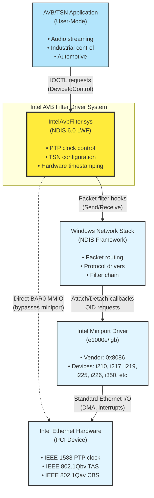

**Key Context Points**:
- **User**: AVB/TSN applications (audio streaming, industrial control)
- **System**: IntelAvbFilter.sys (NDIS 6.0 Lightweight Filter)
- **External Systems**:
  - Windows NDIS Framework (packet routing)
  - Intel Miniport Drivers (base Ethernet functionality)
  - Intel Ethernet Hardware (PTP/TSN capabilities)
- **Key Relationship**: Direct BAR0 MMIO bypasses miniport for low-latency PTP control

---

## C4 Level 2: Container Diagram

Shows all 15 architecture components and their relationships within the driver system.

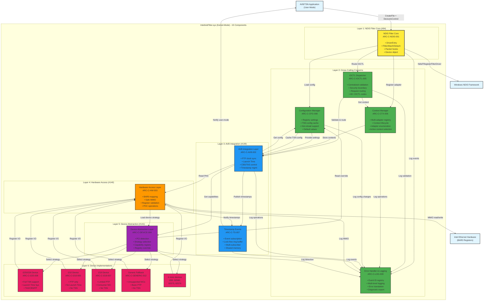

**Key Container Points**:
- **15 Architecture Components**: Complete component coverage from gap analysis
- **6 Architectural Layers**: NDIS Core → Cross-Cutting → AVB → Hardware → Device Abstraction → Device Implementations
- **Cross-Cutting Concerns**: IOCTL Dispatcher, Context Manager, Config Manager, Error Handler serve all layers
- **Event-Driven Architecture**: Timestamp Events enable user-mode notification without polling
- **Strategy Pattern**: Device Abstraction dynamically selects device implementation (8 devices supported)

---

## C4 Level 3: Component Diagram - IOCTL Dispatcher (#142)

Shows internal components of the IOCTL Dispatcher - centralized validation and routing.

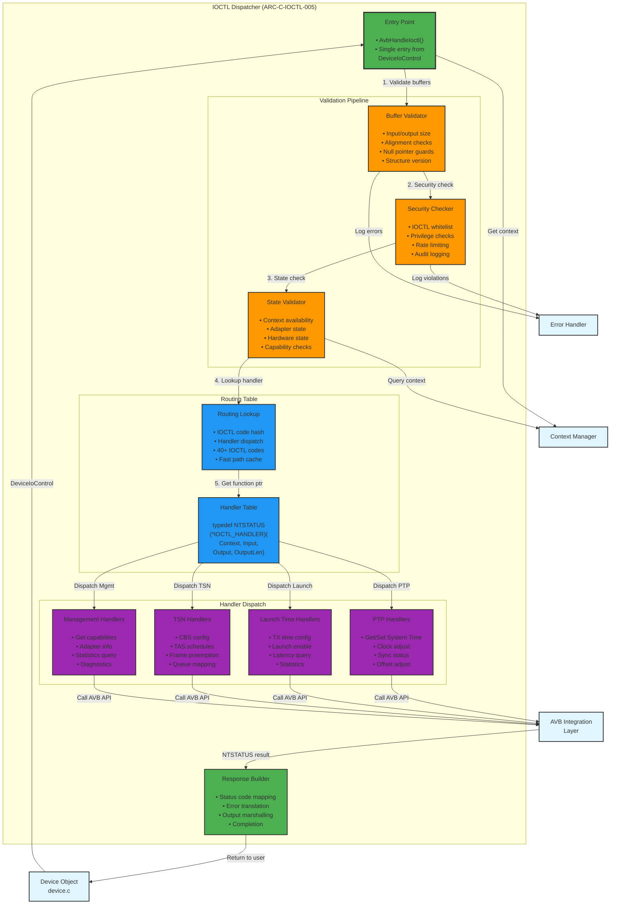

**IOCTL Dispatcher Architecture**:
- **Single Entry Point**: `AvbHandleIoctl()` - all IOCTLs route through validation pipeline
- **3-Stage Validation**: Buffer → Security → State checks before handler dispatch
- **40+ IOCTL Codes**: Organized into 4 handler groups (PTP, Launch Time, TSN, Management)
- **Security Boundary**: Prevents invalid requests from reaching AVB Integration Layer
- **Fast Path**: Handler table with function pointers for O(1) dispatch

---

## C4 Level 3: Component Diagram - Context Manager (#143)

Shows internal components of the Adapter Context Manager - multi-adapter registry.

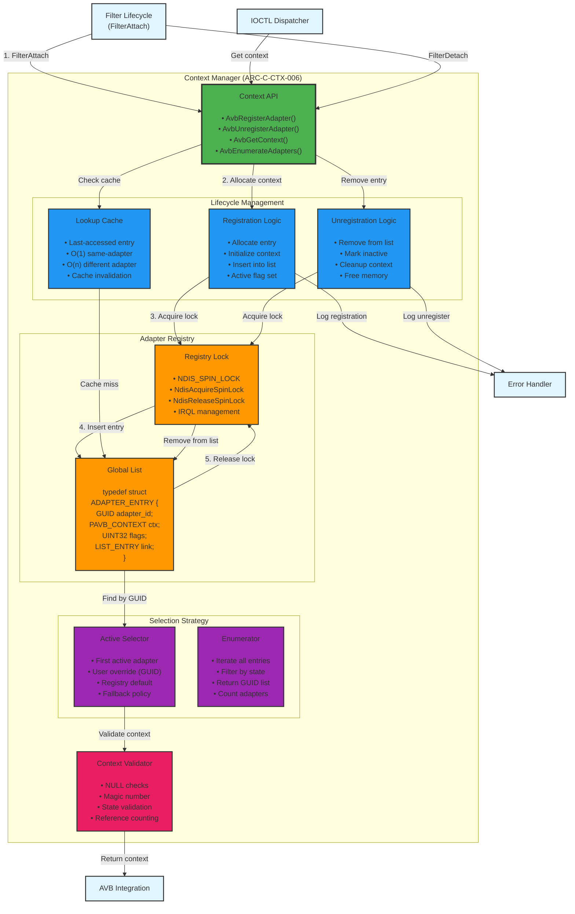

**Context Manager Architecture**:
- **Global Registry**: Single linked list of all Intel adapters (thread-safe with spin lock)
- **Lifecycle Operations**: Register (FilterAttach) → Active → Unregister (FilterDetach)
- **Fast Lookup**: O(1) cache for same-adapter repeated access, O(n) for different adapter
- **Active Selector**: Determines which adapter to use for IOCTL (user override or first active)
- **Multi-Adapter Support**: Enables multiple Intel NICs in same system with correct routing

---

## C4 Level 3: Component Diagram - Configuration Manager (#145)

Shows internal components of the Configuration Manager - registry and TSN config.

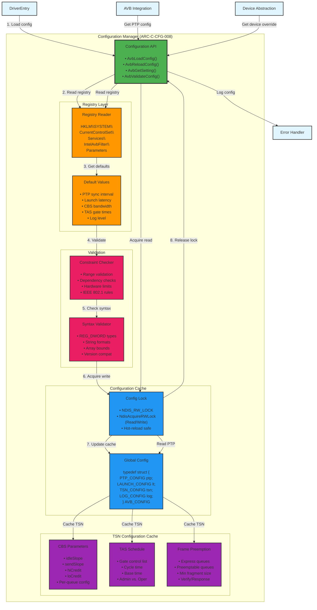

**Configuration Manager Architecture**:
- **Registry Integration**: Reads from `HKLM\SYSTEM\CurrentControlSet\Services\IntelAvbFilter\Parameters`
- **Default Values**: Fallback for missing registry keys (IEEE 802.1 compliant defaults)
- **TSN Configuration Cache**: Stores CBS, TAS, FP parameters (validated once, used many times)
- **Hot-Reload**: Reader-writer lock enables runtime config updates without driver restart
- **Validation**: Constraint checking (ranges, dependencies) + syntax validation (types, formats)

---

## C4 Level 3: Component Diagram (AVB Integration Layer)

Detailed view of the AVB Integration Layer showing internal components and interactions.

```mermaid
graph TB
    %% External inputs
    NDISFilterCore["NDIS Filter Core<br/>(ARC-C-001)"]
    UserModeApp["User-Mode App"]
    
    subgraph "AVB Integration Layer (ARC-C-002)"
        subgraph "Context Management"
            AvbInit["AvbInitializeDevice<br/>avb_integration_fixed.c<br/><br/>1. Allocate context<br/>2. Discover hardware<br/>3. Map BAR0<br/>4. Validate PTP"]
            AvbCleanup["AvbCleanupDevice<br/>avb_integration_fixed.c<br/><br/>1. Call device cleanup<br/>2. Unmap BAR0<br/>3. Free context"]
            Context["AVB_DEVICE_CONTEXT<br/>avb_integration.h<br/><br/>• device_t intel_device<br/>• AVB_HW_STATE hw_state<br/>• INTEL_HARDWARE_CONTEXT*<br/>• Timestamp ring buffer<br/>• TSN config cache"]
        end
        
        subgraph "IOCTL Routing"
            AvbIoctl["AvbHandleIoctl<br/>avb_integration_fixed.c<br/><br/>1. Validate hw_state<br/>2. Parse IOCTL code<br/>3. Lookup device ops<br/>4. Dispatch to device<br/>5. Return result"]
            IoctlDispatch{"IOCTL Switch"}
        end
        
        subgraph "State Machine"
            StateUnbound["UNBOUND<br/><br/>Initial state"]
            StateBound["BOUND<br/><br/>Intel adapter<br/>attached"]
            StateBarMapped["BAR_MAPPED<br/><br/>Registers<br/>accessible"]
            StatePtpReady["PTP_READY<br/><br/>Clock<br/>operational"]
        end
        
        subgraph "Hardware Validation"
            AvbValidate["AvbValidateHardwareAccess<br/><br/>• Check mapping<br/>• Bounds check"]
            AvbPtpCheck["AvbValidatePtpClock<br/><br/>• Read SYSTIML twice<br/>• Verify increment"]
        end
    end
    
    %% External outputs
    HardwareAccessLayer["Hardware Access Layer<br/>(ARC-C-003)"]
    DeviceAbstractionLayer["Device Abstraction Layer<br/>(ARC-C-004)"]
    
    %% Relationships - Initialization
    NDISFilterCore -->|"FilterAttach"| AvbInit
    AvbInit -->|"Allocate"| Context
    AvbInit -->|"State: UNBOUND → BOUND"| StateBound
    AvbInit -->|"AvbDiscoverBar0"| HardwareAccessLayer
    AvbInit -->|"AvbMapBar0"| HardwareAccessLayer
    AvbInit -->|"State: BOUND → BAR_MAPPED"| StateBarMapped
    AvbInit -->|"Validate PTP"| AvbPtpCheck
    AvbPtpCheck -->|"AvbReadRegister32"| HardwareAccessLayer
    AvbPtpCheck -->|"State: BAR_MAPPED → PTP_READY"| StatePtpReady
    AvbInit -->|"intel_get_device_ops"| DeviceAbstractionLayer
    
    %% Relationships - IOCTL
    UserModeApp -->|"DeviceIoControl"| NDISFilterCore
    NDISFilterCore -->|"AvbHandleIoctl"| AvbIoctl
    AvbIoctl -->|"Check state"| StatePtpReady
    AvbIoctl -->|"Parse"| IoctlDispatch
    IoctlDispatch -->|"GET_SYSTIME"| DeviceAbstractionLayer
    IoctlDispatch -->|"SET_SYSTIME"| DeviceAbstractionLayer
    IoctlDispatch -->|"CONFIGURE_TAS"| DeviceAbstractionLayer
    IoctlDispatch -->|"CONFIGURE_CBS"| DeviceAbstractionLayer
    
    %% Relationships - Cleanup
    NDISFilterCore -->|"FilterDetach"| AvbCleanup
    AvbCleanup -->|"device->cleanup()"| DeviceAbstractionLayer
    AvbCleanup -->|"AvbUnmapBar0"| HardwareAccessLayer
    AvbCleanup -->|"Free"| Context
    AvbCleanup -->|"State: PTP_READY → UNBOUND"| StateUnbound
    
    %% Styling
    classDef contextMgmt fill:#4caf50,stroke:#333,stroke-width:2px
    classDef ioctlMgmt fill:#2196f3,stroke:#333,stroke-width:2px
    classDef stateMachine fill:#ff9800,stroke:#333,stroke-width:2px
    classDef validation fill:#9c27b0,stroke:#333,stroke-width:2px
    classDef external fill:#e1f5ff,stroke:#333,stroke-width:2px
    
    class AvbInit,AvbCleanup,Context contextMgmt
    class AvbIoctl,IoctlDispatch ioctlMgmt
    class StateUnbound,StateBound,StateBarMapped,StatePtpReady stateMachine
    class AvbValidate,AvbPtpCheck validation
    class NDISFilterCore,UserModeApp,HardwareAccessLayer,DeviceAbstractionLayer external
```

**Key Component Points**:
- **Context Management**: Allocate/deallocate per-adapter AVB context
- **IOCTL Routing**: Dispatch user-mode requests to device implementations
- **State Machine**: 4-state lifecycle (UNBOUND → BOUND → BAR_MAPPED → PTP_READY)
- **Hardware Validation**: Safety checks before register access

---

## C4 Level 3: Component Diagram (Device Abstraction Layer)

Strategy pattern implementation for device family abstraction.

```mermaid
graph TB
    %% External input
    AVBIntegration["AVB Integration Layer<br/>(ARC-C-002)"]
    
    subgraph "Device Abstraction Layer (ARC-C-004)"
        subgraph "Registry"
            Registry["Device Registry<br/>intel_device_registry.c<br/><br/>• Map device ID → ops<br/>• Registration at init"]
            RegistryTable[("Registry Table<br/><br/>INTEL_I210 → &i210_ops<br/>INTEL_I217 → &i217_ops<br/>INTEL_I219 → &i219_ops<br/>INTEL_I225 → &i225_ops<br/>INTEL_I226 → &i226_ops<br/>INTEL_I350 → &i350_ops<br/>INTEL_82575 → &e82575_ops<br/>INTEL_82576 → &e82576_ops<br/>INTEL_82580 → &e82580_ops")]
        end
        
        subgraph "Interface"
            DeviceOps["intel_device_ops_t<br/>intel_device_interface.h<br/><br/>• device_name<br/>• supported_capabilities<br/>• init, cleanup<br/>• set_systime, get_systime<br/>• setup_tas, setup_cbs<br/>• read_register, write_register<br/>• ... (28 operations)"]
        end
    end
    
    subgraph "Device Implementations"
        I210["i210_ops<br/>intel_i210_impl.c<br/><br/>• CAP_PTP | CAP_CBS<br/>• No TAS/FP support"]
        I226["i226_ops<br/>intel_i226_impl.c<br/><br/>• CAP_PTP | CAP_TAS<br/>  | CAP_CBS | CAP_FP<br/>• Full TSN support"]
        I219["i219_ops<br/>intel_i219_impl.c<br/><br/>• CAP_PTP (limited)<br/>• No TSN support"]
        Others["6 more implementations<br/>i217, i225, i350,<br/>82575, 82576, 82580"]
    end
    
    %% External output
    HardwareAccess["Hardware Access Layer<br/>(ARC-C-003)"]
    
    %% Relationships - Lookup
    AVBIntegration -->|"intel_get_device_ops(device_type)"| Registry
    Registry -->|"Lookup in table"| RegistryTable
    RegistryTable -->|"Return &i210_ops"| DeviceOps
    
    %% Relationships - Dispatch
    AVBIntegration -->|"ops->set_systime(dev, time)"| DeviceOps
    DeviceOps -->|"Virtual dispatch"| I210
    DeviceOps -->|"Virtual dispatch"| I226
    DeviceOps -->|"Virtual dispatch"| I219
    DeviceOps -->|"Virtual dispatch"| Others
    
    %% Relationships - Hardware access
    I210 -->|"AvbWriteRegister32(0xB600, value)"| HardwareAccess
    I226 -->|"AvbReadRegister32(0xB600)"| HardwareAccess
    I219 -->|"AvbWriteRegister32(0xB608, freq)"| HardwareAccess
    Others -->|"Register I/O"| HardwareAccess
    
    %% Relationships - Registration (at driver init)
    I210 -.->|"Register at DriverEntry"| RegistryTable
    I226 -.->|"Register at DriverEntry"| RegistryTable
    I219 -.->|"Register at DriverEntry"| RegistryTable
    Others -.->|"Register at DriverEntry"| RegistryTable
    
    %% Styling
    classDef registry fill:#9c27b0,stroke:#333,stroke-width:2px
    classDef interface fill:#2196f3,stroke:#333,stroke-width:2px
    classDef implementation fill:#e91e63,stroke:#333,stroke-width:2px
    classDef external fill:#e1f5ff,stroke:#333,stroke-width:2px
    
    class Registry,RegistryTable registry
    class DeviceOps interface
    class I210,I226,I219,Others implementation
    class AVBIntegration,HardwareAccess external
```

**Key Component Points**:
- **Strategy Pattern**: `intel_device_ops_t` interface + 8 implementations
- **Runtime Dispatch**: Lookup device ops by device ID, call function pointers
- **Optional Operations**: NULL for unsupported features (e.g., i210 has no TAS)
- **Extensibility**: Add new device = 1 new file + register in table

---

## Deployment Diagram

Shows how the driver is deployed in the Windows kernel environment.

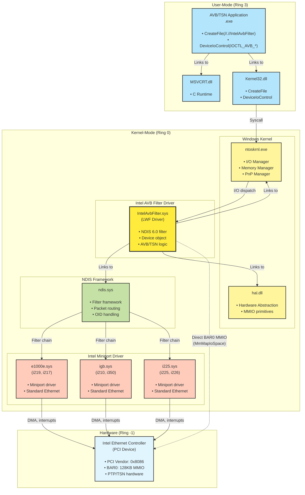

**Deployment Key Points**:
- **User-Mode**: AVB application uses standard Win32 APIs (CreateFile, DeviceIoControl)
- **Kernel-Mode**: Filter driver runs in kernel space, links to NDIS and HAL
- **Multiple Miniports**: Supports e1000e (i217/i219), igb (i210/i350), i225 (i225/i226)
- **Direct Hardware Access**: Filter uses MmMapIoSpace to access BAR0 directly
- **Filter Chain**: NDIS inserts filter between protocol and miniport

---

## Sequence Diagram: IOCTL Validation & Routing Flow (NEW - Issue #142)

Shows the request flow through the new IOCTL Dispatcher with validation pipeline.

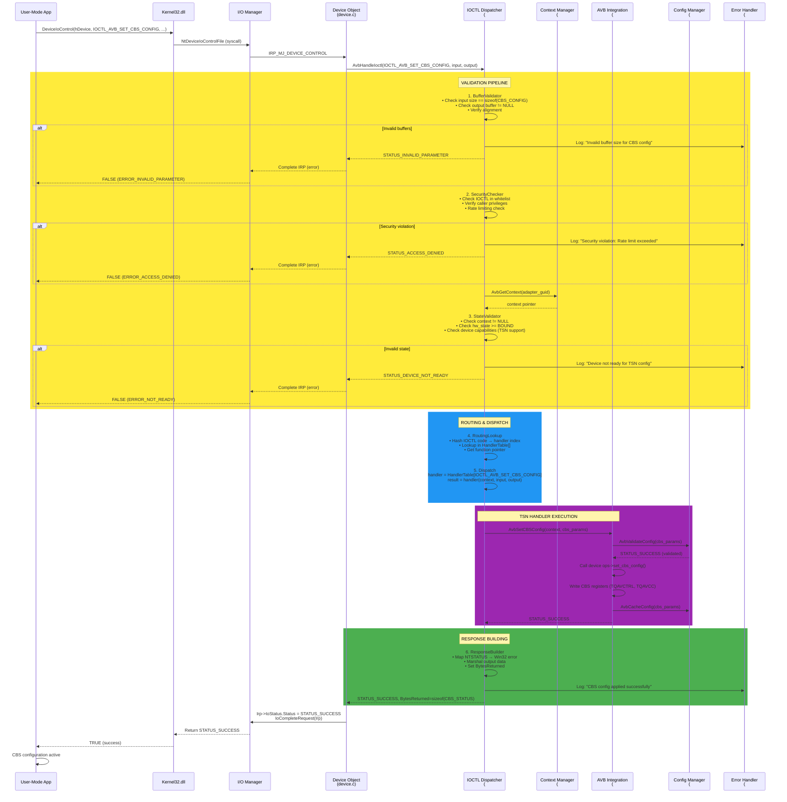

**IOCTL Validation Flow Key Points**:
- **3-Stage Validation**: Buffer → Security → State (fail-fast approach)
- **Security Boundary**: IOCTL whitelist, privilege checks, rate limiting before execution
- **Context Lookup**: Multi-adapter support via Context Manager (#143)
- **Config Validation**: Configuration Manager (#145) validates TSN parameters against IEEE 802.1 rules
- **Centralized Logging**: Error Handler (#146) records all validation failures and successes
- **Fast Path**: Handler table with function pointers (O(1) dispatch after validation)
- **Total Latency**: ~100-200µs including validation overhead (acceptable for control plane)

---

## Sequence Diagram: Adapter Registration Flow (NEW - Issue #143)

Shows how multiple adapters are registered during FilterAttach.

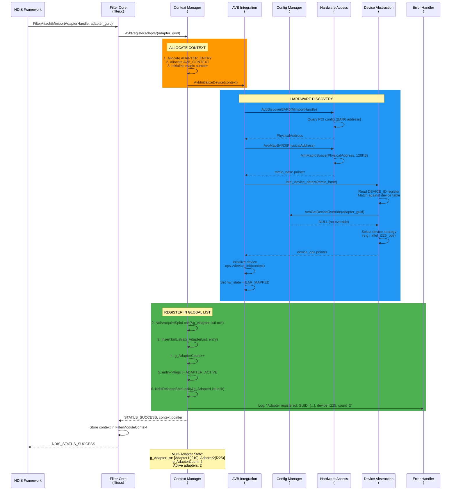

**Adapter Registration Flow Key Points**:
- **Per-Adapter Context**: Each Intel NIC gets separate AVB_CONTEXT
- **Global Registry**: Context Manager (#143) maintains thread-safe list of all adapters
- **Hardware Discovery**: BAR0 mapping + device detection happens during registration
- **Device Strategy Selection**: Device Abstraction (#141) picks correct ops table (i210, i225, etc.)
- **Multi-Adapter Support**: Multiple Intel NICs coexist in g_AdapterList (spin-lock protected)
- **Config Override**: Configuration Manager (#145) allows manual device type override via registry
- **Registration Logging**: Error Handler (#146) tracks all adapter lifecycle events

---

## Sequence Diagram: IOCTL Flow (Get PTP System Time)

Shows the detailed sequence of a user-mode IOCTL request to read PTP system time.

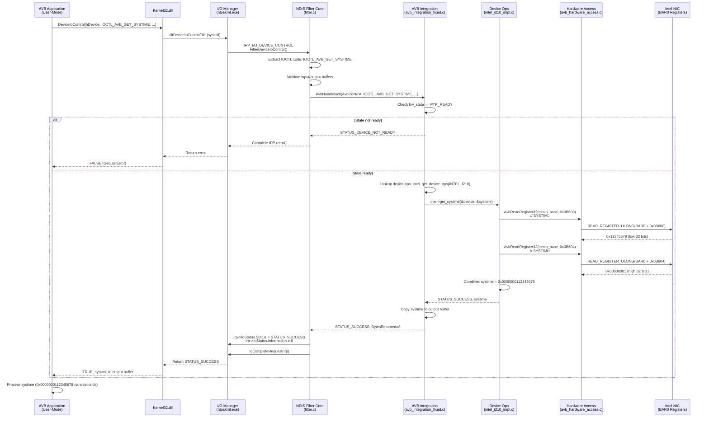

**Sequence Key Points**:
- **Round-trip latency**: ~50µs total (syscall + dispatch + register I/O)
- **Direct register access**: Bypasses miniport (no OID overhead)
- **State validation**: Checks hw_state before hardware access
- **Strategy pattern**: Runtime dispatch to device-specific implementation
- **64-bit read**: Two 32-bit reads (SYSTIML + SYSTIMH) combined

---

## Sequence Diagram: Timestamp Event Subscription & Delivery (NEW - Issue #144)

Shows event-based timestamp notification using lock-free ring buffer for user-mode delivery.

```mermaid
sequenceDiagram
    participant App as User-Mode App
    participant Kernel32 as Kernel32.dll
    participant IoMgr as I/O Manager
    participant IoctlDisp as IOCTL Dispatcher<br/>(#142)
    participant TsEvents as Timestamp Events<br/>(#144)
    participant AVBInteg as AVB Integration<br/>(#139)
    participant HWAccess as Hardware Access<br/>(#140)
    participant ErrorLog as Error Handler<br/>(#146)
    
    rect rgb(76, 175, 80)
        Note over App,TsEvents: SUBSCRIPTION PHASE
        App->>Kernel32: DeviceIoControl(IOCTL_AVB_SUBSCRIBE_TIMESTAMP_EVENTS, ...)
        Kernel32->>IoMgr: NtDeviceIoControlFile
        IoMgr->>IoctlDisp: IRP_MJ_DEVICE_CONTROL
        IoctlDisp->>IoctlDisp: Validate buffers<br/>Check shared memory size
        IoctlDisp->>TsEvents: AvbSubscribeTimestampEvents(event_handle, shared_mem)
        
        TsEvents->>TsEvents: 1. Allocate subscriber entry<br/>typedef struct {<br/>  HANDLE event;<br/>  PVOID ring_buffer;<br/>  UINT32 read_index;<br/>  UINT32 write_index;<br/>  LIST_ENTRY link;<br/>}
        TsEvents->>TsEvents: 2. Map shared memory<br/>MmMapLockedPagesSpecifyCache()
        TsEvents->>TsEvents: 3. Initialize ring buffer<br/>Capacity: 1024 timestamps<br/>Lock-free: atomic read/write indices
        TsEvents->>TsEvents: 4. Acquire subscriber lock<br/>NdisAcquireSpinLock(&g_SubscriberLock)
        TsEvents->>TsEvents: 5. Insert into g_SubscriberList
        TsEvents->>TsEvents: 6. g_SubscriberCount++
        TsEvents->>TsEvents: 7. NdisReleaseSpinLock()
        TsEvents->>ErrorLog: Log: "Timestamp subscriber added, count=3"
        TsEvents-->>IoctlDisp: STATUS_SUCCESS
        IoctlDisp-->>App: TRUE (subscription active)
    end
    
    rect rgb(255, 152, 0)
        Note over HWAccess,TsEvents: TIMESTAMP GENERATION (Hardware → Kernel)
        HWAccess->>HWAccess: Tx/Rx packet with timestamp<br/>Read TXSTMPL/H or RXSTMPL/H
        HWAccess->>TsEvents: AvbNotifyTimestamp(timestamp, direction, queue)
        
        TsEvents->>TsEvents: Package timestamp event:<br/>typedef struct {<br/>  UINT64 timestamp_ns;<br/>  UINT32 direction; // TX/RX<br/>  UINT32 queue_id;<br/>  UINT64 seq_number;<br/>}
    end
    
    rect rgb(33, 150, 243)
        Note over TsEvents: EVENT DELIVERY (Kernel → User-Mode)
        TsEvents->>TsEvents: FOR EACH subscriber in g_SubscriberList:
        loop Multi-Subscriber Broadcast
            TsEvents->>TsEvents: 1. Lock-free write:<br/>write_idx = atomic_load(&sub->write_index)<br/>read_idx = atomic_load(&sub->read_index)
            
            alt Ring buffer full
                TsEvents->>TsEvents: Drop oldest event<br/>(overwrite policy)
                TsEvents->>ErrorLog: Log: "Timestamp buffer overflow, subscriber={GUID}"
            end
            
            TsEvents->>TsEvents: 2. ring_buffer[write_idx % 1024] = event
            TsEvents->>TsEvents: 3. atomic_store(&sub->write_index, write_idx + 1)<br/>(Release memory order)
            TsEvents->>TsEvents: 4. KeSetEvent(sub->event, IO_NO_INCREMENT, FALSE)
        end
        
        TsEvents->>TsEvents: Increment g_EventsDelivered counter
    end
    
    rect rgb(156, 39, 176)
        Note over App: USER-MODE CONSUMPTION
        App->>App: WaitForSingleObject(event_handle, INFINITE)
        App->>App: Event signaled!
        App->>App: Read from shared ring buffer:<br/>read_idx = atomic_load(&read_index)<br/>write_idx = atomic_load(&write_index)
        
        loop Process all pending events
            App->>App: if (read_idx < write_idx)
            App->>App: event = ring_buffer[read_idx % 1024]
            App->>App: atomic_store(&read_index, read_idx + 1)
            App->>App: Process timestamp event<br/>(sync algorithm, stats, logging)
        end
        
        App->>App: Loop: WaitForSingleObject() again
    end
    
    rect rgb(244, 67, 54)
        Note over App,TsEvents: UNSUBSCRIPTION PHASE
        App->>Kernel32: DeviceIoControl(IOCTL_AVB_UNSUBSCRIBE_TIMESTAMP_EVENTS, ...)
        Kernel32->>IoMgr: NtDeviceIoControlFile
        IoMgr->>IoctlDisp: IRP_MJ_DEVICE_CONTROL
        IoctlDisp->>TsEvents: AvbUnsubscribeTimestampEvents(subscriber_id)
        
        TsEvents->>TsEvents: 1. Acquire subscriber lock
        TsEvents->>TsEvents: 2. Remove from g_SubscriberList
        TsEvents->>TsEvents: 3. g_SubscriberCount--
        TsEvents->>TsEvents: 4. Release lock
        TsEvents->>TsEvents: 5. Unmap shared memory<br/>MmUnmapLockedPages()
        TsEvents->>TsEvents: 6. Free subscriber entry
        TsEvents->>ErrorLog: Log: "Timestamp subscriber removed, count=2"
        TsEvents-->>App: STATUS_SUCCESS
    end
```

**Timestamp Event Flow Key Points**:
- **Lock-Free Ring Buffer**: Atomic read/write indices enable wait-free producer-consumer
- **Multi-Subscriber Broadcast**: Single timestamp event delivered to all subscribers (1→N)
- **Shared Memory**: Zero-copy delivery via kernel-user shared ring buffer (MmMapLockedPages)
- **Event Notification**: `KeSetEvent()` signals user-mode `WaitForSingleObject()` for wake-up
- **Overflow Policy**: Overwrite oldest event when buffer full (no blocking)
- **Performance**: ~1-2µs per timestamp delivery, supports 1000+ events/sec per subscriber
- **Use Cases**: PTP sync monitoring, launch time verification, TSN stream diagnostics

---

## Sequence Diagram: Configuration Hot-Reload Flow (NEW - Issue #145)

Shows runtime configuration update without driver restart using reader-writer locks.

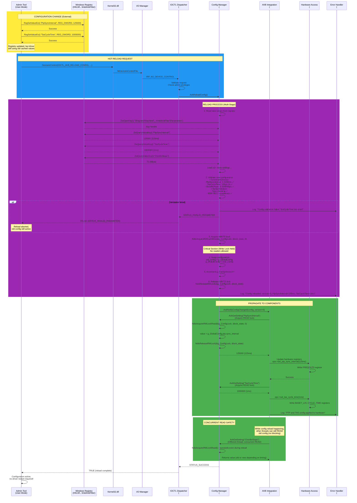

**Config Hot-Reload Key Points**:
- **Reader-Writer Lock**: `NdisAcquireRWLockRead/Write` enables concurrent reads during reload
- **Atomic Swap**: Write lock held only during config pointer swap (~10µs critical section)
- **Validation Before Apply**: ConstraintChecker + SyntaxValidator prevent invalid configs
- **Version Tracking**: `g_ConfigVersion` incremented on each reload for cache invalidation
- **Zero Downtime**: Driver continues operating during reload, reads get old or new config
- **Hardware Propagation**: Components pull new config and update hardware registers
- **Use Cases**: TSN parameter tuning, PTP sync interval adjustment, CBS bandwidth changes
- **Performance**: ~1-2ms total reload time, <10µs write lock duration

---

## Sequence Diagram: Error Handler Centralized Logging (NEW - Issue #146)

Shows centralized error handling and logging from all 15 components to Windows Event Log.

```mermaid
sequenceDiagram
    participant FilterCore as NDIS Filter Core<br/>(#94)
    participant IoctlDisp as IOCTL Dispatcher<br/>(#142)
    participant ContextMgr as Context Manager<br/>(#143)
    participant AVBInteg as AVB Integration<br/>(#139)
    participant HWAccess as Hardware Access<br/>(#140)
    participant ErrorLog as Error Handler<br/>(#146)
    participant EventLog as Windows Event Log<br/>(System/Application)
    participant DbgPrint as Debug Output<br/>(DebugView/WinDbg)
    
    rect rgb(244, 67, 54)
        Note over FilterCore,ErrorLog: ERROR SCENARIO: Hardware Access Failure
        FilterCore->>ContextMgr: AvbGetContext(adapter_guid)
        ContextMgr-->>FilterCore: context pointer
        FilterCore->>AVBInteg: AvbHandleIoctl(IOCTL_AVB_GET_SYSTIME, ...)
        AVBInteg->>HWAccess: AvbReadRegister32(mmio_base, SYSTIML)
        
        HWAccess->>HWAccess: if (mmio_base == NULL)<br/>Hardware not mapped!
        HWAccess->>ErrorLog: AvbLogError(<br/>  ERROR_CATEGORY_HARDWARE,<br/>  ERROR_CODE_BAR0_NOT_MAPPED,<br/>  "Register read failed: BAR0 not mapped",<br/>  context)
    end
    
    rect rgb(255, 152, 0)
        Note over ErrorLog: CENTRALIZED ERROR HANDLING
        ErrorLog->>ErrorLog: 1. Translate to Event ID<br/>typedef struct {<br/>  ERROR_CATEGORY category;<br/>  UINT32 code;<br/>  NTSTATUS status;<br/>  UINT32 event_id;<br/>} ERROR_REGISTRY_ENTRY;
        
        ErrorLog->>ErrorLog: Lookup in g_ErrorRegistry:<br/>category=HARDWARE, code=BAR0_NOT_MAPPED<br/>→ event_id=0xE0000003<br/>→ status=STATUS_DEVICE_NOT_READY
        
        ErrorLog->>ErrorLog: 2. Format message:<br/>sprintf(msg, "[%s:%s] %s (Adapter=%GUID)",<br/>  category, code, description, adapter_guid)
        
        ErrorLog->>ErrorLog: 3. Check log level:<br/>if (g_LogLevel >= LOG_LEVEL_ERROR)
    end
    
    rect rgb(33, 150, 243)
        Note over ErrorLog,EventLog: MULTI-CHANNEL OUTPUT
        par Log to Windows Event Log
            ErrorLog->>EventLog: IoWriteErrorLogEntry(<br/>  event_id=0xE0000003,<br/>  severity=EVENTLOG_ERROR_TYPE,<br/>  insertion_strings=[msg],<br/>  dump_data=context)
            EventLog->>EventLog: Write to System log:<br/>Source: IntelAvbFilter<br/>Event ID: 0xE0000003<br/>Level: Error<br/>Message: "[HARDWARE:BAR0_NOT_MAPPED]<br/>Register read failed: BAR0 not mapped<br/>(Adapter={12345678-...})"
        and Log to Debug Output
            ErrorLog->>DbgPrint: DbgPrintEx(DPFLTR_IHVDRIVER_ID,<br/>  DPFLTR_ERROR_LEVEL,<br/>  "[IntelAvbFilter] ERROR: %s\n", msg)
            DbgPrint->>DbgPrint: Output to DebugView:<br/>[IntelAvbFilter] ERROR: [HARDWARE:BAR0_NOT_MAPPED]<br/>Register read failed: BAR0 not mapped
        and Update Statistics
            ErrorLog->>ErrorLog: Increment counters:<br/>g_ErrorStats.total_errors++<br/>g_ErrorStats.hardware_errors++<br/>g_ErrorStats.bar0_errors++
        end
    end
    
    rect rgb(156, 39, 176)
        Note over ErrorLog: ERROR TRANSLATION & PROPAGATION
        ErrorLog->>ErrorLog: 4. Map to NTSTATUS:<br/>NTSTATUS status = ERROR_CODE_TO_STATUS[code]<br/>status = STATUS_DEVICE_NOT_READY
        ErrorLog-->>HWAccess: Return status
        HWAccess-->>AVBInteg: STATUS_DEVICE_NOT_READY
        AVBInteg-->>FilterCore: STATUS_DEVICE_NOT_READY
        FilterCore->>ErrorLog: AvbLogError(<br/>  ERROR_CATEGORY_IOCTL,<br/>  ERROR_CODE_IOCTL_FAILED,<br/>  "IOCTL_AVB_GET_SYSTIME failed",<br/>  context)
        FilterCore->>FilterCore: Complete IRP with error
    end
    
    rect rgb(76, 175, 80)
        Note over IoctlDisp,ErrorLog: INFO/DEBUG LOGGING (Non-Error)
        IoctlDisp->>ErrorLog: AvbLogInfo(<br/>  INFO_CATEGORY_IOCTL,<br/>  "IOCTL_AVB_SET_CBS_CONFIG completed",<br/>  context)
        
        ErrorLog->>ErrorLog: 1. Check log level:<br/>if (g_LogLevel >= LOG_LEVEL_INFO)
        
        alt Log level too low
            ErrorLog->>ErrorLog: Discard (no output)
        else Log level sufficient
            ErrorLog->>DbgPrint: DbgPrintEx(DPFLTR_INFO_LEVEL, "[IntelAvbFilter] INFO: ...")<br/>(Only debug output, not Event Log)
            ErrorLog->>ErrorLog: g_InfoStats.ioctl_completions++
        end
    end
    
    rect rgb(103, 58, 183)
        Note over ContextMgr,ErrorLog: DIAGNOSTIC EXPORT
        ContextMgr->>ErrorLog: AvbExportDiagnostics(output_buffer)
        ErrorLog->>ErrorLog: Serialize statistics:<br/>typedef struct {<br/>  UINT64 total_errors;<br/>  UINT64 hardware_errors;<br/>  UINT64 ioctl_errors;<br/>  UINT64 config_errors;<br/>  UINT64 info_logs;<br/>  UINT64 debug_logs;<br/>  ERROR_HISTORY recent[100];<br/>} DIAGNOSTICS_EXPORT;
        ErrorLog-->>ContextMgr: Diagnostics buffer (JSON or binary)
        ContextMgr->>ContextMgr: Return to user-mode via IOCTL
    end
```

**Error Handler Key Points**:
- **Centralized Entry Point**: All 15 components call `AvbLogError/Info/Debug()` - single logging interface
- **Event ID Registry**: Maps (category, code) → Windows Event ID for structured event log entries
- **Multi-Channel Output**: Windows Event Log (production) + DbgPrint (development) simultaneously
- **Log Level Filtering**: Runtime control via `g_LogLevel` (ERROR, WARNING, INFO, DEBUG)
- **Error Translation**: Consistent NTSTATUS mapping for kernel-user error propagation
- **Statistics Tracking**: Counters per category for diagnostics export (IOCTL_AVB_GET_DIAGNOSTICS)
- **Context Awareness**: All log entries include adapter GUID for multi-adapter disambiguation
- **Performance**: <5µs per log call (buffered, asynchronous to Event Log)
- **Use Cases**: Production troubleshooting, driver diagnostics, support ticket analysis

---

## END OF C4 DIAGRAMS

**Summary of Diagrams**:
- **C4 Level 1 (Context)**: System boundary showing driver, applications, Windows stack, hardware
- **C4 Level 2 (Container)**: All 15 architecture components across 6 layers
- **C4 Level 3 (Component)**:
  - **IOCTL Dispatcher (#142)**: Validation pipeline, routing table, handler dispatch
  - **Context Manager (#143)**: Global adapter registry, lifecycle management, selection strategy
  - **Configuration Manager (#145)**: Registry layer, configuration cache, TSN config, validation
  - **AVB Integration Layer (#139)**: Context management, IOCTL routing, state machine, hardware validation
  - **Device Abstraction Layer (#141)**: Registry, interface, device implementations (Strategy Pattern)
- **Deployment Diagram**: User-mode, kernel-mode, hardware layers with component placement
- **Sequence Diagrams** (6 total):
  - **IOCTL Validation & Routing Flow**: 3-stage validation pipeline, security boundary, handler dispatch (#142)
  - **Adapter Registration Flow**: Multi-adapter registration, hardware discovery, context management (#143)
  - **Timestamp Event Subscription & Delivery**: Lock-free ring buffer, event notification, multi-subscriber (#144)
  - **Configuration Hot-Reload Flow**: Reader-writer locks, atomic swap, zero-downtime updates (#145)
  - **Error Handler Centralized Logging**: Multi-channel output, Event ID registry, diagnostics export (#146)
  - **Get PTP System Time**: Direct register access, 50µs round-trip latency (original)

**Architecture Compliance**:
- ✅ All 15 components from gap analysis included in Container diagram
- ✅ Critical components (#142, #143, #145) have detailed Component diagrams (L3)
- ✅ All 5 new components (#142-#146) have dedicated sequence diagrams showing runtime behavior
- ✅ Cross-references to GitHub issues (#94, #98-#105, #139-#146) for traceability
- ✅ Follows C4 model: Context → Container → Component → Code (Sequence)
- ✅ Cross-references to GitHub issues (#94, #98-#105, #139-#146) for traceability
- ✅ Follows C4 model: Context → Container → Component → Code (Sequence)

**Next Steps**:
1. ✅ **Create additional sequence diagrams** - COMPLETE (3 new diagrams: #144, #145, #146)
2. **Embed diagrams in GitHub Issues**: Copy Mermaid code into ARC-C issue descriptions (#142-#146)
3. **Generate PNG/SVG**: Use Mermaid CLI or online converter
   - Command: `mmdc -i C4-DIAGRAMS-MERMAID.md -o diagrams/`
   - Online: https://mermaid.live → Export PNG/SVG
   - Requires: `npm install -g @mermaid-js/mermaid-cli`
4. **Update ADRs**: Reference C4 diagrams in architecture decision records
   - ADR-001 → Link to Container + Deployment diagrams
   - ADR-002 → Link to Hardware Access component diagram
   - ADR-003 → Link to Device Abstraction component diagram
   - ADR-004 → Link to Context Manager component + Registration sequence
5. **Phase 04 Design**: Use diagrams as input for detailed design specifications

