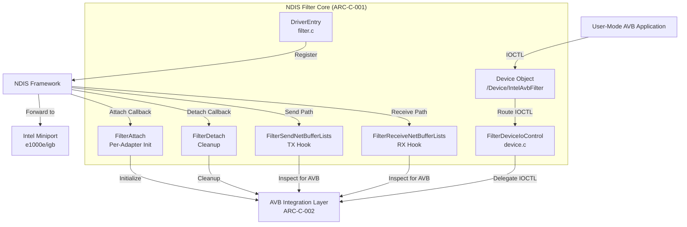
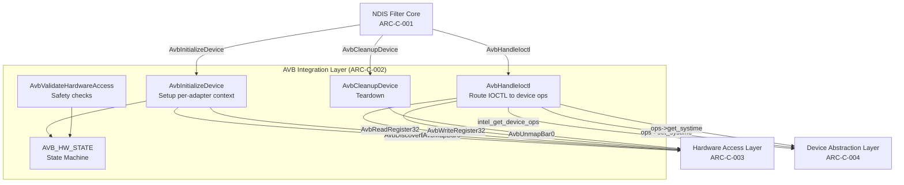
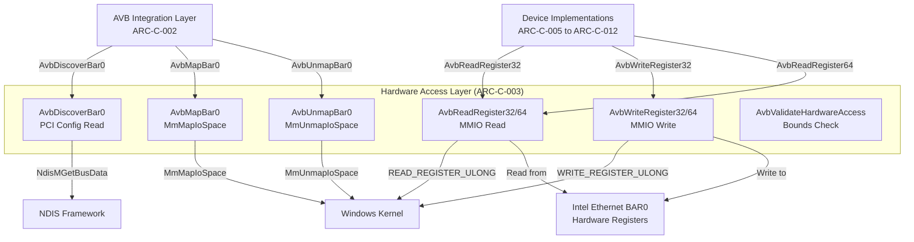

# Architecture Component (ARC-C) - GitHub Issue Templates

**Purpose**: Create these as GitHub Issues with labels `type:architecture:component`, `phase:03-architecture`

---

## ARC-C-001: NDIS Filter Core

**Title**: ARC-C-NDIS-001: NDIS Filter Core (Lifecycle & Packet Hooks)

**Labels**: `type:architecture:component`, `phase:03-architecture`, `priority:p0`, `layer:ndis`

---

### Description
Core NDIS 6.0 Lightweight Filter Driver providing packet interception, device interface, and lifecycle management for Intel AVB/TSN functionality.

### Responsibility
**Single Responsibility**: NDIS framework integration and packet flow interception

**Responsibilities**:
- NDIS driver registration (`NdisFRegisterFilterDriver`)
- Per-adapter lifecycle (Attach, Detach, Restart, Pause)
- Packet interception (Send/Receive hooks)
- OID request handling (pass-through + selective interception)
- Device object creation for user-mode IOCTL interface
- PnP and Power management

**Does NOT Do** (Out of Scope):
- Hardware register access (delegated to Hardware Access Layer)
- PTP/TSN configuration logic (delegated to AVB Integration Layer)
- Device-specific operations (delegated to Device Abstraction Layer)

### Interfaces

#### Provided Interfaces

**NDIS Filter Callbacks** (Registered with `NdisFRegisterFilterDriver`):
```c
// Lifecycle
FILTER_ATTACH FilterAttach;                     // Attach to Intel miniport
FILTER_DETACH FilterDetach;                     // Clean up on detach
FILTER_RESTART FilterRestart;                   // Start packet processing
FILTER_PAUSE FilterPause;                       // Stop packet processing

// Packet processing
FILTER_SEND_NET_BUFFER_LISTS FilterSendNetBufferLists;           // TX interception
FILTER_SEND_NET_BUFFER_LISTS_COMPLETE FilterSendNetBufferListsComplete;
FILTER_RECEIVE_NET_BUFFER_LISTS FilterReceiveNetBufferLists;     // RX interception
FILTER_RETURN_NET_BUFFER_LISTS FilterReturnNetBufferLists;

// OID handling
FILTER_OID_REQUEST FilterOidRequest;             // Intercept OID requests
FILTER_OID_REQUEST_COMPLETE FilterOidRequestComplete;
```

**Device Interface** (IOCTL):
```c
// Device names
#define FILTER_DEVICE_NAME   L"\\Device\\IntelAvbFilter"
#define FILTER_DOSDEVICE_NAME L"\\DosDevices\\IntelAvbFilter"

// IOCTL dispatch
NTSTATUS FilterDeviceIoControl(
    PDEVICE_OBJECT DeviceObject,
    PIRP Irp
);

// IOCTLs handled (delegated to AVB Integration Layer)
- IOCTL_AVB_GET_DEVICE_INFO
- IOCTL_AVB_GET_SYSTIME
- IOCTL_AVB_SET_SYSTIME
- IOCTL_AVB_ADJUST_FREQ
- IOCTL_AVB_CONFIGURE_TAS
- IOCTL_AVB_CONFIGURE_CBS
- (See avb_ioctl.h for complete list)
```

#### Required Interfaces

**Dependencies on NDIS Framework**:
- `NdisFRegisterFilterDriver()` - Driver registration
- `NdisFSetAttributes()` - Filter context setup
- `NdisAllocateMemoryWithTagPriority()` - Memory allocation
- `NdisMGetBusData()` - PCI configuration space access (for device discovery)

**Dependencies on AVB Integration Layer** (#ARC-C-002):
- `AvbInitializeDevice()` - Per-adapter AVB initialization
- `AvbCleanupDevice()` - Per-adapter cleanup
- `AvbHandleIoctl()` - IOCTL request delegation

**Dependencies on Device Abstraction Layer** (via AVB Integration):
- Device operations lookup (`intel_get_device_ops()`)

### Component Diagram



### Technology Stack
- **Language**: C (Kernel-mode)
- **Framework**: NDIS 6.0 Lightweight Filter API
- **Build System**: Visual Studio 2019/2022, MSBuild
- **WDK Version**: Windows Driver Kit 10
- **Target OS**: Windows 7 SP1+ (x64, ARM64)

### Quality Requirements

| Attribute | Requirement | Measure |
|-----------|-------------|---------|
| **Compatibility** | NDIS 6.0+ compliance | Passes HLK certification |
| **Reliability** | No crashes or hangs | 0 BSODs in 100hr stress test |
| **Performance** | Minimal packet latency | <10µs added latency |
| **Resource Usage** | Low memory footprint | <1MB per adapter |

### Data Structures

**Filter Module Context** (`MS_FILTER` in filter.h):
```c
typedef struct _MS_FILTER {
    LIST_ENTRY              FilterModuleLink;     // Global filter list
    NDIS_HANDLE             FilterHandle;         // NDIS filter handle
    NDIS_HANDLE             MiniportHandle;       // Miniport handle
    NDIS_STRING             MiniportName;         // Adapter friendly name
    NDIS_STRING             FilterModuleName;     // Filter instance name
    NET_LUID                MiniportNetLuid;      // Miniport LUID
    
    // AVB-specific context (allocated if Intel adapter)
    PAVB_DEVICE_CONTEXT     AvbContext;           // NULL if not Intel AVB
    
    // Packet queue (for pause/restart)
    LIST_ENTRY              SendNBLQueue;
    NDIS_SPIN_LOCK          SendNBLQueueLock;
    
    // State
    FILTER_STATE            State;                // Running, Pausing, Paused
    ULONG                   OutstandingSends;
    ULONG                   OutstandingReceives;
} MS_FILTER, *PMS_FILTER;
```

**Global State**:
```c
NDIS_HANDLE FilterDriverHandle;      // NDIS driver handle
NDIS_HANDLE NdisFilterDeviceHandle;  // Device object handle
PDEVICE_OBJECT NdisDeviceObject;     // WDM device object
LIST_ENTRY FilterModuleList;         // List of all filter instances
NDIS_SPIN_LOCK FilterListLock;       // Protects filter list
```

### Control Flow

#### Driver Initialization (DriverEntry)
```
DriverEntry()
    ↓
1. Initialize global state (FilterModuleList, locks)
    ↓
2. Set up NDIS filter characteristics (version, callbacks)
    ↓
3. NdisFRegisterFilterDriver()
    ↓
4. Create device object (\Device\IntelAvbFilter)
    ↓
5. Register all device implementations (AvbRegisterAllDevices)
    ↓
Return STATUS_SUCCESS
```

#### Per-Adapter Attach Flow
```
FilterAttach()
    ↓
1. Allocate MS_FILTER context
    ↓
2. NdisFSetAttributes() - register filter context
    ↓
3. Check if Intel adapter (vendor ID 0x8086)
    ↓
    Yes → 4a. Allocate AVB_DEVICE_CONTEXT
           ↓
       4b. AvbInitializeDevice() - discover BAR0, map registers
           ↓
       4c. Validate PTP clock
    ↓
    No → Skip AVB initialization
    ↓
5. Insert into FilterModuleList
    ↓
Return STATUS_SUCCESS
```

#### Packet Send (TX) Flow
```
FilterSendNetBufferLists()
    ↓
1. Check filter state (paused/running)
    ↓
2. If AVB context exists → AvbInspectSendPacket()
    ↓
3. NdisFSendNetBufferLists() - forward to miniport
    ↓
FilterSendNetBufferListsComplete()
    ↓
Complete to protocol above
```

#### IOCTL Dispatch Flow
```
User-mode: DeviceIoControl(hDevice, IOCTL_AVB_GET_SYSTIME, ...)
    ↓
FilterDeviceIoControl()
    ↓
1. Extract IOCTL code and input buffer
    ↓
2. Lookup filter instance (if adapter-specific IOCTL)
    ↓
3. Delegate to AvbHandleIoctl(AvbContext, IoctlCode, Input, Output)
    ↓
4. Complete IRP with result
    ↓
Return to user-mode
```

### Error Handling

| Error Condition | Response | Recovery |
|-----------------|----------|----------|
| **Attach to non-Intel adapter** | Skip AVB init, succeed attach | Filter remains passive |
| **BAR0 discovery fails** | Log error, skip PTP | Filter functional, no PTP |
| **PTP clock invalid** | Log warning, mark unavailable | Retry on first IOCTL |
| **IOCTL invalid buffer** | Return `STATUS_INVALID_PARAMETER` | User retries with correct buffer |
| **IOCTL during pause** | Return `STATUS_DEVICE_NOT_READY` | User waits for restart |

### Testing Strategy

**Unit Tests** (Kernel-Mode Test Framework):
- NDIS characteristic structure validation
- Filter context allocation/deallocation
- Device object creation

**Integration Tests**:
- Attach to physical Intel adapter
- Send/receive packet forwarding
- IOCTL round-trip (user-mode ↔ kernel-mode)

**Stress Tests**:
- 100K packets/sec send/receive
- Rapid attach/detach cycles (100 iterations)
- Concurrent IOCTL requests (10 threads)

**HLK Certification**:
- NDIS filter logo test suite
- Power management tests
- Safe removal tests

### Traceability

**Satisfies Requirements**:
- #31 (StR: NDIS Filter Driver for AVB/TSN)
- #88 (REQ-NF-COMPAT-NDIS-001: NDIS 6.0+ Compatibility)
- #20, #21, #22, #23 (REQ-F-INFRA: Driver lifecycle, IOCTL interface)

**Architecture Decisions**:
- #ADR-001 (NDIS 6.0 for compatibility)

**Depends On**:
- #ARC-C-002 (AVB Integration Layer)
- #ARC-C-003 (Hardware Access Layer - via AVB Integration)
- #ARC-C-004 (Device Abstraction Layer - via AVB Integration)

**Verified By**:
- Manual testing on Windows 7/10/11
- HLK certification suite
- Stress test suite

---

**Status**: Implemented (Production)  
**Owner**: Core Driver Team  
**Last Updated**: 2024-12-08  
**Code Location**: `filter.c`, `filter.h`, `device.c`, `flt_dbg.c`

---

## ARC-C-002: AVB Integration Layer

**Title**: ARC-C-AVB-001: AVB Integration Layer (Bridge Between NDIS and Hardware)

**Labels**: `type:architecture:component`, `phase:03-architecture`, `priority:p0`, `layer:avb`

---

### Description
Bridge layer between NDIS Filter Core and hardware access, managing per-adapter AVB/TSN context, hardware state machine, and IOCTL routing.

### Responsibility
**Single Responsibility**: Manage AVB device lifecycle and coordinate NDIS↔Hardware interactions

**Responsibilities**:
- Per-adapter AVB context allocation/deallocation
- Hardware state machine management (UNBOUND → BOUND → BAR_MAPPED → PTP_READY)
- IOCTL request routing to device implementations
- Hardware access validation and safety checks
- Shared memory timestamp ring buffer management (planned)
- TSN configuration caching

**Does NOT Do** (Out of Scope):
- NDIS lifecycle management (delegated to NDIS Filter Core)
- Direct hardware register access (delegated to Hardware Access Layer)
- Device-specific logic (delegated to Device Abstraction Layer)

### Interfaces

#### Provided Interfaces

**AVB Context Management**:
```c
// Initialize AVB context for Intel adapter
NTSTATUS AvbInitializeDevice(
    PMS_FILTER FilterContext,
    PAVB_DEVICE_CONTEXT *AvbContext
);

// Clean up AVB context on detach
NTSTATUS AvbCleanupDevice(
    PAVB_DEVICE_CONTEXT AvbContext
);
```

**IOCTL Handling** (Called from NDIS Filter Core):
```c
// Route IOCTL to appropriate device operation
NTSTATUS AvbHandleIoctl(
    PAVB_DEVICE_CONTEXT AvbContext,
    ULONG IoctlCode,
    PVOID InputBuffer,
    ULONG InputBufferLength,
    PVOID OutputBuffer,
    ULONG OutputBufferLength,
    PULONG BytesReturned
);

// IOCTLs routed:
- IOCTL_AVB_GET_DEVICE_INFO → device->get_info()
- IOCTL_AVB_GET_SYSTIME → device->get_systime()
- IOCTL_AVB_SET_SYSTIME → device->set_systime()
- IOCTL_AVB_ADJUST_FREQ → device->adjust_freq()
- IOCTL_AVB_CONFIGURE_TAS → device->setup_tas()
- IOCTL_AVB_CONFIGURE_CBS → device->setup_cbs()
```

**Hardware Validation**:
```c
// Check if Intel adapter supports AVB
BOOLEAN AvbIsSupportedIntelController(
    USHORT VendorId,
    USHORT DeviceId
);

// Validate hardware access before operation
NTSTATUS AvbValidateHardwareAccess(
    PAVB_DEVICE_CONTEXT AvbContext
);

// Verify PTP clock is incrementing
NTSTATUS AvbValidatePtpClock(
    PAVB_DEVICE_CONTEXT AvbContext
);
```

#### Required Interfaces

**Depends on Hardware Access Layer** (#ARC-C-003):
- `AvbDiscoverBar0()` - Discover BAR0 physical address
- `AvbMapBar0()` - Map BAR0 into kernel virtual address space
- `AvbUnmapBar0()` - Unmap BAR0 on cleanup
- `AvbReadRegister32()`, `AvbWriteRegister32()` - Register I/O

**Depends on Device Abstraction Layer** (#ARC-C-004):
- `intel_get_device_ops()` - Lookup device operations table
- Device-specific operations (via ops table)

### Component Diagram



### Technology Stack
- **Language**: C (Kernel-mode)
- **Dependencies**: NDIS 6.0, WDK memory management, Intel AVB library (device_t)
- **External Library**: Intel AVB library (`external/intel_avb/lib/`)

### Quality Requirements

| Attribute | Requirement | Measure |
|-----------|-------------|---------|
| **Reliability** | Graceful hardware failure handling | No BSOD on invalid hardware |
| **Safety** | Validate all hardware access | Bounds checks on register offsets |
| **Performance** | Low IOCTL overhead | <50µs IOCTL processing time |
| **Maintainability** | Clear state machine transitions | Documented state machine |

### Data Structures

**AVB Device Context** (`AVB_DEVICE_CONTEXT` in avb_integration.h):
```c
typedef struct _AVB_DEVICE_CONTEXT {
    // Intel AVB library device structure
    device_t intel_device;
    
    // Hardware state machine
    AVB_HW_STATE hw_state;  // UNBOUND → BOUND → BAR_MAPPED → PTP_READY
    
    // Hardware access
    PINTEL_HARDWARE_CONTEXT hardware_context;  // BAR0 mapping
    
    // NDIS references
    NDIS_HANDLE miniport_handle;      // Miniport adapter handle
    PMS_FILTER filter_instance;       // Back-pointer to filter context
    
    // Timestamp event ring (planned)
    BOOLEAN ts_ring_allocated;
    ULONG ts_ring_id;
    PVOID ts_ring_buffer;              // Kernel-space ring buffer
    ULONG ts_ring_length;
    PMDL ts_ring_mdl;
    ULONGLONG ts_user_cookie;
    HANDLE ts_ring_section;            // Section handle for user-mode mapping
    SIZE_T ts_ring_view_size;
    
    // TSN configuration cache
    UCHAR qav_last_tc;                 // Credit-Based Shaper traffic class
    ULONG qav_idle_slope;
    ULONG qav_send_slope;
    ULONG qav_hi_credit;
    ULONG qav_lo_credit;
} AVB_DEVICE_CONTEXT, *PAVB_DEVICE_CONTEXT;
```

**Hardware State Machine**:
```c
typedef enum _AVB_HW_STATE {
    AVB_HW_UNBOUND = 0,      // Initial state, filter not yet attached
    AVB_HW_BOUND,            // Filter attached to Intel miniport
    AVB_HW_BAR_MAPPED,       // BAR0 mapped, registers accessible
    AVB_HW_PTP_READY         // PTP clock verified and operational
} AVB_HW_STATE;
```

### Control Flow

#### Initialization Flow (AvbInitializeDevice)
```
AvbInitializeDevice()
    ↓
1. Allocate AVB_DEVICE_CONTEXT
    ↓
2. Query miniport for PCI device ID
    ↓
3. Check if supported Intel controller → AvbIsSupportedIntelController()
    ↓
    No → Return STATUS_NOT_SUPPORTED
    ↓
4. State: UNBOUND → BOUND
    ↓
5. Discover BAR0 physical address → AvbDiscoverBar0()
    ↓
6. Map BAR0 into kernel address space → AvbMapBar0()
    ↓
7. State: BOUND → BAR_MAPPED
    ↓
8. Validate PTP clock (read SYSTIML/SYSTIMH twice, check increment)
    ↓
9. State: BAR_MAPPED → PTP_READY
    ↓
10. Lookup device operations → intel_get_device_ops(device_type)
    ↓
11. Call device->init() if present
    ↓
Return STATUS_SUCCESS
```

#### IOCTL Routing Flow (AvbHandleIoctl)
```
AvbHandleIoctl(AvbContext, IOCTL_AVB_GET_SYSTIME, ...)
    ↓
1. Validate AvbContext->hw_state == PTP_READY
    ↓
    No → Return STATUS_DEVICE_NOT_READY
    ↓
2. Validate input/output buffer sizes
    ↓
3. Lookup device operations → intel_get_device_ops(AvbContext->intel_device.device_type)
    ↓
4. Switch on IOCTL code:
    ↓
    IOCTL_AVB_GET_SYSTIME:
        → ops->get_systime(&AvbContext->intel_device, &systime)
        → Copy systime to output buffer
    ↓
    IOCTL_AVB_SET_SYSTIME:
        → Copy systime from input buffer
        → ops->set_systime(&AvbContext->intel_device, systime)
    ↓
    IOCTL_AVB_CONFIGURE_TAS:
        → Parse TAS config from input buffer
        → ops->setup_tas(&AvbContext->intel_device, &tas_config)
    ↓
5. Set *BytesReturned
    ↓
Return NTSTATUS
```

#### Cleanup Flow (AvbCleanupDevice)
```
AvbCleanupDevice()
    ↓
1. Lookup device operations
    ↓
2. Call device->cleanup() if present
    ↓
3. Unmap BAR0 → AvbUnmapBar0()
    ↓
4. State: PTP_READY → BAR_MAPPED → BOUND → UNBOUND
    ↓
5. Free AVB_DEVICE_CONTEXT
    ↓
Return STATUS_SUCCESS
```

### Error Handling

| Error Condition | Response | Recovery |
|-----------------|----------|----------|
| **Non-Intel adapter** | Return `STATUS_NOT_SUPPORTED` | Filter skips AVB init |
| **BAR0 discovery fails** | Log error, return failure | Filter attaches without AVB |
| **BAR0 mapping fails** | Log error, return failure | Retry on first IOCTL |
| **PTP clock not incrementing** | Log warning, mark PTP unavailable | User-mode tool reports error |
| **IOCTL with hw_state != PTP_READY** | Return `STATUS_DEVICE_NOT_READY` | User retries after delay |
| **Device operation returns error** | Map to NTSTATUS, log details | User gets specific error code |

### Testing Strategy

**Unit Tests**:
- State machine transitions (mock hardware context)
- IOCTL parameter validation (invalid buffers)
- Error path handling (BAR0 failure, PTP validation failure)

**Integration Tests**:
- Full initialization flow on physical adapter
- IOCTL round-trip (set_systime, get_systime, verify match)
- Cleanup validation (no memory leaks)

**Hardware Tests** (per device family):
- i210, i217, i219, i225, i226, i350
- Validate PTP clock increments
- Validate register access (read-write-verify)

### Traceability

**Satisfies Requirements**:
- #1 (StR: Hardware Abstraction for Multiple Intel Devices)
- #2, #3, #5, #6, #7 (REQ-F-PTP: PTP clock control)
- #20, #21 (REQ-F-INFRA: Driver lifecycle)

**Architecture Decisions**:
- #ADR-002 (Direct BAR0 Access - validates hardware access)
- #ADR-003 (Strategy Pattern - lookups device ops)
- #ADR-004 (Ring Buffer - manages timestamp event buffer)

**Depends On**:
- #ARC-C-003 (Hardware Access Layer)
- #ARC-C-004 (Device Abstraction Layer)

**Used By**:
- #ARC-C-001 (NDIS Filter Core)

**Verified By**:
- `avb_test_i210.c`, `avb_test_i226.c` (hardware validation tests)

---

**Status**: Implemented (Core functionality, ring buffer planned)  
**Owner**: AVB Integration Team  
**Last Updated**: 2024-12-08  
**Code Location**: `avb_integration_fixed.c`, `avb_integration.h`, `avb_context_management.c`

---

## ARC-C-003: Hardware Access Layer

**Title**: ARC-C-HW-001: Hardware Access Layer (Direct BAR0 MMIO)

**Labels**: `type:architecture:component`, `phase:03-architecture`, `priority:p0`, `layer:hardware`

---

### Description
Low-level hardware abstraction providing direct memory-mapped I/O (MMIO) access to Intel Ethernet controller registers via BAR0, with thread safety and validation.

### Responsibility
**Single Responsibility**: Safe, validated, direct hardware register access

**Responsibilities**:
- BAR0 physical address discovery (via PCI config space)
- BAR0 virtual address mapping (`MmMapIoSpace`)
- Register read/write primitives (32-bit, 64-bit)
- Hardware access validation (bounds checking, mapping status)
- Thread-safe register access (spin locks for critical registers)
- BAR0 unmapping on cleanup

**Does NOT Do** (Out of Scope):
- PTP/TSN configuration logic (delegated to Device Abstraction Layer)
- NDIS lifecycle management (handled by NDIS Filter Core)
- Device-specific register interpretation (delegated to Device Implementations)

### Interfaces

#### Provided Interfaces

**BAR0 Discovery and Mapping**:
```c
// Discover BAR0 physical address from PCI config space
NTSTATUS AvbDiscoverBar0(
    PMS_FILTER FilterContext,
    PPHYSICAL_ADDRESS PhysicalAddress,
    PULONG Length
);

// Map BAR0 into kernel virtual address space
NTSTATUS AvbMapBar0(
    PHYSICAL_ADDRESS PhysicalAddress,
    ULONG Length,
    PUCHAR *MmioBase
);

// Unmap BAR0 on cleanup
VOID AvbUnmapBar0(
    PUCHAR MmioBase,
    ULONG Length
);
```

**Register Access Primitives**:
```c
// 32-bit register read/write
ULONG AvbReadRegister32(
    PUCHAR MmioBase,
    ULONG Offset
);

VOID AvbWriteRegister32(
    PUCHAR MmioBase,
    ULONG Offset,
    ULONG Value
);

// 64-bit register read/write (for PTP timestamps)
ULONGLONG AvbReadRegister64(
    PUCHAR MmioBase,
    ULONG Offset
);

VOID AvbWriteRegister64(
    PUCHAR MmioBase,
    ULONG Offset,
    ULONGLONG Value
);

// Safe read with validation
NTSTATUS AvbReadRegister32Safe(
    PINTEL_HARDWARE_CONTEXT HwContext,
    ULONG Offset,
    PULONG Value
);
```

**Hardware Validation**:
```c
// Validate hardware access before operation
NTSTATUS AvbValidateHardwareAccess(
    PINTEL_HARDWARE_CONTEXT HwContext
);

// Read STATUS register to verify mapping
BOOLEAN AvbIsHardwareAccessible(
    PUCHAR MmioBase
);
```

#### Required Interfaces

**Depends on Windows Kernel APIs**:
- `NdisMGetBusData()` - Read PCI configuration space
- `MmMapIoSpace()` - Map physical memory to virtual
- `MmUnmapIoSpace()` - Unmap virtual memory
- `READ_REGISTER_ULONG()`, `WRITE_REGISTER_ULONG()` - Memory barriers for MMIO
- `KeAcquireSpinLockAtDpcLevel()`, `KeReleaseSpinLockFromDpcLevel()` - Thread safety

### Component Diagram



### Technology Stack
- **Language**: C (Kernel-mode)
- **APIs**: Windows HAL (Hardware Abstraction Layer), NDIS 6.0
- **Memory**: Non-paged pool (BAR0 mapping must persist)
- **Thread Safety**: NDIS spin locks

### Quality Requirements

| Attribute | Requirement | Measure |
|-----------|-------------|---------|
| **Performance** | Low latency register access | <500ns per read/write |
| **Safety** | No invalid memory access | Bounds checks on all offsets |
| **Reliability** | Graceful failure on mapping errors | No BSOD if BAR0 unavailable |
| **Thread Safety** | Atomic register access | Spin locks for critical registers |

### Data Structures

**Hardware Context** (`INTEL_HARDWARE_CONTEXT` in avb_integration.h):
```c
typedef struct _INTEL_HARDWARE_CONTEXT {
    PHYSICAL_ADDRESS physical_address;  // BAR0 physical address (from PCI config)
    PUCHAR mmio_base;                  // BAR0 mapped virtual address
    ULONG mmio_length;                 // Mapping size (bytes)
    BOOLEAN mapped;                    // Mapping status flag
} INTEL_HARDWARE_CONTEXT, *PINTEL_HARDWARE_CONTEXT;
```

**PCI Configuration Space Layout** (for BAR0 discovery):
```c
#define PCI_CONFIG_BAR0_OFFSET  0x10  // BAR0 register at offset 0x10
#define PCI_BAR_MEMORY_TYPE_64BIT 0x04  // 64-bit BAR indicator
#define PCI_BAR_ADDRESS_MASK    0xFFFFFFF0  // Mask for base address extraction
```

### Control Flow

#### BAR0 Discovery Flow (AvbDiscoverBar0)
```
AvbDiscoverBar0()
    ↓
1. Read PCI configuration space via NdisMGetBusData()
    ↓
2. Read BAR0 register (offset 0x10)
    ↓
3. Check if 64-bit BAR (bit 2 set)
    ↓
    Yes → Read BAR1 (offset 0x14) for upper 32 bits
    ↓
4. Mask to extract base address (clear lowest 4 bits)
    ↓
5. Read BAR0 size:
    - Write 0xFFFFFFFF to BAR0
    - Read back value
    - Size = ~(value & mask) + 1
    ↓
6. Return physical address and size
```

#### BAR0 Mapping Flow (AvbMapBar0)
```
AvbMapBar0(PhysicalAddress, Length)
    ↓
1. Validate inputs (PhysicalAddress != 0, Length > 0)
    ↓
2. Call MmMapIoSpace(PhysicalAddress, Length, MmNonCached)
    ↓
    Success → Return virtual address
    ↓
    Failure → Log error, return NULL
```

#### Register Read Flow (AvbReadRegister32)
```
AvbReadRegister32(MmioBase, Offset)
    ↓
1. Calculate register address: address = MmioBase + Offset
    ↓
2. Call READ_REGISTER_ULONG((PULONG)address)
    ↓
3. Memory barrier ensured by READ_REGISTER_ULONG
    ↓
Return value
```

#### Register Write Flow (AvbWriteRegister32)
```
AvbWriteRegister32(MmioBase, Offset, Value)
    ↓
1. Calculate register address: address = MmioBase + Offset
    ↓
2. Call WRITE_REGISTER_ULONG((PULONG)address, Value)
    ↓
3. Memory barrier ensured by WRITE_REGISTER_ULONG
```

#### Safe Register Read Flow (AvbReadRegister32Safe)
```
AvbReadRegister32Safe(HwContext, Offset, *Value)
    ↓
1. Validate HwContext != NULL
    ↓
2. Validate HwContext->mapped == TRUE
    ↓
3. Validate Offset < HwContext->mmio_length
    ↓
4. Call AvbReadRegister32(HwContext->mmio_base, Offset)
    ↓
5. Store result in *Value
    ↓
Return STATUS_SUCCESS or error code
```

### Error Handling

| Error Condition | Response | Recovery |
|-----------------|----------|----------|
| **PCI config read fails** | Log error, return `STATUS_UNSUCCESSFUL` | Filter skips AVB init |
| **BAR0 address is zero** | Log error, return `STATUS_INVALID_ADDRESS` | Hardware not configured correctly |
| **MmMapIoSpace fails** | Log error, return `STATUS_INSUFFICIENT_RESOURCES` | System low on resources, retry possible |
| **Invalid register offset** | Return `STATUS_INVALID_PARAMETER` | Caller bug, fix caller |
| **Read from unmapped BAR0** | Validate mapping first, return error | Prevent BSOD from invalid access |

### Testing Strategy

**Unit Tests**:
- BAR0 discovery with mock PCI config data
- Offset bounds checking (valid/invalid offsets)
- Mapping/unmapping lifecycle

**Integration Tests**:
- Physical adapter BAR0 discovery
- Register read-write-verify cycle
- Mapping cleanup (no memory leaks)

**Hardware Tests** (per device):
- Read STATUS register (0x00008) - should return non-zero
- Read/write PTP SYSTIML (0x0B600) - verify increment
- Read device ID register - verify matches expected

### Register Safety Rules

**Safe Registers** (PTP only - no miniport conflict):
| Register | Offset | Access | Purpose |
|----------|--------|--------|---------|
| SYSTIML  | 0x0B600 | R/W | System time low 32 bits |
| SYSTIMH  | 0x0B604 | R/W | System time high 32 bits |
| TIMINCA  | 0x0B608 | R/W | Time increment attribute |
| TSAUXC   | 0x0B640 | R/W | Auxiliary timestamp control |
| RXSTMPL  | 0x0B694 | R   | RX timestamp low |
| RXSTMPH  | 0x0B698 | R   | RX timestamp high |
| TXSTMPL  | 0x0B618 | R   | TX timestamp low |
| TXSTMPH  | 0x0B61C | R   | TX timestamp high |

**Unsafe Registers** (miniport-owned - DO NOT TOUCH):
| Register | Offset | Reason |
|----------|--------|--------|
| CTRL     | 0x00000 | Device control - miniport owns |
| STATUS   | 0x00008 | Read-only OK, write forbidden |
| RCTL     | 0x00100 | RX control - miniport owns |
| TCTL     | 0x00400 | TX control - miniport owns |
| ICR      | 0x000C0 | Interrupt cause - miniport owns |

### Traceability

**Satisfies Requirements**:
- #2, #3, #5, #6, #7 (REQ-F-PTP: Hardware PTP clock control)
- #71 (REQ-NF-PERF: Low-latency hardware access <1µs)

**Architecture Decisions**:
- #ADR-002 (Direct BAR0 MMIO Access - this component implements the decision)

**Used By**:
- #ARC-C-002 (AVB Integration Layer - initialization)
- #ARC-C-004 (Device Abstraction Layer - register I/O)
- #ARC-C-005 to #ARC-C-012 (Device Implementations - device-specific register access)

**Verified By**:
- `avb_hardware_access.c` unit tests
- `avb_bar0_discovery.c` integration tests
- `avb_test_i210.c` hardware validation

---

**Status**: Implemented (Production)  
**Owner**: Hardware Abstraction Team  
**Last Updated**: 2024-12-08  
**Code Location**: `avb_hardware_access.c`, `avb_bar0_discovery.c`, `avb_bar0_enhanced.c`

---

**END OF ARC-C TEMPLATES**

---

## Next Steps

1. **Create GitHub Issues** for each ARC-C template
2. **Create remaining ARC-C issues** for:
   - ARC-C-004: Device Abstraction Layer
   - ARC-C-005 to ARC-C-012: Device Implementations (i210, i217, i219, i225, i226, i350, 82575, 82576, 82580)
   - ARC-C-013: TSN Configuration
   - ARC-C-014: Debug/Diagnostics
3. **Link ADR ↔ ARC-C** issues with traceability comments
4. **Create C4 diagrams** (see next file)
