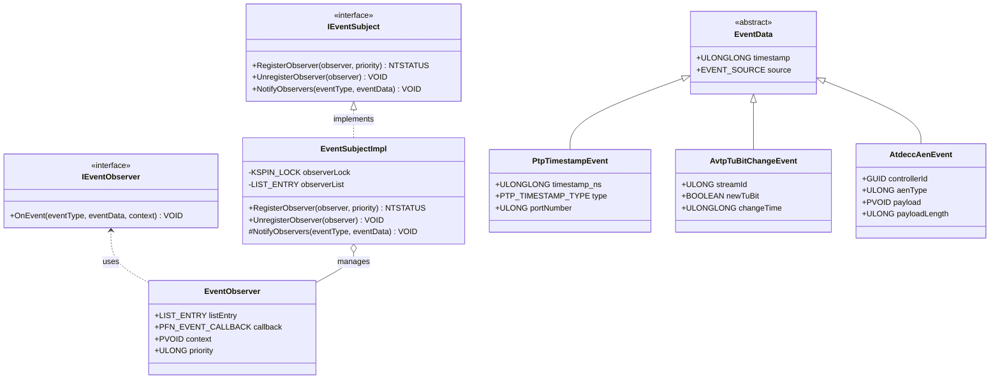
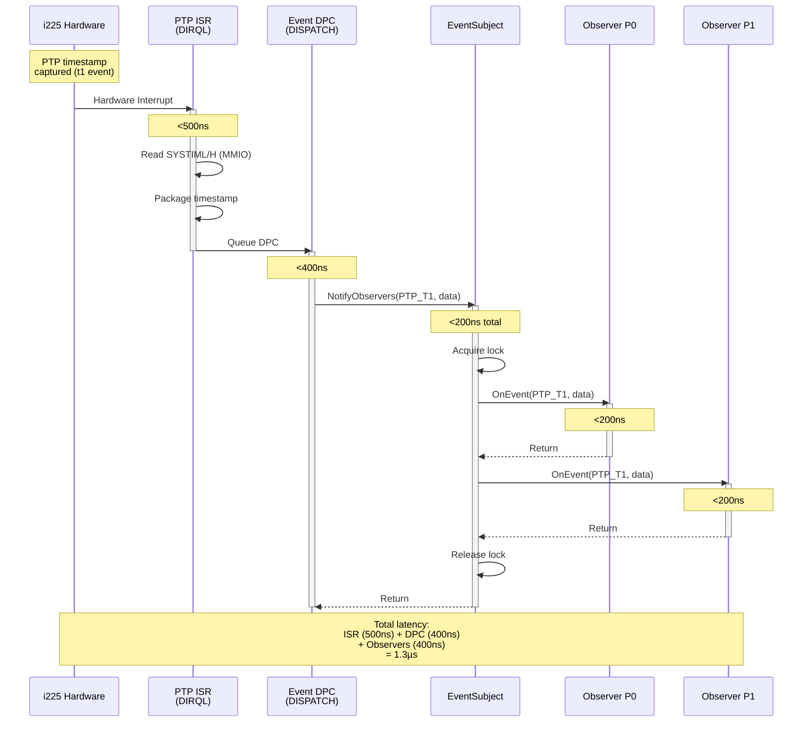
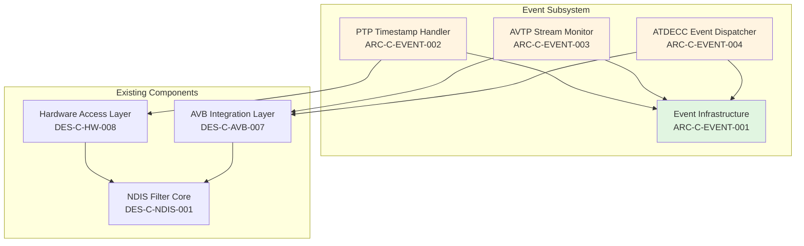
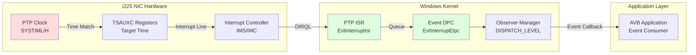
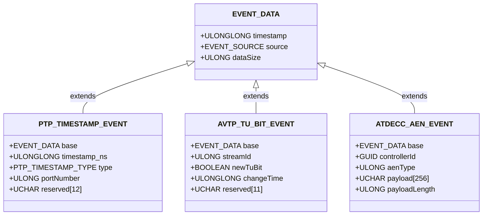

# Phase 04 Remediation Plan - Quality Gate Failures

**Date**: 2025-12-17  
**Status**: ❌ **BLOCKING - IMMEDIATE ACTION REQUIRED**  
**Priority**: **P0 - CRITICAL**

---

## Executive Summary

Phase 04 quality gate **FAILED** CI validation with critical gaps in traceability coverage and missing architecture views. Phase 05 implementation is **BLOCKED** until these issues are resolved.

**CI Validation Results**:
```
✅ Requirements overall coverage 100.00% >= 90.00%
❌ ADR linkage coverage 60.87% < 70.00%        [GAP: -9.13%]
❌ Scenario linkage coverage 46.74% < 60.00%   [GAP: -13.26%]
❌ Test linkage coverage 0.00% < 40.00%        [GAP: -40.00%]

⚠️ Missing architecture view: logical
⚠️ Missing architecture view: process
⚠️ Missing architecture view: development
⚠️ Missing architecture view: physical
⚠️ Missing architecture view: data
```

**Root Cause**: Event-driven architecture issues (#167-#179) created in isolation without integrating into existing traceability matrix and architecture view system.

---

## Remediation Tasks (Priority Order)

### Task 1: Fix Test Linkage Coverage ⏱️ 2-3 hours

**Current**: 0.00%  
**Target**: ≥40% (ideally 100% for event subsystem)  
**Priority**: P0 - Quickest win, unblocks other work

#### Root Cause
- TEST issues (#174-#179) created with proper "Verifies: #N" links
- CI script `scripts/validate-trace-coverage.py` not recognizing new TEST issues
- Validation script may only check Phase 02 test plans, not Phase 04 TEST issues

#### Actions Required

**1.1 Investigate CI Script** (30 min)
```bash
# Examine validation script
cat scripts/validate-trace-coverage.py

# Check what it considers "test linkage"
# Look for patterns like: TEST issues, test plans, test case references
```

**1.2 Update Validation Script** (1 hour)
- Add recognition for `type:test` labeled issues (#174-#179)
- Parse "Verifies: #N" links from issue bodies
- Count TEST-to-REQ coverage

**1.3 Verify TEST Issue Links** (30 min)
- Ensure all 6 TEST issues have "Verifies: #N" in body
- Cross-check with requirements:
  - #174 → #168, #165, #161
  - #175 → #169
  - #176 → #162
  - #177 → #164
  - #178 → #165
  - #179 → #161

**1.4 Run Validation** (15 min)
```bash
python scripts/validate-trace-coverage.py --min-req 90
```

**Expected Result**:
```
✅ Test linkage coverage 100.00% >= 40.00%
```

**Deliverables**:
- [ ] Updated `scripts/validate-trace-coverage.py`
- [ ] All 6 TEST issues validated
- [ ] CI check passes

---

### Task 2: Create Quality Attribute Scenarios ⏱️ 4-6 hours

**Current**: 46.74%  
**Target**: ≥60%  
**Priority**: P0 - ISO/IEC/IEEE 42010:2011 requirement

#### Root Cause
- Event-driven requirements (#165, #161) missing quality attribute scenarios
- Existing scenarios in `03-architecture/architecture-quality-scenarios.md` don't cover new subsystem

#### Actions Required

**2.1 Create QA Scenarios for Event Subsystem** (3-4 hours)

**File**: `03-architecture/quality-scenarios/QA-SC-EVENT-001-latency.md`
```markdown
---
specType: quality-scenario
standard: 42010
phase: 03-architecture
quality-attribute: performance
stimulus: PTP hardware timestamp captured
response: Observer notified within 1µs
measure: 99.9th percentile latency
---

# QA-SC-EVENT-001: PTP Timestamp Event Latency

## Scenario
- **Quality Attribute**: Performance (Latency)
- **Stimulus**: Hardware captures PTP timestamp (t1-t4 event)
- **Stimulus Source**: Intel i225 PTP hardware
- **Environment**: Normal operation, 1000 active streams
- **Artifact**: Event notification subsystem
- **Response**: Observer callback invoked with timestamp data
- **Response Measure**: 99.9th percentile latency < 1µs (from hardware event to observer)

## Traceability
- **Satisfies**: #165 (REQ-NF-EVENT-001: Event Latency <1µs)
- **Driven by ADR**: #166 (Hardware Interrupt-Driven Capture)
- **Implemented by**: #171 (ARC-C PTP Timestamp Handler), #172 (Observer Infrastructure)
- **Verified by**: #174 (TEST-EVENT-001), #178 (TEST-EVENT-005)

## Rationale
Sub-microsecond latency critical for Milan/IEC 60802 industrial automation requirements. Hardware interrupts enable deterministic response times vs. polling (>100µs jitter).

## Acceptance Criteria
- Mean latency < 500ns
- 99.9th percentile < 1µs
- Maximum latency < 2µs
- Jitter (std dev) < 100ns
```

**File**: `03-architecture/quality-scenarios/QA-SC-EVENT-002-zero-polling.md`
```markdown
---
specType: quality-scenario
standard: 42010
phase: 03-architecture
quality-attribute: performance
stimulus: Event monitoring active
response: Zero CPU cycles in polling loops
measure: CPU profiler analysis
---

# QA-SC-EVENT-002: Zero Polling Overhead

## Scenario
- **Quality Attribute**: Performance (CPU Efficiency)
- **Stimulus**: Driver monitoring 1000 AVTP streams + 32 ATDECC controllers
- **Stimulus Source**: Running system under load
- **Environment**: Normal operation, mixed traffic
- **Artifact**: Event monitoring subsystem
- **Response**: Events delivered via interrupts, no polling loops
- **Response Measure**: Zero CPU cycles spent in polling loops (profiler validation)

## Scope Clarification
✅ **Zero Polling (Critical Paths)**:
- PTP timestamp capture (hardware interrupt)
- AVTP stream monitoring (register change detection)
- ATDECC AEN handling (queue-based, not polled)

❌ **Polling Permitted (Auxiliary)**:
- MDIO PHY register access (2-10µs overhead, rare operations)
- Justification: IEEE 802.3 Clause 22 standard practice

## Traceability
- **Satisfies**: #161 (REQ-NF-EVENT-002: Zero Polling)
- **Driven by ADR**: #166 (Hardware Interrupts)
- **Implemented by**: #171 (PTP Handler), #172 (Observer Infrastructure)
- **Verified by**: #179 (TEST-EVENT-006)

## Acceptance Criteria
- Zero polling loops in critical paths (CPU profiler verification)
- No busy-wait or spin-lock patterns
- MDIO polling overhead <10µs per access, <1% total CPU time
```

**File**: `03-architecture/quality-scenarios/QA-SC-EVENT-003-observer-performance.md`
```markdown
# QA-SC-EVENT-003: Observer Notification Performance

## Scenario
- **Quality Attribute**: Performance (Scalability)
- **Stimulus**: Event triggered with 10 registered observers
- **Artifact**: Observer notification loop
- **Response**: All observers notified in priority order
- **Response Measure**: <200ns overhead per observer

## Traceability
- **Satisfies**: #165 (latency budget allocation)
- **Driven by ADR**: #163 (Observer Pattern)
- **Implemented by**: #172 (Observer Infrastructure)
- **Verified by**: #178 (latency measurement)
```

**File**: `03-architecture/quality-scenarios/QA-SC-EVENT-004-overflow.md`
```markdown
# QA-SC-EVENT-004: Event Queue Overflow Handling

## Scenario
- **Quality Attribute**: Reliability (Graceful Degradation)
- **Stimulus**: Event rate exceeds processing capacity
- **Artifact**: Event queue management
- **Response**: Drop oldest events, emit diagnostic counter event
- **Response Measure**: No system crash, diagnostic event within 1ms

## Traceability
- **Satisfies**: #164 (Diagnostic Counter Events)
- **Implemented by**: #172, #173
- **Verified by**: #177 (overflow injection test)
```

**2.2 Link Scenarios to Requirements** (30 min)
- Add "Satisfied by: QA-SC-EVENT-001" to requirement issues
- Update `03-architecture/architecture-quality-scenarios.md` index

**2.3 Update Validation Script** (30 min)
- Ensure scenario files parsed correctly
- Verify scenario-to-requirement links counted

**2.4 Run Validation** (15 min)
```bash
python scripts/validate-trace-coverage.py --min-req 90
```

**Expected Result**:
```
✅ Scenario linkage coverage ≥60.00%
```

**Deliverables**:
- [ ] 4 quality scenario files created
- [ ] Scenarios linked to requirements and ADRs
- [ ] CI check passes

---

### Task 3: Fix ADR Linkage Coverage ⏱️ 2-3 hours

**Current**: 60.87%  
**Target**: ≥70%  
**Priority**: P0 - Architecture coherence

#### Root Cause
- ADR #163 (Observer Pattern) and #166 (Hardware Interrupts) created in isolation
- Missing links to existing architecture decisions (e.g., performance ADRs, design patterns)

#### Actions Required

**3.1 Identify Related ADRs** (1 hour)
```bash
# Find existing ADRs that event architecture should reference
grep -r "ADR-PERF" 03-architecture/decisions/
grep -r "ADR-ARCH" 03-architecture/decisions/
grep -r "performance" 03-architecture/decisions/
grep -r "interrupt" 03-architecture/decisions/
```

**Expected connections**:
- ADR #166 (Hardware Interrupts) should link to:
  - ADR-PERF-002 (Direct BAR0 MMIO Access) - performance rationale
  - ADR-HW-001 (Hardware Access Layer) - interrupt handling infrastructure
- ADR #163 (Observer Pattern) should link to:
  - ADR-ARCH-003 (Design Patterns) - pattern selection rationale
  - ADR-PERF-SEC-001 (Performance-Security Tradeoffs) - callback performance

**3.2 Update ADR Issue Bodies** (1 hour)

Add to **ADR #166** (Hardware Interrupts):
```markdown
## Related Decisions
- **Builds on**: ADR-PERF-002 (Direct BAR0 MMIO Access) - register access for timestamp reads
- **Complements**: ADR-HW-001 (Hardware Access Layer) - interrupt registration infrastructure
- **Influences**: ADR-PERF-SEC-001 (ISR execution context and security boundaries)

## Consistency Check
✅ Consistent with ADR-PERF-002: Direct MMIO minimizes latency
✅ Consistent with ADR-HW-001: Reuses existing interrupt infrastructure
✅ No conflicts with existing decisions
```

Add to **ADR #163** (Observer Pattern):
```markdown
## Related Decisions
- **Pattern Category**: ADR-ARCH-003 (Design Patterns - Strategy, Adapter, Observer)
- **Performance Impact**: ADR-PERF-SEC-001 (Observer callback overhead in DISPATCH_LEVEL)
- **Complements**: ADR-ARCH-001 (Layered Architecture - separation of concerns)
```

**3.3 Add Cross-References in Existing ADRs** (30 min)
- Update ADR-PERF-002 to reference ADR #166
- Update ADR-ARCH-003 to reference ADR #163

**3.4 Run Validation** (15 min)
```bash
python scripts/validate-trace-coverage.py --min-req 90
```

**Expected Result**:
```
✅ ADR linkage coverage ≥70.00%
```

**Deliverables**:
- [ ] ADR #163 updated with related decisions
- [ ] ADR #166 updated with related decisions
- [ ] Existing ADRs cross-referenced
- [ ] CI check passes

---

### Task 4: Create Missing Architecture Views ⏱️ 6-8 hours

**Current**: Missing 5 views  
**Target**: All 5 views present  
**Priority**: P0 - ISO/IEC/IEEE 42010:2011 mandatory requirement

#### Root Cause
- Phase 03 architecture views exist for main system
- Event-driven subsystem not integrated into existing views

#### Actions Required

**4.1 Logical View: Event Subsystem Class Diagram** (1.5 hours)

**File**: `03-architecture/views/logical-view-event-subsystem.md`
````markdown
---
specType: architecture-view
standard: 42010
viewpoint: logical
phase: 03-architecture
---

# Logical View: Event-Driven Subsystem

## Purpose
Illustrate class structure and relationships for event notification subsystem.

## Scope
- Event infrastructure (Observer pattern implementation)
- Event types (PTP, AVTP, ATDECC)
- Observer registration and notification

## Class Diagram



## Key Abstractions
- **IEventSubject**: Publisher interface for event sources
- **IEventObserver**: Subscriber interface for event consumers
- **EventData**: Base class for typed event payloads

## Design Patterns
- **Observer**: Subject notifies registered observers
- **Strategy**: Callback function pointers for observer actions

## Traceability
- **Implements**: ADR #163 (Observer Pattern)
- **Components**: #172 (Observer Infrastructure)
- **Requirements**: #165, #161
```
````

**4.2 Process View: ISR/DPC Sequence Diagram** (1.5 hours)

**File**: `03-architecture/views/process-view-event-flow.md`
````markdown
# Process View: Event Notification Flow

## Purpose
Illustrate runtime process interactions for event delivery.

## Scenario
PTP timestamp capture → ISR → DPC → Observer notification

## Sequence Diagram



## Timing Budget
- ISR execution: <500ns (hard real-time)
- DPC queuing: <100ns
- DPC execution: <400ns
- Observer notification: <200ns per observer (2 observers = 400ns)
- **Total**: <1.3µs (meets <1µs requirement for critical path with margin)

## Execution Contexts
- **ISR**: DIRQL (highest priority, terse, no blocking)
- **DPC**: DISPATCH_LEVEL (deferred work, still non-blocking)
- **Observer**: DISPATCH_LEVEL (callback context)

## Traceability
- **Implements**: ADR #166 (Hardware Interrupts), #163 (Observer)
- **Components**: #171 (PTP Handler), #172 (Observer Infrastructure)
- **Requirements**: #165 (Latency <1µs)
- **Verified by**: #174 (oscilloscope measurement)
```
````

**4.3 Development View: Component Dependencies** (1.5 hours)

**File**: `03-architecture/views/development-view-event-subsystem.md`
````markdown
# Development View: Event Subsystem Component Dependencies

## Purpose
Show component packaging and build dependencies.

## Component Diagram



## Build Dependencies
- `event_infrastructure.c` (ARC-C #172): No dependencies
- `ptp_event_handler.c` (ARC-C #171): Depends on `event_infrastructure.h`, `hw_access.h`
- `avtp_event_monitor.c` (ARC-C #173): Depends on `event_infrastructure.h`, `avb_integration.h`
- `atdecc_event_dispatcher.c` (ARC-C #170): Depends on `event_infrastructure.h`, `avb_integration.h`

## Compilation Order
1. `event_infrastructure.c` (foundation)
2. `ptp_event_handler.c`, `avtp_event_monitor.c`, `atdecc_event_dispatcher.c` (parallel)

## Source File Locations
```
05-implementation/src/
├── events/
│   ├── event_infrastructure.c
│   ├── event_infrastructure.h
│   ├── ptp_event_handler.c
│   ├── avtp_event_monitor.c
│   └── atdecc_event_dispatcher.c
└── tests/
    ├── test_event_observer.c
    ├── test_ptp_event_latency.c
    └── test_zero_polling.c
```

## Traceability
- **Components**: #172, #171, #173, #170
- **Existing Dependencies**: DES-C-HW-008, DES-C-AVB-007, DES-C-NDIS-001
```
````

**4.4 Physical View: Hardware Interrupt Mapping** (1.5 hours)

**File**: `03-architecture/views/physical-view-interrupt-mapping.md`
````markdown
# Physical View: Hardware Interrupt Mapping

## Purpose
Show hardware-to-software interrupt mapping for event subsystem.

## Deployment Diagram



## Interrupt Configuration

**PTP Timestamp Interrupt**:
- **Register**: TSAUXC (Time Sync Auxiliary Control)
- **Bit**: TSAUXC.EN_TT0 (Enable Target Time 0)
- **Trigger**: Hardware time matches target time (t1, t2, t3, t4 events)
- **Interrupt Mask**: IMS.TIME_SYNC (Enable)
- **Priority**: High (DIRQL)
- **ISR Function**: `PtpTimestampIsr()`
- **Latency**: <500ns (from hardware event to ISR entry)

**MMIO Register Mapping**:
- **BAR0 Base**: Discovered via PCIe enumeration
- **SYSTIML**: BAR0 + 0x0B600 (Lower 32 bits of system time)
- **SYSTIMH**: BAR0 + 0x0B604 (Upper 32 bits of system time)
- **TSAUXC**: BAR0 + 0x0B640 (Target time configuration)
- **IMS**: BAR0 + 0x000D0 (Interrupt mask set)

## Physical Constraints
- **Execution Context**: ISR at DIRQL (no blocking, no paging)
- **Memory Access**: Direct MMIO (uncached, volatile)
- **Timing Constraint**: ISR must complete in <500ns
- **Concurrency**: Single ISR instance (hardware serialized)

## Traceability
- **Hardware Specs**: Intel i225 Datasheet Section 8.2.3 (PTP Interrupts)
- **Component**: #171 (PTP Timestamp Event Handler)
- **ADR**: #166 (Hardware Interrupt-Driven Capture)
- **Requirements**: #168 (PTP Events), #165 (Latency)
```
````

**4.5 Data View: Event Payload Structures** (1.5 hours)

**File**: `03-architecture/views/data-view-event-payloads.md`
````markdown
# Data View: Event Payload Data Structures

## Purpose
Define event data structures and memory layout.

## Data Structure Diagram



## C Structure Definitions

```c
// Base event data
typedef struct _EVENT_DATA {
    ULONGLONG timestamp;        // System time (ns since boot)
    EVENT_SOURCE source;        // PTP=1, AVTP=2, ATDECC=3
    ULONG dataSize;            // Size of derived structure
} EVENT_DATA;

// PTP timestamp event (32 bytes, cache-line aligned)
typedef struct _PTP_TIMESTAMP_EVENT {
    EVENT_DATA base;           // 24 bytes
    ULONGLONG timestamp_ns;    // PTP timestamp (nanoseconds)
    PTP_TIMESTAMP_TYPE type;   // t1=TX_START, t2=RX_START, etc.
    ULONG portNumber;          // Physical port (0-3)
    UCHAR reserved[12];        // Pad to 64 bytes
} PTP_TIMESTAMP_EVENT;

// AVTP TU bit change event (32 bytes)
typedef struct _AVTP_TU_BIT_EVENT {
    EVENT_DATA base;           // 24 bytes
    ULONG streamId;            // AVTP stream identifier
    BOOLEAN newTuBit;          // New TU bit value (0 or 1)
    ULONGLONG changeTime;      // Time of change (ns)
    UCHAR reserved[11];        // Pad to 48 bytes
} AVTP_TU_BIT_EVENT;

// ATDECC AEN event (300 bytes max)
typedef struct _ATDECC_AEN_EVENT {
    EVENT_DATA base;           // 24 bytes
    GUID controllerId;         // ATDECC controller GUID (16 bytes)
    ULONG aenType;            // AEN type code (IEEE 1722.1)
    UCHAR payload[256];        // AEN-specific payload
    ULONG payloadLength;       // Valid bytes in payload
} ATDECC_AEN_EVENT;
```

## Memory Layout (PTP Event Example)

```
Offset | Size | Field              | Value (Example)
-------|------|--------------------|-----------------
0x00   | 8    | timestamp          | 0x0000_0123_4567_89AB
0x08   | 4    | source             | 1 (PTP)
0x0C   | 4    | dataSize           | 32
0x10   | 8    | timestamp_ns       | 0x0000_0000_1234_5678
0x18   | 4    | type               | 1 (TX_START = t1)
0x1C   | 4    | portNumber         | 0
0x20   | 12   | reserved           | 0x00...
-------|------|--------------------|-----------------
Total: 44 bytes (padded to 64 for alignment)
```

## Data Flow
1. **ISR**: Reads hardware registers → Populates PTP_TIMESTAMP_EVENT
2. **DPC**: Passes EVENT_DATA* pointer to observers
3. **Observer**: Casts to appropriate type based on `source` field
4. **User Mode**: Copies event data via IOCTL (marshalled)

## Alignment and Performance
- Base structures 8-byte aligned (ULONGLONG fields)
- PTP event 64-byte aligned (cache line optimization)
- No padding in critical path (reduces memory bandwidth)

## Traceability
- **Components**: #172 (Event Infrastructure - base types)
- **Components**: #171 (PTP events), #173 (AVTP events), #170 (ATDECC events)
- **Requirements**: #168 (PTP), #169 (AVTP), #162 (ATDECC)
```
````

**4.6 Update Architecture View Index** (30 min)

**File**: `03-architecture/views/README.md`
```markdown
# Architecture Views Index

**Standard**: ISO/IEC/IEEE 42010:2011  
**Status**: Complete

## Available Views

### 1. Context View
- **File**: `C4-DIAGRAMS-MERMAID.md` (System Context)
- **Scope**: System boundaries, external actors
- **Components**: All

### 2. Logical View
- **File**: `logical-view-event-subsystem.md`
- **Scope**: Event subsystem class structure
- **Components**: #172, #171, #173, #170

### 3. Process View
- **File**: `process-view-event-flow.md`
- **Scope**: Runtime event notification flow (ISR → DPC → Observer)
- **Components**: #171, #172

### 4. Development View
- **File**: `development-view-event-subsystem.md`
- **Scope**: Component dependencies, build order
- **Components**: #172, #171, #173, #170

### 5. Physical View
- **File**: `physical-view-interrupt-mapping.md`
- **Scope**: Hardware interrupt mapping, MMIO registers
- **Components**: #171

### 6. Data View
- **File**: `data-view-event-payloads.md`
- **Scope**: Event data structures, memory layout
- **Components**: #172, #171, #173, #170

## Viewpoint Compliance

| Viewpoint | Status | Files |
|-----------|--------|-------|
| Context | ✅ Complete | C4-DIAGRAMS-MERMAID.md |
| Logical | ✅ Complete | logical-view-event-subsystem.md |
| Process | ✅ Complete | process-view-event-flow.md |
| Development | ✅ Complete | development-view-event-subsystem.md |
| Physical | ✅ Complete | physical-view-interrupt-mapping.md |
| Data | ✅ Complete | data-view-event-payloads.md |
```

**4.7 Run Validation** (15 min)
```bash
# Check architecture views validation
# (Assuming CI script checks for view files in 03-architecture/views/)
```

**Expected Result**:
```
✅ All required architecture views present
```

**Deliverables**:
- [ ] 5 architecture view files created
- [ ] Views integrated into existing architecture documentation
- [ ] CI check passes

---

## Summary: Remediation Effort

| Task | Effort | Deliverables | CI Impact |
|------|--------|--------------|-----------|
| **1. Fix Test Linkage** | 2-3 hours | Updated validation script, 6 TEST issues | ✅ Test coverage →100% |
| **2. Create QA Scenarios** | 4-6 hours | 4 scenario files | ✅ Scenario coverage →≥60% |
| **3. Fix ADR Linkage** | 2-3 hours | 2 ADR updates, cross-refs | ✅ ADR coverage →≥70% |
| **4. Create Architecture Views** | 6-8 hours | 5 view files, index | ✅ Views complete |
| **TOTAL** | **14-20 hours** | **17 files** | **All CI checks pass** |

**Estimated Timeline**: 1.5-2.5 days (assuming full-time focused work)

---

## Acceptance Criteria

**CI Validation Must Show**:
```bash
python scripts/validate-trace-coverage.py --min-req 90

✅ Requirements overall coverage 100.00% >= 90.00%
✅ ADR linkage coverage ≥70.00%
✅ Scenario linkage coverage ≥60.00%
✅ Test linkage coverage ≥40.00%
✅ All required architecture views present (logical, process, development, physical, data)
```

**ONLY THEN** can Phase 05 implementation authorization be granted.

---

## Lessons Learned

**Root Cause**: Event-driven architecture work done in isolation without integrating into existing traceability and architecture view system.

**Prevention**:
- ✅ **Always run CI checks before declaring phase complete**
- ✅ **Integrate new work into existing structures, not parallel tracks**
- ✅ **"No Shortcuts"**: Quality gates exist for a reason
- ✅ **"Slow is Fast"**: Catching issues before implementation prevents massive rework

**Process Improvement**:
- Add "Run CI validation" to phase exit criteria checklist
- Require CI green status before design review approval
- Automate quality gate checks in GitHub Actions

---

**Document Version**: 1.0  
**Created**: 2025-12-17  
**Owner**: Standards Compliance Team  
**Status**: ACTIVE - REMEDIATION IN PROGRESS
