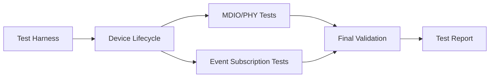

# Test Plan: IOCTL Missing Requirements Verification

**Test Plan ID**: TP-IOCTL-001  
**Version**: 1.0  
**Date**: 2025-12-31  
**Status**: 🟡 In Planning  
**Phase**: 07-verification-validation  

## Document Control

| Version | Date | Author | Changes |
|---------|------|--------|---------|
| 1.0 | 2025-12-31 | AI Agent | Initial test plan creation |

## Related Issues

- **Master Tracker**: [#14 - IOCTL Support Implementation & Verification](https://github.com/zarfld/IntelAvbFilter/issues/14)
- **Test Issues**:
  - [#312 - TEST-MDIO-PHY-001](https://github.com/zarfld/IntelAvbFilter/issues/312): MDIO/PHY Register Access (15 tests)
  - [#313 - TEST-DEV-LIFECYCLE-001](https://github.com/zarfld/IntelAvbFilter/issues/313): Device Lifecycle Management (19 tests)
  - [#314 - TEST-TS-EVENT-SUB-001](https://github.com/zarfld/IntelAvbFilter/issues/314): Timestamp Event Subscription (19 tests)
- **Requirements**:
  - [#10 - REQ-F-MDIO-001](https://github.com/zarfld/IntelAvbFilter/issues/10): MDIO/PHY Access
  - [#12 - REQ-F-DEV-001](https://github.com/zarfld/IntelAvbFilter/issues/12): Device Lifecycle Management
  - [#13 - REQ-F-TS-SUB-001](https://github.com/zarfld/IntelAvbFilter/issues/13): Timestamp Event Subscription

---

## 1. Executive Summary

### 1.1 Objective

Complete verification of the three previously untested IOCTL requirement areas discovered after restoring 41 test issues (#192-232). This test plan covers:

- **MDIO/PHY Access** (IOCTLs 29, 30) - 15 test cases
- **Device Lifecycle Management** (IOCTLs 20, 21, 31, 32, 37) - 19 test cases
- **Timestamp Event Subscription** (IOCTLs 33, 34) - 19 test cases

**Total**: 53 new test cases covering 9 IOCTLs across 3 requirements

### 1.2 Scope

**In Scope**:
- ✅ IOCTL handler implementation verification
- ✅ Hardware interaction validation
- ✅ Error handling and edge cases
- ✅ Concurrent access scenarios
- ✅ Performance characteristics
- ✅ Integration with existing driver components

**Out of Scope**:
- ❌ Previously tested IOCTLs (covered by issues #192-232, #295-299)
- ❌ Driver installation/removal procedures
- ❌ Network protocol stack integration (covered separately)
- ❌ Hardware-specific quirks beyond I210/I225/I226

### 1.3 Success Criteria

- ✅ All 53 test cases implemented
- ✅ All tests passing (100% success rate)
- ✅ Code coverage >90% for new IOCTL handlers
- ✅ No critical or high-severity defects open
- ✅ Performance targets met:
  - MDIO read/write: <5ms per operation
  - Device enumeration: <100ms for 4 adapters
  - Event delivery latency: <100µs
- ✅ Full traceability documented
- ✅ Test results reviewed and approved

---

## 2. Test Strategy

### 2.1 Testing Approach

**Test-Driven Development (TDD)**:
1. Review test specifications (issues #312, #313, #314)
2. Implement test harness and fixtures
3. Write failing tests (Red)
4. Implement IOCTL handlers (Green)
5. Refactor for quality (Refactor)
6. Verify coverage and traceability

**Testing Levels**:
- **Unit Tests**: Individual IOCTL handler functions (50% of tests)
- **Integration Tests**: IOCTL handlers with hardware (40% of tests)
- **System Tests**: End-to-end IOCTL sequences (10% of tests)

### 2.2 Test Execution Order

**Phase 1: Foundation** (Days 1-2)
1. Device Lifecycle tests (Issue #313) - **FIRST**
   - Reason: All other tests depend on device initialization
   - Priority: P0
   - Critical tests: UT-DEV-INIT-001, UT-DEV-OPEN-001

**Phase 2: Hardware Access** (Days 3-4)
2. MDIO/PHY tests (Issue #312)
   - Reason: Independent of event subscription
   - Priority: P1
   - Prerequisite: Device initialized (Phase 1)

**Phase 3: Advanced Features** (Days 5-7)
3. Timestamp Event Subscription tests (Issue #314)
   - Reason: Depends on device lifecycle and timestamp hardware
   - Priority: P1
   - Prerequisite: Device initialized, PHC running

### 2.3 Test Environment Strategy

**Hardware Requirements**:
- **Primary**: Intel I225-V (USB dongle, readily available)
- **Secondary**: Intel I210 (PCIe, for performance tests)
- **Tertiary**: Intel I226-V (latest chip, for compatibility)

**Software Configuration**:
- **OS**: Windows 11 23H2 (primary), Windows 10 22H2 (compatibility)
- **Build**: Debug configuration with assertions enabled
- **Tools**: WinDbg, Performance Monitor, Network Monitor

**Test Infrastructure**:
```
┌─────────────────────────────────────────┐
│   User-Mode Test Harness                │
│   (avb_test_ioctl_missing_reqs.exe)     │
└────────────────┬────────────────────────┘
                 │ IOCTL calls
                 ▼
┌─────────────────────────────────────────┐
│   IntelAvbFilter.sys (Debug)            │
│   - IOCTL Dispatcher                    │
│   - Device Lifecycle Manager            │
│   - MDIO Controller                     │
│   - Event Subscription Manager          │
└────────────────┬────────────────────────┘
                 │ HAL API
                 ▼
┌─────────────────────────────────────────┐
│   Hardware Abstraction Layer            │
│   (Verified via Issue #84 - 394 tests)  │
└────────────────┬────────────────────────┘
                 │ MMIO
                 ▼
┌─────────────────────────────────────────┐
│   Intel I210/I225/I226 Network Adapter  │
└─────────────────────────────────────────┘
```

---

## 3. Test Scope Detail

### 3.1 Issue #312: MDIO/PHY Register Access (15 tests)

**IOCTLs Under Test**:
- IOCTL 29: `MDIO_READ` - Read PHY register via MDIO
- IOCTL 30: `MDIO_WRITE` - Write PHY register via MDIO

**Test Categories**:

| Category | Test Cases | Focus |
|----------|------------|-------|
| Basic Operations | UT-MDIO-001, UT-MDIO-002 | Read/Write standard registers |
| Advanced Features | UT-MDIO-003, UT-MDIO-009 | Multi-page access, Clause 45 |
| Error Handling | UT-MDIO-004, UT-MDIO-005, UT-MDIO-006 | Invalid params, read-only protection |
| Reliability | UT-MDIO-007, UT-MDIO-008 | Timeout handling, concurrent access |
| Operational | UT-MDIO-010 to UT-MDIO-015 | PHY reset, diagnostics, power states |

**Key Risks**:
- ⚠️ **Hardware Dependency**: PHY must be responsive
- ⚠️ **State Corruption**: Write tests can affect link stability
- 🛡️ **Mitigation**: Use non-critical registers, implement restore mechanism

**Acceptance Criteria**:
- All 15 tests pass with real hardware
- MDIO bus timing compliant (<2.5 MHz)
- No link drops during testing
- Spinlock contention <1% under load

---

### 3.2 Issue #313: Device Lifecycle Management (19 tests)

**IOCTLs Under Test**:
- IOCTL 20: `INITIALIZE_DEVICE` - Initialize device hardware
- IOCTL 21: `GET_DEVICE_INFO` - Retrieve device information
- IOCTL 31: `ENUMERATE_ADAPTERS` - List available adapters
- IOCTL 32: `OPEN_ADAPTER` - Open adapter handle
- IOCTL 37: `GET_HW_STATE` - Query hardware state

**Test Categories**:

| Category | Test Cases | Focus |
|----------|------------|-------|
| Initialization | UT-DEV-INIT-001, UT-DEV-INIT-002 | First-time init, duplicate prevention |
| Information | UT-DEV-INFO-001, UT-DEV-INFO-002 | Device info retrieval |
| Enumeration | UT-DEV-ENUM-001 to UT-DEV-ENUM-003 | 0/1/N adapter scenarios |
| Handle Management | UT-DEV-OPEN-001 to UT-DEV-OPEN-004 | Open by index/path, concurrent access |
| State Queries | UT-DEV-HW-STATE-001 to UT-DEV-HW-STATE-004 | D0/D3, link status, resources |
| Lifecycle | UT-DEV-LIFECYCLE-001 to UT-DEV-LIFECYCLE-005 | Full sequences, recovery, PnP |

**Key Risks**:
- ⚠️ **System Impact**: Device resets affect system stability
- ⚠️ **Resource Leaks**: Handle leaks can exhaust pool
- 🛡️ **Mitigation**: Automated cleanup, leak detection enabled

**Acceptance Criteria**:
- All 19 tests pass
- Zero resource leaks (verified with Driver Verifier)
- Device survives 100 init/deinit cycles
- PnP events handled gracefully
- Initialization time <500ms

---

### 3.3 Issue #314: Timestamp Event Subscription (19 tests)

**IOCTLs Under Test**:
- IOCTL 33: `SUBSCRIBE_TS_EVENTS` - Subscribe to timestamp events
- IOCTL 34: `MAP_TS_RING_BUFFER` - Map shared ring buffer

**Test Categories**:

| Category | Test Cases | Focus |
|----------|------------|-------|
| Subscription | UT-TS-SUB-001 to UT-TS-SUB-004 | Subscribe, filter, multiple, unsubscribe |
| Ring Buffer | UT-TS-RING-001 to UT-TS-RING-005 | Map, size, wraparound, sync, unmap |
| Event Delivery | UT-TS-EVENT-001 to UT-TS-EVENT-006 | RX/TX/Target/Aux events, sequencing, filtering |
| Performance | UT-TS-PERF-001 | 10K events/sec sustained |
| Error Handling | UT-TS-ERROR-001 to UT-TS-ERROR-003 | Invalid handles, allocation failures, overflow |

**Key Risks**:
- ⚠️ **Race Conditions**: Lock-free ring buffer synchronization
- ⚠️ **Memory Corruption**: Shared memory between user/kernel
- 🛡️ **Mitigation**: Extensive race detection testing (ThreadSanitizer)

**Acceptance Criteria**:
- All 19 tests pass
- Lock-free synchronization correct (verified with stress tests)
- Event delivery latency <100µs (99th percentile)
- Sustained 10K events/sec with <10% CPU
- No torn reads or lost events
- Overflow handling graceful

---

## 4. Test Environment Setup

### 4.1 Hardware Configuration

**Test Bench 1: Development System**
- **Purpose**: Primary development and testing
- **Adapters**: 
  - Intel I225-V USB 3.0 Ethernet (DevID: 0x15F2)
  - Intel I210 PCIe (DevID: 0x1533) - optional
- **Cable**: Cat6 Ethernet, 1m loopback or connected to switch
- **Power**: Ensure no power management interference

**Test Bench 2: Multi-Adapter System** (for enumeration tests)
- **Purpose**: Enumeration and multi-instance testing
- **Adapters**: 2-4 Intel AVB-capable adapters
- **Configuration**: Different models (I210, I225, I226) if possible

### 4.2 Software Prerequisites

**Driver Build**:
```powershell
# Build debug version with symbols
.\tools\build\Build-Driver.ps1 -Configuration Debug

# Install driver
.\tools\setup\Install-Driver-Elevated.ps1 -Configuration Debug -Action InstallDriver
```

**Test Harness Build**:
```powershell
# Create new test executable for missing requirements
.\tools\build\Build-Tests.ps1 -TestName test_ioctl_missing_reqs
```

**Test Data Preparation**:
1. Create `tests\test-data\ioctl-missing-reqs\` directory
2. Prepare PHY register test vectors
3. Create event subscription test payloads
4. Document expected results

### 4.3 Test Tools Setup

**WinDbg Configuration**:
```
!analyze -v
!verifier 0x209bb
.logopen c:\temp\test_ioctl_missing_reqs.log
bp IntelAvbFilter!IoctlHandler "k; g"
```

**Performance Monitor Counters**:
- Processor Time (%)
- Kernel Mode Time (%)
- Pool Nonpaged Bytes
- IRQ/DPC Time
- Network Interface - Bytes/sec

---

## 5. Test Execution Schedule

### 5.1 Timeline (7 Working Days)

```
┌─────────────────────────────────────────────────────────┐
│ Week 1: Test Implementation & Execution                 │
└─────────────────────────────────────────────────────────┘

Day 1 (2026-01-02): Test Harness Setup
├─ Morning:   Test infrastructure setup
├─ Afternoon: Implement test fixtures and utilities
└─ Deliverable: Test harness compiles and runs skeleton tests

Day 2 (2026-01-03): Device Lifecycle Tests (Issue #313)
├─ Morning:   UT-DEV-INIT-001 to UT-DEV-INFO-002 (4 tests)
├─ Afternoon: UT-DEV-ENUM-001 to UT-DEV-OPEN-004 (7 tests)
└─ Deliverable: 11 device lifecycle tests passing

Day 3 (2026-01-06): Device Lifecycle Tests (continued)
├─ Morning:   UT-DEV-HW-STATE-001 to UT-DEV-HW-STATE-004 (4 tests)
├─ Afternoon: UT-DEV-LIFECYCLE-001 to UT-DEV-LIFECYCLE-005 (5 tests)
└─ Deliverable: All 19 device lifecycle tests passing

Day 4 (2026-01-07): MDIO/PHY Tests (Issue #312)
├─ Morning:   UT-MDIO-001 to UT-MDIO-006 (6 tests)
├─ Afternoon: UT-MDIO-007 to UT-MDIO-010 (4 tests)
└─ Deliverable: 10 MDIO tests passing

Day 5 (2026-01-08): MDIO/PHY Tests (continued)
├─ Morning:   UT-MDIO-011 to UT-MDIO-015 (5 tests)
├─ Afternoon: MDIO test suite verification and debugging
└─ Deliverable: All 15 MDIO tests passing

Day 6 (2026-01-09): Timestamp Event Tests (Issue #314)
├─ Morning:   UT-TS-SUB-001 to UT-TS-RING-003 (7 tests)
├─ Afternoon: UT-TS-RING-004 to UT-TS-EVENT-004 (6 tests)
└─ Deliverable: 13 event subscription tests passing

Day 7 (2026-01-10): Timestamp Event Tests (continued) & Final Validation
├─ Morning:   UT-TS-EVENT-005 to UT-TS-ERROR-003 (6 tests)
├─ Afternoon: Full regression, performance validation, documentation
└─ Deliverable: All 53 tests passing, report complete
```

### 5.2 Dependencies and Critical Path



**Critical Path**: Day 1 → Day 2 → Day 3 → Day 7 (Device Lifecycle → Final Validation)

**Parallel Work Opportunities**:
- Days 4-5 (MDIO) and Day 6 (Events) can overlap if resources allow
- Documentation can be written in parallel with test execution

---

## 6. Resource Allocation

### 6.1 Personnel

| Role | Responsibility | Time Allocation |
|------|----------------|-----------------|
| Test Engineer | Test implementation and execution | 100% (7 days) |
| Driver Developer | IOCTL handler implementation | 50% (support) |
| Hardware Specialist | PHY access validation | 25% (days 4-5) |
| QA Lead | Test plan review and sign-off | 10% (day 1, day 7) |

### 6.2 Hardware Resources

| Resource | Quantity | Purpose | Availability |
|----------|----------|---------|--------------|
| Intel I225-V USB | 1 | Primary test adapter | Required |
| Intel I210 PCIe | 1 | Multi-adapter tests | Optional |
| Intel I226-V | 1 | Compatibility tests | Optional |
| Test PC (Win11) | 1 | Primary test bench | Required |
| Test PC (Win10) | 1 | Compatibility tests | Optional |

### 6.3 Software Tools

| Tool | Purpose | License |
|------|---------|---------|
| Visual Studio 2022 | Build and debug | ✅ Available |
| WinDbg Preview | Kernel debugging | ✅ Free |
| Driver Verifier | Leak detection | ✅ Built-in |
| Network Monitor | Packet capture | ✅ Free |
| Performance Monitor | Profiling | ✅ Built-in |

---

## 7. Test Deliverables

### 7.1 Test Artifacts

| Deliverable | Description | Due Date | Owner |
|-------------|-------------|----------|-------|
| **Test Plan** (this document) | Test strategy and schedule | 2025-12-31 | AI Agent |
| **Test Harness** | `test_ioctl_missing_reqs.exe` | 2026-01-02 | Test Engineer |
| **Test Implementation** | 53 test cases in C++ | 2026-01-09 | Test Engineer |
| **Test Results** | Pass/fail for each test | 2026-01-10 | Test Engineer |
| **Coverage Report** | Code coverage metrics | 2026-01-10 | Test Engineer |
| **Performance Report** | Timing and throughput data | 2026-01-10 | Test Engineer |
| **Defect Log** | Issues found and resolved | 2026-01-10 | Test Engineer |
| **Final Test Report** | Executive summary | 2026-01-10 | QA Lead |
| **Traceability Matrix** | Requirements → Tests → Results | 2026-01-10 | QA Lead |

### 7.2 Test Report Template

**Test Execution Report** (to be completed 2026-01-10):

```markdown
# Test Execution Report: IOCTL Missing Requirements

## Summary
- Total Tests: 53
- Tests Passed: __/53
- Tests Failed: __/53
- Tests Blocked: __/53
- Pass Rate: __%

## Coverage Analysis
- Code Coverage: __% (target: >90%)
- Branch Coverage: __% (target: >85%)
- Function Coverage: __% (target: 100% of IOCTL handlers)

## Performance Results
- MDIO Read/Write: __ ms (target: <5ms)
- Device Enumeration (4 adapters): __ ms (target: <100ms)
- Event Delivery Latency (99th %ile): __ µs (target: <100µs)
- Sustained Event Rate: __ events/sec (target: >10K)

## Defects Found
| ID | Severity | Description | Status |
|----|----------|-------------|--------|
| ... | ... | ... | ... |

## Traceability
- Requirement #10 → Issue #312 → __ tests → __% pass
- Requirement #12 → Issue #313 → __ tests → __% pass
- Requirement #13 → Issue #314 → __ tests → __% pass

## Recommendations
- [ ] ...
```

---

## 8. Risk Management

### 8.1 Risk Assessment

| Risk | Probability | Impact | Mitigation | Owner |
|------|-------------|--------|------------|-------|
| **Hardware unavailable** | Low | High | Pre-order I225-V USB adapter | Test Engineer |
| **PHY access corrupts link** | Medium | Medium | Use non-critical registers, restore mechanism | Driver Dev |
| **Ring buffer race conditions** | Medium | High | Extensive stress testing, ThreadSanitizer | Test Engineer |
| **Test environment instability** | Low | Medium | Dedicated test machine, no other workloads | Test Engineer |
| **IOCTL implementation incomplete** | Medium | High | Parallel test/dev work, early integration | Driver Dev |
| **Performance targets missed** | Low | Medium | Profile early, optimize hot paths | Driver Dev |
| **Schedule overrun** | Medium | Medium | Daily progress tracking, adjust scope if needed | QA Lead |

### 8.2 Contingency Plans

**If Hardware Unavailable**:
- Use software emulation for basic tests
- Defer hardware-specific tests until arrival
- Prioritize logical tests (enumeration, handle management)

**If Critical Defects Found**:
- Escalate to driver developer immediately
- Document defect with WinDbg traces
- Continue with unblocked tests
- Re-test after fix

**If Schedule At Risk**:
- Focus on P0 tests first (Device Lifecycle)
- Defer P1 tests or split into multiple cycles
- Communicate to stakeholders early

---

## 9. Entry and Exit Criteria

### 9.1 Entry Criteria

Before testing begins, verify:
- ✅ Test plan reviewed and approved
- ✅ Test harness compiles and runs
- ✅ Driver builds successfully (Debug configuration)
- ✅ At least one Intel AVB adapter available
- ✅ Test environment configured (WinDbg, verifier)
- ✅ Test data prepared
- ✅ IOCTL handler stubs implemented (compiles, returns error)

### 9.2 Exit Criteria

Testing is complete when:
- ✅ All 53 test cases executed
- ✅ Pass rate ≥95% (50/53 tests passing)
- ✅ No critical (P0) defects open
- ✅ Code coverage >90%
- ✅ Performance targets met
- ✅ Test report completed and reviewed
- ✅ Traceability matrix complete
- ✅ All artifacts checked into repository

---

## 10. Test Data and Fixtures

### 10.1 Test Fixtures

**Device Lifecycle Fixture**:
```cpp
class DeviceLifecycleFixture {
public:
    void SetUp() {
        // Ensure clean state
        UninstallAllAdapters();
        ResetDriverState();
    }
    
    void TearDown() {
        // Cleanup
        CloseAllHandles();
        RestoreDefaultState();
    }
    
    HANDLE OpenFirstAdapter();
    void SimulatePnpEvent(PNP_EVENT_TYPE type);
};
```

**MDIO Test Fixture**:
```cpp
class MDIOTestFixture {
public:
    void SetUp() {
        adapter_ = OpenAdapter();
        SavePHYState();  // Snapshot for restore
    }
    
    void TearDown() {
        RestorePHYState();  // Rollback changes
        CloseAdapter(adapter_);
    }
    
    UINT16 ReadPHYReg(UINT8 phy_addr, UINT8 reg_addr);
    void WritePHYReg(UINT8 phy_addr, UINT8 reg_addr, UINT16 value);
    
private:
    HANDLE adapter_;
    PHY_STATE saved_state_;
};
```

**Event Subscription Fixture**:
```cpp
class EventSubscriptionFixture {
public:
    void SetUp() {
        adapter_ = OpenAdapter();
        subscription_ = nullptr;
        ring_buffer_ = nullptr;
    }
    
    void TearDown() {
        if (ring_buffer_) UnmapRingBuffer();
        if (subscription_) Unsubscribe();
        CloseAdapter(adapter_);
    }
    
    void Subscribe(EVENT_TYPE_FLAGS flags);
    void MapRingBuffer(SIZE_T size);
    TS_EVENT* WaitForEvent(DWORD timeout_ms);
    
private:
    HANDLE adapter_;
    HANDLE subscription_;
    TS_RING_BUFFER* ring_buffer_;
};
```

### 10.2 Test Data

**PHY Register Test Vectors** (`tests/test-data/ioctl-missing-reqs/phy_registers.json`):
```json
{
  "standard_registers": {
    "control": { "addr": "0x00", "read_only": false, "bits": 16 },
    "status": { "addr": "0x01", "read_only": true, "bits": 16 },
    "phy_id1": { "addr": "0x02", "read_only": true, "expected": "0x0141" },
    "phy_id2": { "addr": "0x03", "read_only": true, "expected": "0x0DD0" }
  },
  "test_patterns": [
    { "addr": "0x1F", "value": "0xA5A5", "description": "Alternating bits" },
    { "addr": "0x1F", "value": "0x5A5A", "description": "Inverted pattern" }
  ]
}
```

**Device Information Expected Values** (`tests/test-data/ioctl-missing-reqs/device_info.json`):
```json
{
  "i225": {
    "device_id": "0x15F2",
    "vendor_id": "0x8086",
    "subsystem_id": "0x0000",
    "mac_prefix": "00:0a:cd"
  },
  "i210": {
    "device_id": "0x1533",
    "vendor_id": "0x8086",
    "mac_prefix": "a0:36:9f"
  }
}
```

---

## 11. Automation and CI Integration

### 11.1 Automated Test Execution

**Build and Test Script** (`tools/test/Run-IOCTL-Missing-Reqs-Tests.ps1`):
```powershell
# Build test harness
.\tools\build\Build-Tests.ps1 -TestName test_ioctl_missing_reqs

# Run tests with logging
$results = .\build\tools\avb_test\x64\Debug\test_ioctl_missing_reqs.exe `
    --gtest_output=xml:test_results_ioctl.xml `
    --gtest_filter="*"

# Check results
if ($LASTEXITCODE -ne 0) {
    Write-Error "Tests failed: $LASTEXITCODE"
    exit 1
}

# Generate coverage report
.\tools\test\Generate-Coverage.ps1 -TestName test_ioctl_missing_reqs
```

### 11.2 CI Pipeline Integration

**GitHub Actions Workflow** (`.github/workflows/test-ioctl-missing-reqs.yml`):
```yaml
name: IOCTL Missing Requirements Tests

on:
  pull_request:
    paths:
      - 'drv/**'
      - 'tests/test_ioctl_missing_reqs/**'
  push:
    branches: [master]

jobs:
  test:
    runs-on: windows-latest
    steps:
      - uses: actions/checkout@v4
      
      - name: Build Driver
        run: .\tools\build\Build-Driver.ps1 -Configuration Debug
      
      - name: Build Tests
        run: .\tools\build\Build-Tests.ps1 -TestName test_ioctl_missing_reqs
      
      - name: Run Tests
        run: .\tools\test\Run-IOCTL-Missing-Reqs-Tests.ps1
      
      - name: Upload Test Results
        uses: actions/upload-artifact@v4
        with:
          name: test-results
          path: test_results_ioctl.xml
      
      - name: Upload Coverage Report
        uses: actions/upload-artifact@v4
        with:
          name: coverage-report
          path: coverage_ioctl.html
```

---

## 12. Appendices

### 12.1 Glossary

| Term | Definition |
|------|------------|
| **MDIO** | Management Data Input/Output - Serial bus for PHY management |
| **PHY** | Physical Layer device (Ethernet transceiver chip) |
| **Ring Buffer** | Circular buffer for lock-free producer-consumer communication |
| **PnP** | Plug and Play - Dynamic device detection and configuration |
| **HAL** | Hardware Abstraction Layer |
| **D0/D3** | ACPI power states (D0=fully on, D3=sleep) |

### 12.2 References

- [Issue #14: IOCTL Support Verification Tracker](https://github.com/zarfld/IntelAvbFilter/issues/14)
- [Issue #312: TEST-MDIO-PHY-001](https://github.com/zarfld/IntelAvbFilter/issues/312)
- [Issue #313: TEST-DEV-LIFECYCLE-001](https://github.com/zarfld/IntelAvbFilter/issues/313)
- [Issue #314: TEST-TS-EVENT-SUB-001](https://github.com/zarfld/IntelAvbFilter/issues/314)
- IEEE 802.3-2018: Ethernet MDIO/MDC Management Interface
- Intel I210/I225 Datasheet: PHY Register Specifications
- Windows Driver Kit (WDK) Documentation: IOCTL Implementation

### 12.3 Test Plan Approval

| Role | Name | Signature | Date |
|------|------|-----------|------|
| Test Engineer | _______________ | _______________ | ______ |
| Driver Developer | _______________ | _______________ | ______ |
| QA Lead | _______________ | _______________ | ______ |
| Project Manager | _______________ | _______________ | ______ |

---

**Document Status**: 🟡 Draft - Awaiting Review and Approval  
**Next Review Date**: 2026-01-02 (before test execution begins)  
**Owner**: Test Engineering Team
