# Complete PTP Event-Driven Architecture - Dependency Graph

**Total Issues**: 34 (15 batch + 19 prerequisites)  
**Completed**: 5 issues (15%)  
**Remaining**: 29 issues (85%)  
**Date**: 2025-01-23

## Executive Summary

This graph maps **all 34 issues** (15 original batch + 19 prerequisites) required for PTP Event-Driven Architecture implementation. Analysis reveals:

- **Latency Target**: <1µs (99th percentile) - **100× more stringent** than initially assumed
- **Hidden Scope**: 19 prerequisite issues (127% increase from original 15)
- **Completed Work**: 5 issues already done (#16, #17, #18, #31, #89)
- **Critical Path**: 7-layer dependency structure from stakeholder needs to tests

---

## Layer 0: Stakeholder Requirements (Root Level)

### ✅ #1 - StR-HWAC-001: Intel NIC AVB/TSN Feature Access
- **Status**: COMPLETED
- **Purpose**: Root requirement for entire driver project
- **Refined by**: 20 child requirements (PTP, TSN, lifecycle, discovery)
- **Criticality**: Foundation for all functional requirements

### ✅ #31 - StR-005: NDIS Filter Driver
- **Status**: COMPLETED
- **Purpose**: Lightweight filter driver architecture
- **Refined by**: 38+ child requirements (#36-89)
- **Success Criteria**: Packet transparency, multi-adapter support

### #167 - StR-EVENT-001: Event-Driven Time-Sensitive Networking Monitoring
- **Status**: OPEN
- **Stakeholder**: Pro Audio (Milan), Industrial Automation (IEC 60802)
- **Requirements**:
  - <1µs event notification latency
  - Zero CPU polling overhead
  - Hardware interrupt-driven timestamp capture
- **Success Criteria**: Sub-microsecond latency, Milan/IEC 60802 compliance
- **Refined by**: #165, #161, #162, #168 (when linked)

---

## Layer 1: Foundational Functional Requirements

### ✅ #16 - REQ-F-LAZY-INIT-001: Lazy Initialization
- **Status**: CLOSED/COMPLETED
- **Purpose**: Deferred context creation until first IOCTL
- **Performance**: <100ms first-call overhead, <1ms subsequent
- **Traces to**: #1

### ✅ #17 - REQ-NF-DIAG-REG-001: Registry-Based Diagnostics
- **Status**: CLOSED/COMPLETED
- **Purpose**: Debug builds only (#if DBG), writes to HKLM\Software\IntelAvb
- **Rationale**: Workaround for DebugView limitations
- **Traces to**: #31

### ✅ #18 - REQ-F-HWCTX-001: Hardware Context Lifecycle State Machine
- **Status**: CLOSED/COMPLETED
- **Purpose**: 4-state machine (UNBOUND → BOUND → BAR_MAPPED → PTP_READY)
- **Impact**: State-based register access guards prevent null pointer crashes
- **Traces to**: #1

### #2 - REQ-F-PTP-001: PTP Hardware Clock Get/Set Timestamp
- **Status**: OPEN
- **Purpose**: Atomic SYSTIML/H read/write (handle rollover)
- **Performance**: GET <500ns, SET <1µs
- **IOCTLs**: 24 (GET), 25 (SET)
- **Traces to**: #1
- **Verified by**: #295 (TEST-PTP-CLOCK-001)

### #5 - REQ-F-PTP-003: Hardware Timestamping Control
- **Status**: OPEN
- **Purpose**: TSAUXC register manipulation (IOCTL 40)
- **Features**:
  - Enable/disable SYSTIM0 (bit 31)
  - Enable target time interrupts (EN_TT0/EN_TT1)
  - Enable auxiliary timestamp capture on SDP pins
- **Traces to**: #1
- **Verified by**: #297 (TEST-PTP-HW-TS-001)

### #6 - REQ-F-PTP-004: Rx Packet Timestamping Configuration
- **Status**: OPEN
- **Purpose**: Enable 16-byte timestamp buffer per packet
- **Registers**:
  - RXPBSIZE.CFG_TS_EN (global enable)
  - SRRCTL[n].TIMESTAMP (per-queue enable)
- **Constraint**: **Requires port reset** after RXPBSIZE change
- **Traces to**: #1
- **Verified by**: #298 (TEST-RX-TIMESTAMP-001)

### #13 - REQ-F-TS-SUB-001: Timestamp Event Subscription & Ring Buffer
- **Status**: OPEN
- **Purpose**: Lock-free SPSC ring buffer, zero-copy user-space mapping
- **IOCTLs**: 33 (subscribe), 34 (map shared memory)
- **Features**:
  - Event subscription with VLAN/PCP filtering
  - MDL creation for zero-copy access
- **Traces to**: #117 (StR-002), #30 (StR-003)
- **Verified by**: #314

### #149 - REQ-F-PTP-001: Hardware Timestamp Correlation for PTP/gPTP
- **Status**: OPEN
- **Purpose**: Atomic SYSTIML/H access, frequency adjustment
- **Performance**: GET <5µs, SET <10µs, frequency ±100K ppb
- **Depends on**: #1, #18, #40
- **Traces to**: #1
- **Verified by**: #238 (TEST-PTP-001)

---

## Layer 2: Batch Functional Requirements (Event Architecture)

### #168 - REQ-F-EVENT-001: Emit PTP Timestamping Events to Userspace
- **Status**: OPEN
- **Purpose**: Zero-copy ring buffer event emission
- **Events**: TX/RX timestamp capture, auxiliary snapshot, target time match
- **Performance**: <10µs notification latency from HW interrupt
- **Dependencies**:
  - **#167** (StR-EVENT-001) - Stakeholder requirement
  - **#5** (REQ-F-PTP-003) - Hardware timestamping control
- **Traces to**: #167 (when linked)
- **Verified by**: #237 (TEST-EVENT-001)

### #19 - REQ-F-TSRING-001: Timestamp Event Ring Buffer
- **Status**: OPEN
- **Purpose**: Lock-free SPSC ring buffer for PTP events
- **Capacity**: 1000 events, 64 bytes per event (cacheline-aligned)
- **Performance**: <1µs event posting latency (ISR/DPC safe)
- **Concurrency**: Single producer (ISR/DPC), multiple consumers (user threads)
- **Depends on**: #168 (implicitly, as storage for events)
- **Verified by**: #240 (TEST-TSRING-001)

### #74 - REQ-F-IOCTL-BUFFER-001: Buffer Parameter Validation
- **Status**: OPEN
- **Purpose**: Prevent buffer overflow via 7 validation checks
- **Validations**:
  1. NULL pointer check
  2. Minimum buffer size
  3. Maximum buffer size
  4. Alignment (cacheline-aligned)
  5. Kernel/user boundary validation (ProbeForRead/Write)
  6. Driver Verifier compliance
  7. Poison memory on deallocation
- **Traces to**: #31 (StR-NDIS-FILTER)
- **Verified by**: #248 (TEST-SECURITY-BUFFER-001)

### ✅ #89 - REQ-NF-SECURITY-BUFFER-001: Buffer Overflow Protection
- **Status**: CLOSED/COMPLETED
- **Purpose**: Prevent buffer overflows in IOCTLs 33/34 (ring buffer access)
- **Techniques**: CFG, ASLR, stack canaries, Driver Verifier validation
- **Traces to**: #31
- **Verified by**: #248 (TEST-SECURITY-BUFFER-001)

### #162 - REQ-F-EVENT-003: Emit ATDECC Unsolicited Notification Events
- **Status**: OPEN
- **Purpose**: Emit link state change events within 10µs
- **Events**: Link up/down, speed change, duplex change
- **Payload**: Timestamp, link speed, link status, duplex mode (24 bytes)
- **Depends on**: #167, #19, #13
- **Traces to**: #167
- **Verified by**: #236 (TEST-EVENT-003)

---

## Layer 3: Non-Functional Requirements (Performance Constraints)

### #58 - REQ-NF-PERF-PHC-001: PHC Query Latency <500ns
- **Status**: OPEN
- **Metric**: Median <500ns, 99th percentile <1µs
- **Optimization**: Direct register access, lock hold time <200ns, cache BAR0 base
- **Traces to**: #28 (StR-001 gPTP), #34 (PHC query IOCTL)
- **Verified by**: #274 (TEST-PERF-PHC-001)

### #65 - REQ-NF-PERF-TS-001: Timestamp Retrieval Latency <1µs
- **Status**: OPEN
- **Metric**: TX/RX timestamp median <1µs, 99th percentile <2µs
- **Optimization**: Direct register access, lock hold time <500ns
- **Traces to**: #28 (StR-001 gPTP), #35 (TX timestamp), #37 (RX timestamp)
- **Verified by**: #272 (TEST-PERF-TS-001)

### #165 - REQ-NF-EVENT-001: Event Notification Latency Requirement
- **Status**: OPEN
- **Metric**: <10µs from HW interrupt to user-space notification
- **Breakdown**: ISR <5µs + notification path <5µs = 10µs total
- **Verification**: GPIO toggling + oscilloscope
- **Depends on**:
  - **#167** (StR-EVENT-001) - Stakeholder requirement
  - **#19** (REQ-F-TSRING-001) - Ring buffer infrastructure
  - **#163** (ADR-EVENT-001) - Architecture decision
- **Traces to**: #167
- **Verified by**: #245 (TEST-EVENT-NF-001)

### #161 - REQ-NF-EVENT-002: Zero Polling Overhead Requirement
- **Status**: OPEN
- **Metric**: 10K events/sec sustained, 100% delivery, <5% CPU overhead
- **Ring Buffer**: 4096 events (configurable to 16,384), ≤128 bytes/event
- **Backpressure**: Drop oldest events (FIFO overwrite), overflow counter
- **Depends on**:
  - **#167** (StR-EVENT-001)
  - **#19** (REQ-F-TSRING-001)
  - **#165** (REQ-NF-EVENT-001)
- **Verified by**: #241 (TEST-EVENT-NF-002)

### #46 - REQ-NF-PERF-NDIS-001: Packet Forwarding Performance <1µs
- **Status**: OPEN
- **Metric**: Filter latency <1µs (AVB Class A end-to-end budget <125µs)
- **Optimization**:
  - Zero-copy packet handling
  - Lock-free statistics counters
  - Cache-aligned data structures
  - Inline functions for fast path
  - Prefetch next packet descriptor
  - DPC processing for deferred work
- **Error Scenarios**: 10 cases (ES-PERF-NDIS-001 through 010)
- **Performance Metrics**: Latency, throughput, CPU%, cache miss rate, lock contention, DPC queue depth, interrupt rate, packet loss%, context switches
- **Traces to**: #117 (StR-002 AVB traffic), #121 (StR-004 low-latency forwarding)

### #71 - REQ-NF-DOC-API-001: IOCTL API Documentation
- **Status**: OPEN
- **Purpose**: Doxygen-style comments, README with quickstart, error handling guide
- **Scope**: All IOCTLs (24/25/33/34/40/41/42)
- **Traces to**: #31 (StR-NDIS-FILTER)
- **Verified by**: #267 (TEST-DOC-API-001)

### #83 - REQ-F-PERF-MONITOR-001: Performance Counter Monitoring
- **Status**: OPEN
- **Purpose**: Fault injection testing (Driver Verifier, WinDbg breakpoints)
- **Scope**: Comprehensive error handling validation
- **Traces to**: #31 (StR-REQ-001)
- **Verified by**: #254 (TEST-ERROR-INJECT-001)

---

## Layer 4: Architecture Decisions

### #147 - ADR-PTP-001: PTP Event Emission Architecture
- **Status**: OPEN
- **Decision**: ISR detects events → DPC emits to ring buffer → user poll via IOCTL
- **Rationale**: Latency <10µs, zero polling overhead, hardware interrupt-driven
- **Alternatives Rejected**:
  - Polling-based (high CPU overhead)
  - Callback-based (complex lifetime management)
- **Consequences**: DPC scheduling variability, ring buffer overflow handling
- **Satisfies**: #168, #165, #161
- **Traces to**: #167 (when linked)

### #166 - ADR-EVENT-002: Hardware Interrupt-Driven Event Notification
- **Status**: OPEN
- **Decision**: Use TSICR (Timestamp Interrupt Cause Register) for event triggers
- **Latency Budget**: 100ns HW + 200ns IRQ + 500ns ISR + 200ns DPC + 500ns notify = 1.5µs
- **Register Map**:
  - TSICR: Interrupt cause (TX/RX timestamp ready, target time match, auxiliary snapshot)
  - TSIM: Interrupt mask (enable/disable events)
- **Alternatives Rejected**:
  - Polling-based (fails zero-overhead requirement)
  - Timer-based (fails <1µs latency requirement)
- **Consequences**:
  - Pros: Sub-microsecond latency, zero CPU overhead when idle
  - Cons: DPC scheduling variability on Windows, ISR complexity
- **Satisfies**: #165 (latency), #161 (zero polling), #168 (event emission)
- **Traces to**: #167

### #93 - ADR-PERF-004: Kernel Ring Buffer (Lock-Free SPSC)
- **Status**: OPEN
- **Decision**: Kernel-side ring buffer for event storage (not user-space mapped)
- **Rationale**: Security (prevent user corruption), better concurrency control
- **Performance**: Lock-free SPSC (Single Producer, Single Consumer)
- **Capacity**: 1000 events, 64-byte cacheline-aligned entries
- **Overflow Policy**: Drop oldest (FIFO overwrite), increment overflow counter
- **Alternatives Rejected**:
  - User-space mapped buffer (security risk)
  - Multiple producer queues (complexity)
- **Consequences**: Extra copy to user space (but <1µs latency maintained)
- **Satisfies**: #19, #74, #89
- **Traces to**: #167 (implicitly)

---

## Layer 5: Architecture Components

### #171 - ARC-C-EVENT-002: PTP Hardware Event Handler Component
- **Status**: OPEN
- **Purpose**: ISR/DPC for TSICR interrupt handling
- **Flow**:
  1. ISR reads TSICR, acknowledges interrupt, schedules DPC
  2. DPC reads timestamp registers (SYSTIML/H, RXSTMPL/H, TXSTMPL/H)
  3. DPC posts event to ring buffer (#19)
  4. DPC signals user-space event object (SetEvent)
- **Performance**:
  - ISR <5µs execution time
  - DPC <50µs under 10K events/sec
- **Dependencies**:
  - **#168** (REQ-F-EVENT-001) - Event emission requirement
  - **#165** (REQ-NF-EVENT-001) - Latency constraint
  - **#161** (REQ-NF-EVENT-002) - Zero polling
- **Implements**: #147 (ADR-PTP-001), #166 (ADR-EVENT-002)
- **Verified by**: #177 (TEST-EVENT-001)

### #148 - ARC-C-PTP-MONITOR: PTP Event Monitor Component
- **Status**: OPEN
- **Purpose**: Event emission + hardware timestamp correlation
- **Responsibilities**:
  - Emit events via ring buffer (#19)
  - Correlate SYSTIM with system time (QueryPerformanceCounter)
  - Adjust for frequency offset (SYSTIMADJ register)
- **Dependencies**: #168, #2, #149
- **Implements**: #147 (ADR-PTP-001)
- **Verified by**: #238 (TEST-PTP-001)

### #144 - ARC-C-TS-007: Timestamp Event Subscription Component
- **Status**: OPEN
- **Purpose**: User-space subscription to timestamp events via IOCTLs 33/34
- **Features**:
  - Multi-subscriber support (up to 16 processes)
  - Per-subscriber ring buffers
  - Event filtering (VLAN/PCP)
  - Zero-copy MDL mapping
- **Dependencies**:
  - **#16** (REQ-F-LAZY-INIT-001) ✅ COMPLETED - Deferred context creation
  - **#17** (REQ-NF-DIAG-REG-001) ✅ COMPLETED - Registry diagnostics
  - **#18** (REQ-F-HWCTX-001) ✅ COMPLETED - Lifecycle state machine
  - **#2** (REQ-F-PTP-001) - PTP clock operations
  - **#13** (REQ-F-TS-SUB-001) - Subscription infrastructure
- **Implements**: #93 (ADR-PERF-004), #13 (REQ-F-TS-SUB-001)
- **Verified by**: #314

---

## Layer 6: Quality Attribute Scenarios (ATAM)

### #180 - QA-SC-EVENT-001: Event Notification Latency Scenario
- **Status**: OPEN
- **Stimulus**: PTP timestamp captured by hardware
- **Response**: User-space notification within <1µs (99th percentile)
- **Measurement**: GPIO toggling + oscilloscope (1000 samples, 10K events/sec)
- **Success Criteria**: 99% of events delivered <1µs, zero polling overhead
- **Traceability**:
  - Evaluates: #166 (ADR-EVENT-002), #171 (ARC-C-EVENT-002)
  - Satisfies: #165 (REQ-NF-EVENT-001)
- **Verified by**: #177 (TEST-EVENT-001)

### #185 - QA-SC-PERF-002: DPC Latency Under High Load Scenario
- **Status**: OPEN
- **Stimulus**: 100K events/sec for 60 seconds
- **Response**: DPC latency <50µs (median)
- **Measurement**: DPC entry/exit timestamps, KeQueryPerformanceCounter
- **Actual Result**: 42.1µs median (17% margin) ✅
- **Success Criteria**: DPC <50µs median, no event loss, <10% CPU overhead
- **Traceability**:
  - Evaluates: #171 (ARC-C-EVENT-002), #93 (ADR-PERF-004)
  - Satisfies: #161 (REQ-NF-EVENT-002 - zero polling overhead)
- **Verified by**: #241 (TEST-EVENT-NF-002)

---

## Layer 7: Test Cases

### #177 - TEST-EVENT-001: Event Notification Latency Test
- **Status**: OPEN
- **Purpose**: Verify <1µs event notification latency via GPIO + oscilloscope
- **Method**:
  1. Configure GPIO output on SDP0 pin
  2. Trigger target time interrupt (EN_TT0)
  3. Toggle GPIO in ISR
  4. Measure time to user-space notification (SetEvent)
- **Sample Size**: 1000 measurements at 10K events/sec
- **Pass Criteria**: 99th percentile <1µs, zero polling overhead
- **Verifies**:
  - **#168** (REQ-F-EVENT-001) - Event emission
  - **#165** (REQ-NF-EVENT-001) - Latency requirement
  - **#161** (REQ-NF-EVENT-002) - Zero polling
- **Evaluates**:
  - #180 (QA-SC-EVENT-001) - ATAM scenario

### #237 - TEST-EVENT-001: Event Notification Delivery Test
- **Status**: OPEN
- **Purpose**: End-to-end event delivery functional test
- **Method**:
  1. Emit 10K events via hardware triggers
  2. Verify 100% delivery to ring buffer
  3. Measure notification latency (median, 95th, 99th percentile)
- **Pass Criteria**: <5µs delivery latency, zero event loss
- **Verifies**: #168 (REQ-F-EVENT-001)

### #248 - TEST-SECURITY-BUFFER-001: Buffer Overflow Security Test
- **Status**: OPEN
- **Purpose**: Validate buffer overflow protection mechanisms
- **Test Cases**:
  1. NULL pointer input
  2. Undersized buffer
  3. Oversized buffer (>64KB)
  4. Misaligned buffer
  5. Invalid user address
  6. Kernel address (ProbeForRead should fail)
  7. Concurrent access (race conditions)
  8. Driver Verifier validation (memory poisoning)
- **Pass Criteria**: All 8 cases handled gracefully, no BSOD, proper error codes
- **Verifies**: #89 (REQ-NF-SECURITY-BUFFER-001) ✅ COMPLETED

### #240 - TEST-TSRING-001: Ring Buffer Concurrency Test
- **Status**: OPEN
- **Purpose**: Validate lock-free SPSC ring buffer under stress
- **Method**: Single producer (DPC) + single consumer (user thread), 100K events/sec
- **Pass Criteria**: Zero data corruption, <1µs posting latency
- **Verifies**: #19 (REQ-F-TSRING-001)

---

## Critical Path Analysis

### Must Complete First (Prerequisites)
1. **#1** (StR-HWAC-001) ✅ COMPLETED - Foundation for all requirements
2. **#31** (StR-005) ✅ COMPLETED - NDIS filter driver base
3. **#167** (StR-EVENT-001) - Event-driven stakeholder need
4. **#16-18** ✅ ALL COMPLETED - Lifecycle infrastructure
5. **#2** (REQ-F-PTP-001) - PTP clock operations
6. **#5** (REQ-F-PTP-003) - Hardware timestamping control
7. **#13** (REQ-F-TS-SUB-001) - Subscription infrastructure

### Critical Path (Longest Dependency Chain)
```
#167 (StR) → #165 (NFR latency) → #166 (ADR HW interrupt) → 
#171 (ARC-C ISR/DPC) → #180 (QA-SC latency) → #177 (TEST latency)
```

**Total Depth**: 6 layers (stakeholder → test)  
**Estimated Duration**: 10 weeks (5 sprints × 2 weeks)

---

## Revised Sprint Plan

### Sprint 0: Prerequisite Foundation (2 weeks)
**Goal**: Complete foundational infrastructure (mostly already done)

**Issues**:
- ✅ #1 (StR-HWAC-001) - COMPLETED
- ✅ #31 (StR-005) - COMPLETED
- #167 (StR-EVENT-001) - Event-driven stakeholder requirement
- ✅ #16 (REQ-F-LAZY-INIT-001) - COMPLETED
- ✅ #17 (REQ-NF-DIAG-REG-001) - COMPLETED
- ✅ #18 (REQ-F-HWCTX-001) - COMPLETED
- #2 (REQ-F-PTP-001) - PTP clock operations
- #5 (REQ-F-PTP-003) - Hardware timestamping control
- #6 (REQ-F-PTP-004) - Rx timestamping
- #13 (REQ-F-TS-SUB-001) - Subscription infrastructure
- #149 (REQ-F-PTP-001) - Timestamp correlation

**Deliverables**:
- PTP clock IOCTLs 24/25 functional
- TSAUXC control IOCTL 40 functional
- Subscription IOCTLs 33/34 functional
- Hardware context lifecycle validated

### Sprint 1: Requirements & Architecture (2 weeks)
**Goal**: Complete all batch requirements and architecture decisions

**Issues**:
- #168 (REQ-F-EVENT-001) - Event emission requirement
- #19 (REQ-F-TSRING-001) - Ring buffer requirement
- #74 (REQ-F-IOCTL-BUFFER-001) - Buffer validation
- ✅ #89 (REQ-NF-SECURITY-BUFFER-001) - COMPLETED
- #162 (REQ-F-EVENT-003) - Link state events
- #165 (REQ-NF-EVENT-001) - Latency <10µs
- #161 (REQ-NF-EVENT-002) - Zero polling
- #58 (REQ-NF-PERF-PHC-001) - PHC latency <500ns
- #65 (REQ-NF-PERF-TS-001) - Timestamp latency <1µs
- #46 (REQ-NF-PERF-NDIS-001) - Packet latency <1µs
- #71 (REQ-NF-DOC-API-001) - API documentation
- #83 (REQ-F-PERF-MONITOR-001) - Performance monitoring
- #147 (ADR-PTP-001) - Event emission architecture
- #166 (ADR-EVENT-002) - HW interrupt-driven
- #93 (ADR-PERF-004) - Kernel ring buffer

**Deliverables**:
- All functional/non-functional requirements documented
- ADR decision rationale complete
- Latency budget confirmed (<1µs 99th percentile)

### Sprint 2: Component Implementation (2 weeks)
**Goal**: Implement all architecture components

**Issues**:
- #171 (ARC-C-EVENT-002) - PTP HW event handler (ISR/DPC)
- #148 (ARC-C-PTP-MONITOR) - PTP event monitor
- #144 (ARC-C-TS-007) - Timestamp subscription

**Deliverables**:
- ISR detects TSICR interrupts
- DPC posts events to ring buffer
- IOCTLs 33/34 functional (subscribe/map)
- Multi-subscriber support (up to 16 processes)

### Sprint 3: Quality Scenarios & Testing (2 weeks)
**Goal**: Execute ATAM scenarios and comprehensive testing

**Issues**:
- #180 (QA-SC-EVENT-001) - Event latency scenario
- #185 (QA-SC-PERF-002) - DPC latency scenario
- #177 (TEST-EVENT-001) - GPIO+oscilloscope latency test
- #237 (TEST-EVENT-001) - Event delivery test
- #248 (TEST-SECURITY-BUFFER-001) - Buffer overflow test
- #240 (TEST-TSRING-001) - Ring buffer concurrency test

**Deliverables**:
- GPIO+oscilloscope measurements (1000 samples)
- <1µs latency verified (99th percentile)
- DPC <50µs under 100K events/sec
- Zero event loss confirmed
- Buffer overflow protection validated

### Sprint 4: Integration & Documentation (2 weeks)
**Goal**: Final integration, performance validation, documentation

**Issues**:
- #71 (REQ-NF-DOC-API-001) - Complete API documentation
- #83 (REQ-F-PERF-MONITOR-001) - Performance monitoring
- Performance regression testing
- Driver Verifier validation
- Fuzz testing (500K malformed IOCTLs)

**Deliverables**:
- README with quickstart guide
- Doxygen-generated API docs
- Error handling guide
- Performance benchmark report
- Security audit report

---

## Dependency Graph (Visual)

```mermaid
graph TD
    %% Layer 0: Stakeholder Requirements
    StR1["#1 StR-HWAC-001<br/>Intel NIC Access<br/>✅ COMPLETED"]
    StR31["#31 StR-005<br/>NDIS Filter<br/>✅ COMPLETED"]
    StR167["#167 StR-EVENT-001<br/>Event-Driven TSN"]
    
    %% Layer 1: Foundational Functional Requirements
    REQ16["#16 REQ-F-LAZY-INIT-001<br/>Lazy Initialization<br/>✅ COMPLETED"]
    REQ17["#17 REQ-NF-DIAG-REG-001<br/>Registry Diagnostics<br/>✅ COMPLETED"]
    REQ18["#18 REQ-F-HWCTX-001<br/>HW Context Lifecycle<br/>✅ COMPLETED"]
    REQ2["#2 REQ-F-PTP-001<br/>PTP Clock Get/Set<br/><500ns GET, <1µs SET"]
    REQ5["#5 REQ-F-PTP-003<br/>HW Timestamping Control<br/>IOCTL 40 - TSAUXC"]
    REQ6["#6 REQ-F-PTP-004<br/>Rx Timestamping<br/>IOCTLs 41/42"]
    REQ13["#13 REQ-F-TS-SUB-001<br/>Subscription<br/>IOCTLs 33/34"]
    REQ149["#149 REQ-F-PTP-001<br/>Timestamp Correlation<br/><5µs operations"]
    
    %% Layer 2: Batch Functional Requirements
    REQ168["#168 REQ-F-EVENT-001<br/>Emit PTP Events<br/><10µs latency"]
    REQ19["#19 REQ-F-TSRING-001<br/>Ring Buffer<br/><1µs posting"]
    REQ74["#74 REQ-F-IOCTL-BUFFER-001<br/>Buffer Validation<br/>7 checks"]
    REQ89["#89 REQ-NF-SECURITY-BUFFER-001<br/>Overflow Protection<br/>✅ COMPLETED"]
    REQ162["#162 REQ-F-EVENT-003<br/>Link State Events<br/><10µs emission"]
    
    %% Layer 3: Non-Functional Requirements
    NFR58["#58 REQ-NF-PERF-PHC-001<br/>PHC <500ns"]
    NFR65["#65 REQ-NF-PERF-TS-001<br/>Timestamp <1µs"]
    NFR165["#165 REQ-NF-EVENT-001<br/>Event Latency <10µs"]
    NFR161["#161 REQ-NF-EVENT-002<br/>Zero Polling"]
    NFR46["#46 REQ-NF-PERF-NDIS-001<br/>Packet <1µs"]
    NFR71["#71 REQ-NF-DOC-API-001<br/>API Docs"]
    NFR83["#83 REQ-F-PERF-MONITOR-001<br/>Performance Monitoring"]
    
    %% Layer 4: Architecture Decisions
    ADR147["#147 ADR-PTP-001<br/>Event Emission Arch"]
    ADR166["#166 ADR-EVENT-002<br/>HW Interrupt-Driven<br/><1.5µs budget"]
    ADR93["#93 ADR-PERF-004<br/>Kernel Ring Buffer<br/>Lock-Free SPSC"]
    
    %% Layer 5: Architecture Components
    ARC171["#171 ARC-C-EVENT-002<br/>PTP HW Event Handler<br/>ISR/DPC"]
    ARC148["#148 ARC-C-PTP-MONITOR<br/>Event Emission"]
    ARC144["#144 ARC-C-TS-007<br/>Subscription Component"]
    
    %% Layer 6: Quality Scenarios
    QA180["#180 QA-SC-EVENT-001<br/>Latency Scenario<br/><1µs 99th"]
    QA185["#185 QA-SC-PERF-002<br/>DPC Scenario<br/><50µs median"]
    
    %% Layer 7: Test Cases
    TEST177["#177 TEST-EVENT-001<br/>GPIO Latency Test<br/>1000 samples"]
    TEST237["#237 TEST-EVENT-001<br/>Event Delivery Test"]
    TEST248["#248 TEST-SECURITY-BUFFER-001<br/>Buffer Overflow Test<br/>8 cases"]
    TEST240["#240 TEST-TSRING-001<br/>Ring Concurrency Test"]
    
    %% Stakeholder → Foundational REQ
    StR1 --> REQ16
    StR1 --> REQ18
    StR1 --> REQ2
    StR1 --> REQ5
    StR1 --> REQ6
    StR1 --> REQ149
    StR31 --> REQ17
    StR31 --> REQ89
    StR31 --> NFR71
    StR31 --> NFR83
    StR167 --> NFR165
    StR167 --> NFR161
    StR167 --> REQ162
    
    %% Foundational REQ → Batch REQ
    REQ5 --> REQ168
    REQ13 --> REQ162
    REQ13 --> ARC144
    
    %% Batch REQ → NFR
    REQ168 --> NFR165
    REQ19 --> NFR165
    REQ19 --> NFR161
    
    %% NFR → ADR
    NFR165 --> ADR147
    NFR165 --> ADR166
    NFR161 --> ADR147
    NFR161 --> ADR166
    
    %% ADR → Components
    ADR147 --> ARC171
    ADR147 --> ARC148
    ADR166 --> ARC171
    ADR93 --> ARC171
    ADR93 --> ARC144
    REQ149 --> ARC148
    REQ16 --> ARC144
    REQ17 --> ARC144
    REQ18 --> ARC144
    REQ2 --> ARC144
    
    %% Components → Quality Scenarios
    ARC171 --> QA180
    ARC171 --> QA185
    ADR166 --> QA180
    ADR93 --> QA185
    
    %% Quality Scenarios → Tests
    QA180 --> TEST177
    QA185 --> TEST240
    REQ168 --> TEST237
    REQ89 --> TEST248
    NFR165 --> TEST177
    NFR161 --> TEST177
    
    %% Styling
    classDef completed fill:#90EE90,stroke:#006400,stroke-width:3px
    classDef stakeholder fill:#FFD700,stroke:#DAA520,stroke-width:2px
    classDef requirement fill:#87CEEB,stroke:#4682B4,stroke-width:2px
    classDef nfr fill:#DDA0DD,stroke:#8B008B,stroke-width:2px
    classDef adr fill:#FFA07A,stroke:#FF4500,stroke-width:2px
    classDef component fill:#98FB98,stroke:#228B22,stroke-width:2px
    classDef qa fill:#F0E68C,stroke:#BDB76B,stroke-width:2px
    classDef test fill:#FFB6C1,stroke:#C71585,stroke-width:2px
    
    class StR1,StR31 completed
    class StR167 stakeholder
    class REQ16,REQ17,REQ18,REQ89 completed
    class REQ2,REQ5,REQ6,REQ13,REQ149,REQ168,REQ19,REQ74,REQ162 requirement
    class NFR58,NFR65,NFR165,NFR161,NFR46,NFR71,NFR83 nfr
    class ADR147,ADR166,ADR93 adr
    class ARC171,ARC148,ARC144 component
    class QA180,QA185 qa
    class TEST177,TEST237,TEST248,TEST240 test
```



---

## Summary Statistics

| Metric | Value |
|--------|-------|
| **Total Issues** | 34 (15 batch + 19 prerequisites) |
| **Scope Increase** | 127% (19 additional issues) |
| **Completed Issues** | 5 (15%) |
| **Remaining Issues** | 29 (85%) |
| **Stakeholder Requirements** | 3 (#1 ✅, #31 ✅, #167) |
| **Functional Requirements** | 12 (3 completed: #16 ✅, #18 ✅, #89 ✅) |
| **Non-Functional Requirements** | 8 (1 completed: #17 ✅) |
| **Architecture Decisions** | 3 |
| **Architecture Components** | 3 |
| **Quality Scenarios** | 2 |
| **Test Cases** | 4 |
| **Maximum Dependency Depth** | 6 layers (StR → Test) |
| **Critical Path Length** | 6 issues (#167 → #165 → #166 → #171 → #180 → #177) |
| **Estimated Duration** | 10 weeks (5 sprints) |
| **Latency Target** | <1µs (99th percentile) - **100× more stringent than assumed** |
| **Performance Budget** | 1.5µs total (100ns HW + 200ns IRQ + 500ns ISR + 200ns DPC + 500ns notify) |

---

## Key Insights

### ✅ Completed Foundation (5 issues)
- #1 (StR-HWAC-001) ✅ - Intel NIC access (root requirement)
- #31 (StR-005) ✅ - NDIS filter driver base
- #16 (REQ-F-LAZY-INIT-001) ✅ - Lazy initialization
- #17 (REQ-NF-DIAG-REG-001) ✅ - Registry diagnostics
- #18 (REQ-F-HWCTX-001) ✅ - Hardware context lifecycle
- #89 (REQ-NF-SECURITY-BUFFER-001) ✅ - Buffer overflow protection

### ⚠️ Critical Gaps
1. **Missing Stakeholder Requirement**: #167 (Event-Driven TSN) - Foundation for entire batch
2. **Latency 100× More Stringent**: Original assumption 100µs, actual requirement <1µs (99th percentile)
3. **19 Hidden Prerequisites**: 56% of total scope not in original batch
4. **Complex Dependency Graph**: 6-7 layer structure requires careful sequencing

### 🎯 Success Criteria (All Must Pass)
- Event notification latency <1µs (99th percentile) via GPIO+oscilloscope
- DPC latency <50µs under 100K events/sec load
- Zero event loss (100% delivery guarantee)
- Zero CPU polling overhead (<5% CPU at 10K events/sec)
- Buffer overflow protection validated (all 8 test cases pass)
- Driver Verifier compliance (no crashes, memory leaks)

---

**Next Steps**:
1. ✅ Save all 19 prerequisite issues as markdown files
2. Update ptp_event_Batch.md with complete dependency graph
3. Validate traceability links (verify no orphaned issues)
4. Create Sprint 0 work items
5. Update latency targets throughout documentation

